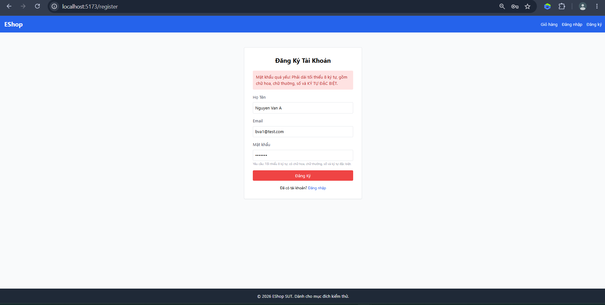
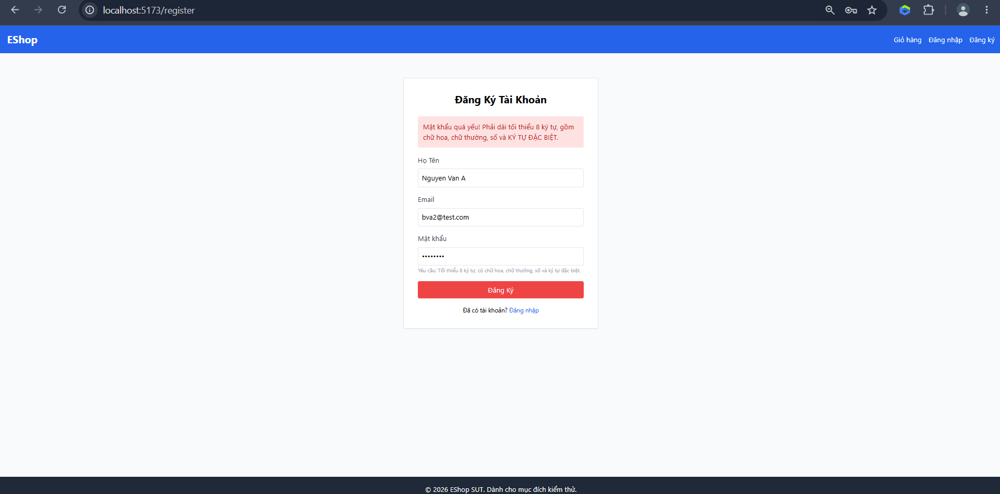
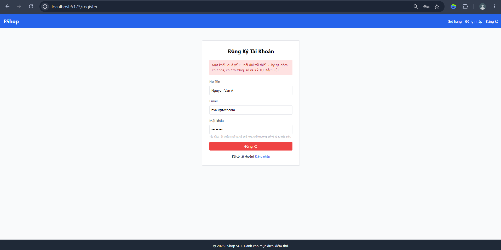
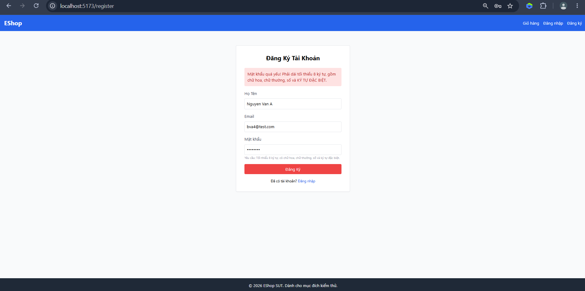

# FR-01 Boundary Value Analysis

## Screenshot Plan
- SP-03: Please capture one success-path screenshot for TC-FR01-BVA-02 and TC-FR01-BVA-03. Open http://localhost:5173/register, submit a valid registration form, and capture the page after submission/redirect to /login.
- SP-04: Please capture one invalid-input screenshot for TC-FR01-BVA-01 and TC-FR01-BVA-04. Submit one invalid registration attempt and capture the registration form area showing the validation/error message.

| TC ID | Precondition | Input | Steps | Expected Result | UI Actual Result | API Actual Result (status + body summary) | final Status | Class(es) Covered | Priority |
|---|---|---|---|---|---|---|---|---|---|
| TC-FR01-BVA-01 | none | name="Nguyen Van A", email="bva1@test.com", password="Abcde1!" | Fill form, submit | Registration rejected; no redirect; system-defined message, verify at execution |  | 200 OK; body {"message":"User registered successfully","id":25} | Fail (UI screenshot attached; API accepted invalid input) | EC-PW-TOO-SHORT | High |
| TC-FR01-BVA-02 | none | name="Nguyen Van A", email="bva2@test.com", password="Abcdef1!" | Fill form, submit | Registration accepted; redirected to /login | | 200 OK; body {"message":"User registered successfully","id":26} | Pass (UI screenshot attached; API accepted valid input) | EC-PW-VALID | High |
| TC-FR01-BVA-03 | none | name="Nguyen Van A", email="bva3@test.com", password="Abcdefg1!" | Fill form, submit | Registration accepted; redirected to /login | | 200 OK; body {"message":"User registered successfully","id":27} | Pass (UI screenshot attached; API accepted valid input) | EC-PW-VALID | Medium |
| TC-FR01-BVA-04 | none | name="Nguyen Van A", email="bva4@test.com", password="Abcdef1#" | Fill form, submit | Registration rejected; no redirect; system-defined message, verify at execution |  | 200 OK; body {"message":"User registered successfully","id":28} | Fail (UI screenshot attached; API accepted invalid input) | EC-PW-DISALLOWED-SPECIAL-CHAR | High |
