# FR-01 Domain Testing

## Screenshot Plan
- SP-01: Please capture one success-path screenshot for TC-FR01-01 and TC-FR01-15. Open http://localhost:5173/register, submit a valid registration form, and capture the page after submission/redirect to /login.
- SP-02: Please capture one invalid-input screenshot covering TC-FR01-02, TC-FR01-03, TC-FR01-04, TC-FR01-05, TC-FR01-06, TC-FR01-07, TC-FR01-08, TC-FR01-09, TC-FR01-10, TC-FR01-11, and TC-FR01-12. Submit one invalid registration attempt and capture the registration form area showing the validation/error message.

| TC ID | Precondition | Input | Steps | Expected Result | UI Actual Result | API Actual Result (status + body summary) | final Status | Class(es) Covered | Priority |
|---|---|---|---|---|---|---|---|---|---|
| TC-FR01-01 | none | name="Nguyen Van A", email="fr01-01@test.com", password="Abcdef1!" | Fill form, submit | Registration accepted; redirected to /login | 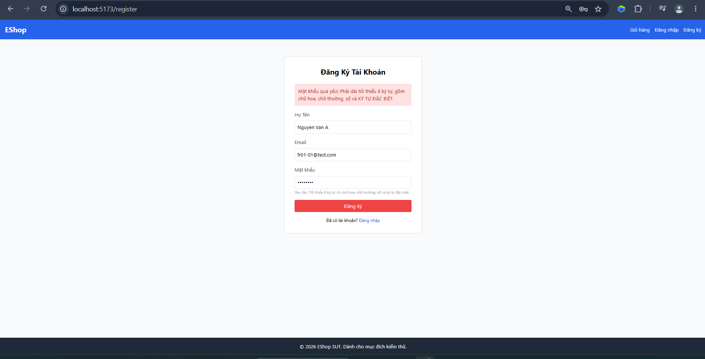 | 200 OK; body {"message":"User registered successfully","id":10} | Pass (UI screenshot attached; API accepted valid input) | EC-NAME-VALID, EC-EMAIL-VALID, EC-PW-VALID | High |
| TC-FR01-02 | none | name="", email="fr01-02@test.com", password="Abcdef1!" | Fill form with empty name, submit | Registration rejected; no redirect; system-defined message, verify at execution | 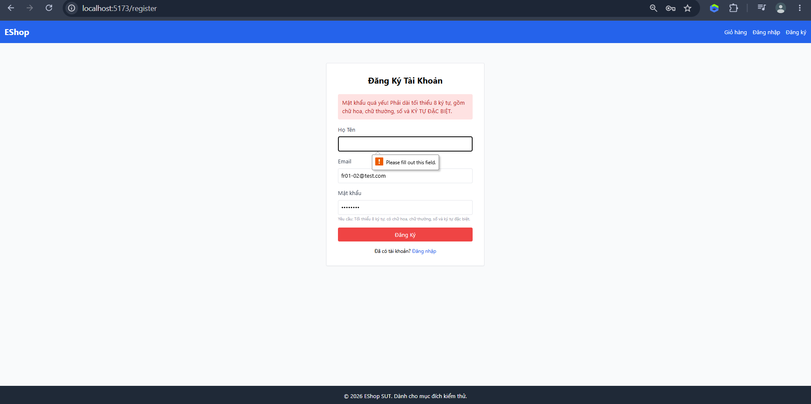 | 200 OK; body {"message":"User registered successfully","id":11} | Fail (UI screenshot attached; API accepted invalid input) | EC-NAME-INVALID | High |
| TC-FR01-03 | none | name="Le Thi B", email="invalid-email", password="Abcdef1!" | Fill form with malformed email, submit | Registration rejected; no redirect; system-defined message, verify at execution | 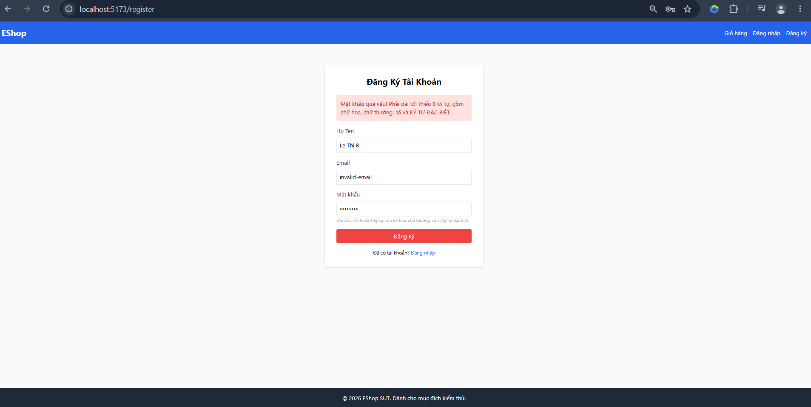 | 200 OK; body {"message":"User registered successfully","id":12} | Fail (UI screenshot attached; API accepted invalid input) | EC-EMAIL-FORMAT-INVALID | High |
| TC-FR01-04 | none | name="Le Thi B", email="", password="Abcdef1!" | Fill form with empty email, submit | Registration rejected; no redirect; system-defined message, verify at execution | 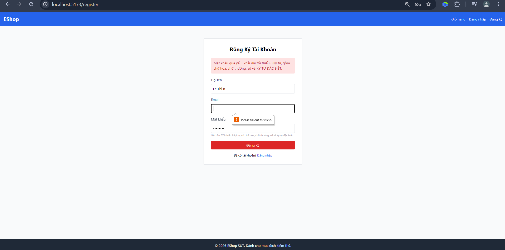 | 200 OK; body {"message":"User registered successfully","id":13} | Fail (UI screenshot attached; API accepted invalid input) | EC-EMAIL-MISSING | High |
| TC-FR01-05 | A prior successful registration exists for email "fr01-dup-base@test.com" | name="Tran Van C", email="fr01-dup-base@test.com", password="Abcdef1!" | Fill form with already-registered email, submit | Registration rejected; no redirect; system-defined message, verify at execution |  | 200 OK; body {"message":"User registered successfully","id":14} | Fail (UI screenshot attached; API accepted invalid input) | EC-EMAIL-DUPLICATE | High |
| TC-FR01-06 | A prior successful registration exists for email "fr01-dup-base@test.com" | name="Tran Van C", email="fr01-dup-base@test.com", password="Abcdef1!" | Register once successfully, then repeat registration with the same email | Registration rejected on the second attempt; no redirect; system-defined message, verify at execution | 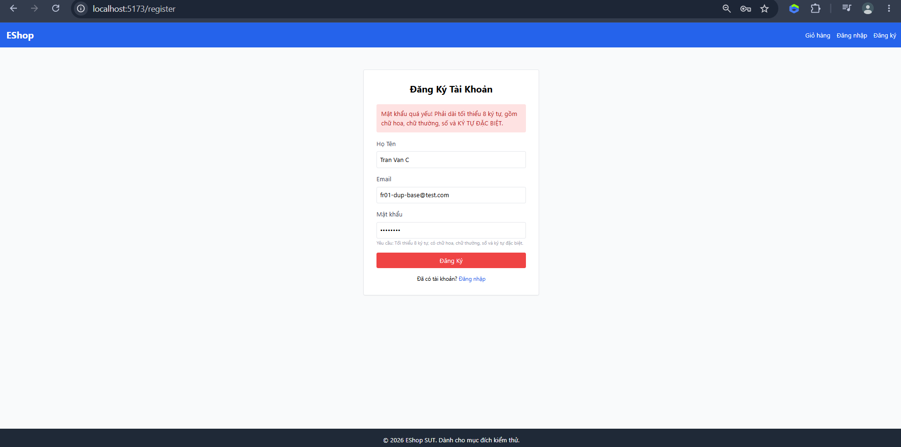 | 200 OK; body {"message":"User registered successfully","id":15} | Fail (UI screenshot attached; API accepted invalid input) | EC-EMAIL-STATE-DUPLICATE | High |
| TC-FR01-07 | none | name="Tran Van C", email="fr01-07@test.com", password="abcdef1!" | Fill form with password missing uppercase, submit | Registration rejected; no redirect; system-defined message, verify at execution | 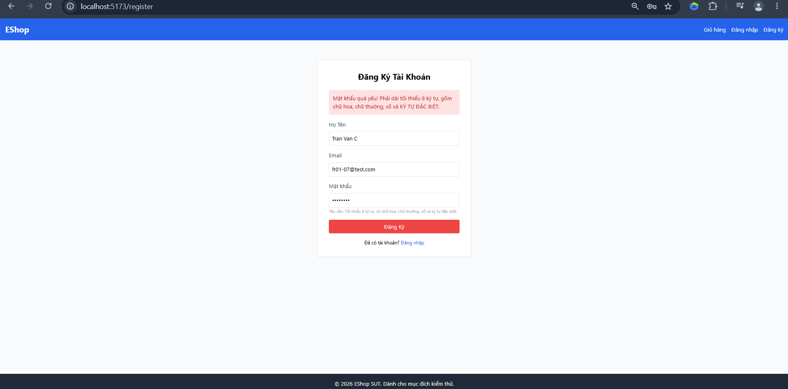 | 200 OK; body {"message":"User registered successfully","id":16} | Fail (UI screenshot attached; API accepted invalid input) | EC-PW-MISSING-UPPERCASE | High |
| TC-FR01-08 | none | name="Tran Van C", email="fr01-08@test.com", password="ABCDEF1!" | Fill form with password missing lowercase, submit | Registration rejected; no redirect; system-defined message, verify at execution |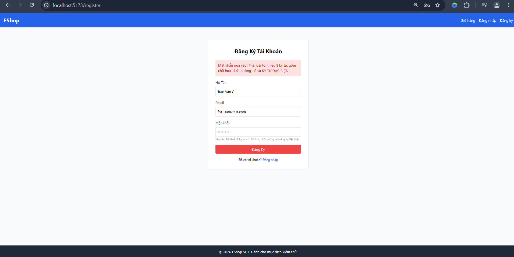 | 200 OK; body {"message":"User registered successfully","id":17} | Fail (UI screenshot attached; API accepted invalid input) | EC-PW-MISSING-LOWERCASE | High |
| TC-FR01-09 | none | name="Tran Van C", email="fr01-09@test.com", password="Abcdef!" | Fill form with password missing digit, submit | Registration rejected; no redirect; system-defined message, verify at execution |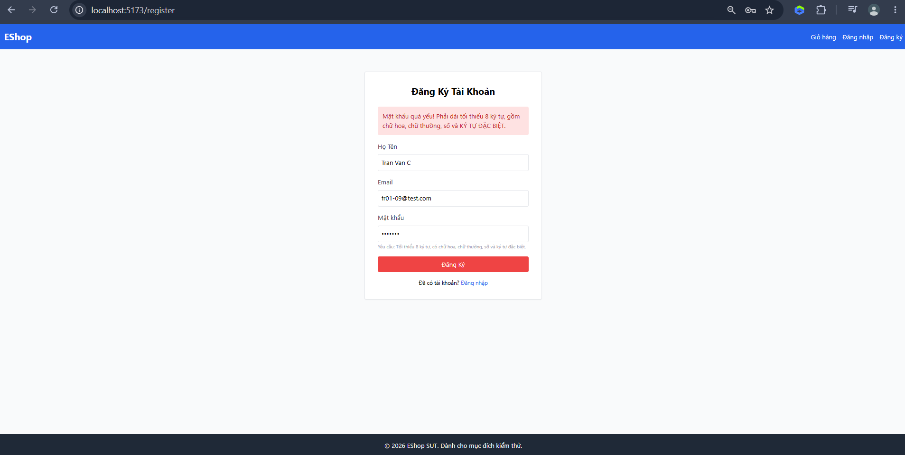| 200 OK; body {"message":"User registered successfully","id":18} | Fail (UI screenshot attached; API accepted invalid input) | EC-PW-MISSING-DIGIT | High |
| TC-FR01-10 | none | name="Tran Van C", email="fr01-10@test.com", password="Abcdef1" | Fill form with password missing special character, submit | Registration rejected; no redirect; system-defined message, verify at execution |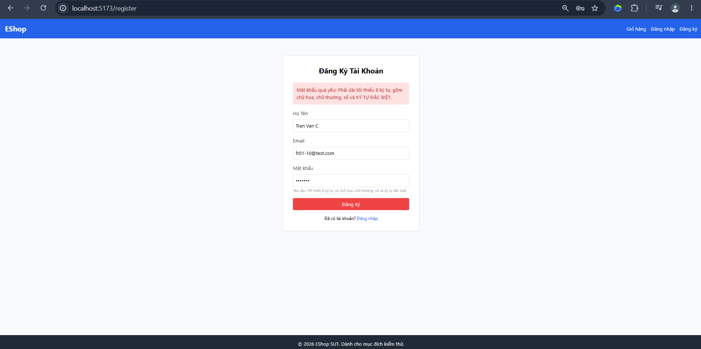| 200 OK; body {"message":"User registered successfully","id":19} | Fail (UI screenshot attached; API accepted invalid input) | EC-PW-MISSING-SPECIAL | High |
| TC-FR01-11 | none | name="Tran Van C", email="fr01-11@test.com", password="Abcde1!" | Fill form with password shorter than 8 characters, submit | Registration rejected; no redirect; system-defined message, verify at execution |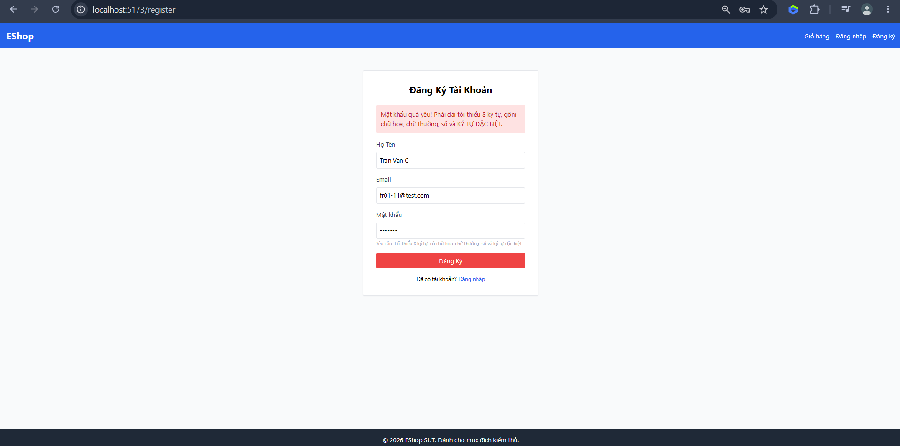 | 200 OK; body {"message":"User registered successfully","id":20} | Fail (UI screenshot attached; API accepted invalid input) | EC-PW-TOO-SHORT | High |
| TC-FR01-12 | none | name="Tran Van C", email="fr01-12@test.com", password="" | Fill form with empty password, submit | Registration rejected; no redirect; system-defined message, verify at execution | 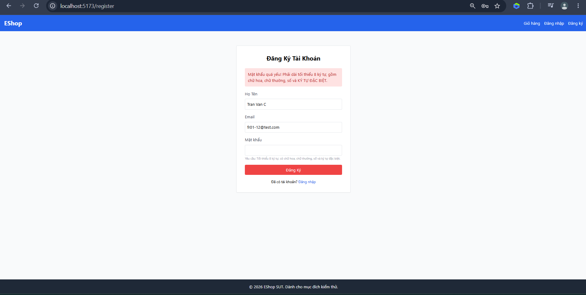| 200 OK; body {"message":"User registered successfully","id":21} | Fail (UI screenshot attached; API accepted invalid input) | EC-PW-MISSING | High |
| TC-FR01-15 | none | name="Pham Thi D", email="fr01-15@test.com", password="Abcde12!" | Fill form with a valid password at the minimum acceptable length, submit | Registration accepted; redirected to /login | 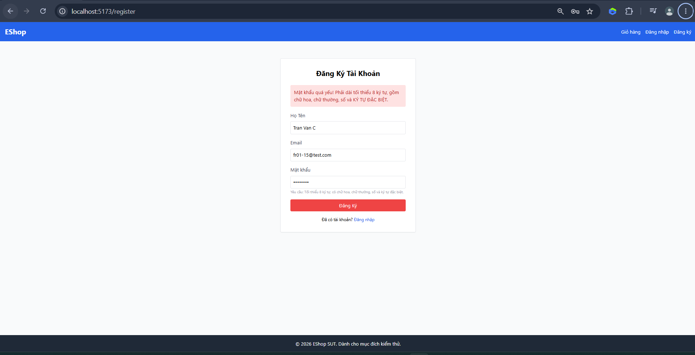 | 200 OK; body {"message":"User registered successfully","id":24} | Pass (UI screenshot attached; API accepted valid input) | EC-NAME-VALID, EC-EMAIL-VALID, EC-PW-VALID | Medium |
