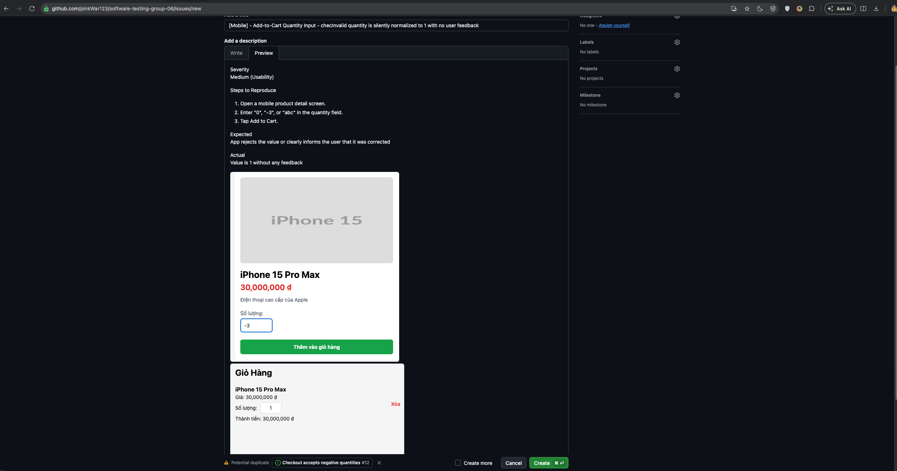
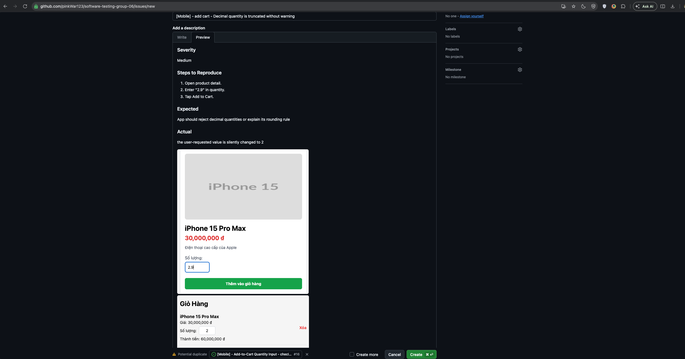
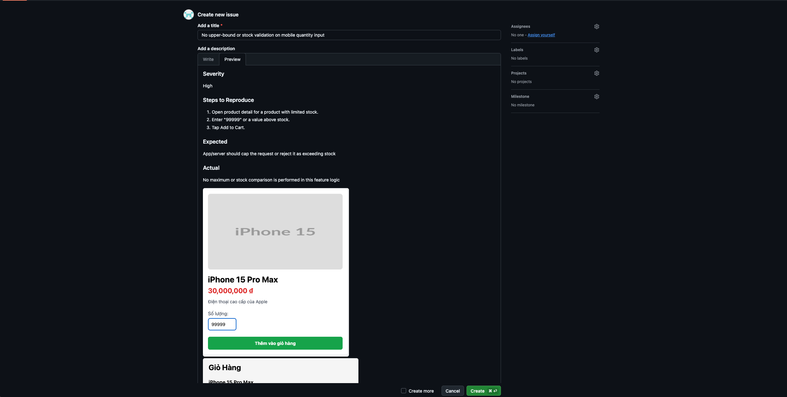

# HW02 — Separate Bug Report

**Student ID:** 22127345  
**Date:** July 2026  
**SUT:** EShop — https://github.com/ttbhanh/eshop-sut

This document collects the bug-report sections already identified in [report.md](./report.md).

---

## Feature A — FR-02: Login and Account Lockout

| Bug ID | Title | Severity | Steps to Reproduce | Expected | Actual | GitHub Issue | Image |
|--------|-------|----------|--------------------|----------|--------|--------------|-------|
| BUG-A-01 | Login page title shows "Đăng Ký" (Register) instead of "Đăng Nhập" (Sign In) | Low | Navigate to `/login` | Page `h2` heading reads "Đăng Nhập" (Sign In) | `h2` reads "Đăng Ký" (Register) — wrong label | |  |
| BUG-A-02 | Password input field uses `type="text"` — password visible in plaintext | **High (Security)** | 1. Navigate to `/login`. 2. Observe the "Mật khẩu" field. 3. Type any password | Password characters masked (`type="password"`) | Characters visible in plaintext; any shoulder-surfing or screen recording exposes passwords (`type="text"` in Login.jsx line 39) | https://github.com/pinkWar123/software-testing-group-06/issues/1 |  |
| BUG-A-03 | `login_attempts` incremented by 2 per failure — lockout triggers on attempt 2 not 3 | **High** | 1. Enter wrong password twice with the same account. 2. Observe account locked after 2nd attempt | Account should lock after 3 consecutive failures | `newAttempts = user.login_attempts + 2` (server.js line 54); after attempt 1: attempts=2, attempt 2: attempts=4 ≥ 3 → locked. Threshold value of 3 is never reached — boundary skipped | https://github.com/pinkWar123/software-testing-group-06/issues/3 |  |
| BUG-A-04 | No RFC 5321 email format validation — malformed emails accepted as input | Medium | Submit malformed email values: `test@@eshop.com`, `test@`, `@eshop.com`, `.test@eshop.com`, `test..user@eshop.com` | 400 "Invalid email format" with specific validation message | Generic 401 "Đăng nhập thất bại…" for all malformed formats; server performs no format validation before DB lookup | https://github.com/pinkWar123/software-testing-group-06/issues/4 |  |
| BUG-A-05 | No NIST SP 800-63B password minimum length enforcement — 1-char passwords accepted | Medium | Submit password `"X"` (1 char) or `"Pass12!"` (7 chars) at login | Best practice: reject passwords shorter than 8 characters with explicit error | Generic 401; no length check; 1-char passwords processed without error | https://github.com/pinkWar123/software-testing-group-06/issues/5 |  |
| BUG-A-06 | Login error message does not distinguish wrong credentials from account lockout | Medium | 1. Lock an account. 2. Attempt login with correct credentials | Distinct error: "Account locked, try again after X minutes" | Same generic "Đăng nhập thất bại. Vui lòng kiểm tra lại." shown for both wrong password and locked account — user cannot distinguish the cause | https://github.com/pinkWar123/software-testing-group-06/issues/6 |  |

---

## Feature B — FR-07: Shopping Cart

| Bug ID | Title | Severity | Steps to Reproduce | Expected | Actual | GitHub Issue |
|--------|-------|----------|--------------------|----------|--------|--------------|
| BUG-B-01 | No server-side quantity validation — negative and zero quantities accepted | **High** | POST /api/cart with `{quantity: 0}` or `{quantity: -1}` while authenticated | Server should return 400; invalid quantity rejected | Server returns 200; item added with quantity=0 or quantity=-1; cart total becomes 0 or negative (server.js: `userCarts[email].push(item)` with no validation) |  |
| BUG-B-02 | Checkout total is a user-editable field — price manipulation via the **normal UI** | **Critical (Security)** | 1. Add items worth 500,000. 2. Go to /checkout. 3. Edit the "Tổng tiền" number input to `1`. 4. Confirm | Order total is computed server-side from cart contents; client-supplied total rejected | Web renders the total as `<input type="number">` (`Checkout.jsx:93–102`) and POSTs it verbatim; server stores `req.body.total_amount` unverified (`server.js:299–303`). **Exploitable in a plain browser — no API tooling needed** |  |
| BUG-B-03 | Cart lost on page refresh / app restart (unpersisted React state) | **Medium (Reliability)** | 1. Add items (web or mobile). 2. Refresh the page / relaunch | Cart persists, or session-scoping is intentional and documented | Cart lives in `useState` with no `localStorage`/backend persistence → cleared on every reload (`CartContext.jsx`). *(The earlier "server restart" framing targeted the orphaned `userCarts` store, which no client populates.)* |  |
| BUG-B-04 | Inconsistent duplicate handling: web appends, mobile merges | **Medium** | Add the same product twice on web, then on mobile; compare carts | Both clients behave identically (merge into one line, summed qty) | Web `CartContext.addToCart` appends (`CartContext.jsx:8–10`); mobile `addToCart` merges by id (`App.js:134–150`) → web shows two lines, mobile shows one. *(Root cause is frontend cart logic, not the server.)* |  |
| BUG-B-05 | Orphaned `POST /api/cart` accepts arbitrary `price`/`quantity` (no validation) | **Medium (API hardening)** | POST /api/cart with `{id:1, price:1, quantity:-5}` directly | Endpoint validates inputs, or is removed | `userCarts[id].push(req.body)` stores any body unvalidated (`server.js:290–294`). *Severity reduced from Critical:* no UI calls this endpoint, and the real price-manipulation vector is the editable checkout total (BUG-B-02), independent of cart `price`. Recommend deleting the dead endpoint |  |
| BUG-B-07 | Web has no quantity normalization — NaN / 0 / negative quantities | **High** | On web product detail, clear the qty field (or enter `0` / `-3`), add to cart | Quantity coerced to a valid integer ≥ 1 | `addToCart(product, parseInt(quantity))` with no `Number.isFinite`/`>0` guard (`ProductDetail.jsx:27`); empty → NaN propagates into cartTotal and checkout total. Mobile guards this; web does not |  |

---

## Feature C — FR-17: Coupon Management (CRUD)

| Bug ID | Title | Severity | Steps to Reproduce | Expected | Actual | GitHub Issue |
|--------|-------|----------|--------------------|----------|--------|--------------|
| BUG-C-01 | Percent coupon `discount_value` treated as integer multiplier — produces negative final amount | **Critical** | Create coupon: `{type:"percent", discount_value:10}`. Apply to order total=500,000. | `final = 500000 * (1 - 0.10) = 450,000` | `final = 500000 * (1 - 10) = -4,500,000` — negative order total. Formula in server.js uses stored integer directly instead of dividing by 100. Any `discount_value >= 1` produces `final <= 0`. |  |
| BUG-C-02 | Duplicate coupon code causes unhandled 500 Internal Server Error | **Medium** | POST /api/admin/coupons with a `code` that already exists in the database. | 409 Conflict with message "Coupon code already exists" | SQLite `UNIQUE` constraint error propagates as 500 — raw database error exposed to client |  |
| BUG-C-04 | `min_order_amount` uses strict `>` — orders exactly equal to minimum are rejected | **Low** | Create coupon with `min_order_amount=300000`. Apply with `total_amount=300000`. | Coupon should apply (order meets the stated minimum) | Error: minimum order not met — `300000 > 300000` is false; customers at exactly the threshold are incorrectly rejected |  |

---

## Feature D — Mobile Add-to-Cart Quantity Input

| Bug ID | Title | Severity | Steps to Reproduce | Expected | Actual | GitHub Issue |
|--------|-------|----------|--------------------|----------|--------|--------------|
| BUG-D-01 | Invalid quantity is silently normalized to `1` with no user feedback | **Medium (Usability)** | 1. Open a mobile product detail screen. 2. Enter `"0"`, `"-3"`, or `"abc"` in the quantity field. 3. Tap Add to Cart. | App rejects the value or clearly informs the user that it was corrected | `normalizeQuantity()` converts the value to `1` and the add-to-cart flow continues without any visible feedback |  |
| BUG-D-02 | Decimal quantity is truncated by `parseInt()` without warning | **Medium** | 1. Open product detail. 2. Enter `"2.9"` in quantity. 3. Tap Add to Cart. | App should reject decimal quantities or explain its rounding rule | `parseInt("2.9")=2`; the user-requested value is silently changed before adding to cart |  |
| BUG-D-03 | No upper-bound or stock validation on mobile quantity input | **High** | 1. Open product detail for a product with limited stock. 2. Enter `"99999"` or a value above stock. 3. Tap Add to Cart. | App/server should cap the request or reject it as exceeding stock | The input path only checks `parsed > 0`; no maximum or stock comparison is performed in this feature logic |  |
