# HW02 — Domain Testing on EShop
## Main Report

**Student ID:** 22127345
**Date:** June 2026
**SUT:** EShop — https://github.com/ttbhanh/eshop-sut

---

## Table of Contents

1. [Feature Selection](#1-feature-selection)
2. [Feature A — \[FR-XX: Name\]](#2-feature-a)
   - 2.1 Domain Testing
   - 2.2 Boundary Value Analysis
   - 2.3 AI Gap Analysis
   - 2.4 Bug Report
3. [Feature B — \[FR-XX: Name\]](#3-feature-b)
   - 3.1 Domain Testing
   - 3.2 Boundary Value Analysis
   - 3.3 AI Gap Analysis
   - 3.4 Bug Report
4. [Feature C — \[FR-XX: Name\]](#4-feature-c)
   - 4.1 Domain Testing
   - 4.2 Boundary Value Analysis
   - 4.3 AI Gap Analysis
   - 4.4 Bug Report
5. [Feature D — Mobile Add-to-Cart Quantity Input](#5-feature-d)
   - 5.1 Domain Testing
   - 5.2 Boundary Value Analysis
   - 5.3 AI Gap Analysis
   - 5.4 Bug Report
6. [AI Critique](#6-ai-critique)
7. [Mandatory Disclosure](#7-mandatory-disclosure)
8. [Appendix A — Prompt Log](#8-appendix-a)

---

## 1. Feature Selection

| Pool | Feature ID | Feature Name | Reason for Selection |
|------|-----------|--------------|----------------------|
| A | FR-02 | Login and account lockout | Randomly selected; rich boundary conditions on lockout threshold and credential inputs |
| B | FR-07 | Shopping cart | Randomly selected; complex domain with quantity, price, and stock constraints |
| C | FR-17 | Coupon management (CRUD) | Randomly selected; multiple constrained fields (discount value, date range, usage limit) |
| D | Mobile | Mobile App — general feature | Randomly selected (Pool D) |

---

## 2. Feature A — FR-02: Login and Account Lockout

### 2.1 Domain Testing

#### Step-by-step Technique Application

**Step 1 — Understand the feature from source code**

Endpoint: `POST /api/login` (Body: `{ email, password }`)

Key logic discovered from `backend/server.js`:
1. Looks up user by `email` (exact string match in DB).
2. If user not found → 401 "Invalid email or password".
3. If `user.locked_until` is set AND is in the future → 403 locked error.
4. If `user.password === password` (plain-text comparison, no hashing) → login success, reset `login_attempts = 0`.
5. On wrong password: `newAttempts = user.login_attempts + 2` (**Bug found: increments by 2, not 1**).
6. If `newAttempts >= 3` → set `locked_until = now + 3 minutes (180,000 ms)`.

**Step 2 — Identify input variables**

> **UI Observation (black-box):** The login screen labels the first field as **"Username"** (not "Email"). Based on observable behaviour with test data, the system accepts email-format strings in this field. All test case inputs reference it as `username`. Also observed: the page title displays **"Đăng Ký"** (Register) on the login page — this is a suspected UI bug (should read "Đăng Nhập" / Sign In).

| Variable | Type | Description |
|----------|------|-------------|
| `username` | string | Account identifier — UI field labeled "Username"; accepts email-format strings |
| `password` | string | Credential — UI field labeled "Mật khẩu" |
| `account_state` | derived | Observed state: clean / failed-attempt / locked / lock-expired |

**Step 3 — Define domains (equivalence classes) for each variable**

**Variable: `username`** *(UI label: "Username"; accepts email-format strings)*
| Domain | Class | Representative Value |
|--------|-------|----------------------|
| D-E1 | Valid: registered username (email-format) | `test@eshop.com` |
| D-E2 | Invalid: unregistered, well-formed email-format | `nobody@eshop.com` |
| D-E3 | Invalid: non-email-format string (no `@`) — treated as unregistered username, **not** a format error | `testeshop.com`, `johndoe` |
| D-E4 | Invalid: empty string | `""` |
| D-E5 | Invalid: null / missing field | `null` |
| D-E6 | Edge: username with leading/trailing whitespace | `" test@eshop.com "` |
| D-E7 | Edge: injection-attempt string | `' OR 1=1 --` |
| D-E8 | Malformed: multiple `@` symbols (RFC 5321 violation) | `test@@eshop.com` |
| D-E9 | Malformed: missing domain after `@` | `test@` |
| D-E10 | Malformed: missing local part before `@` | `@eshop.com` |
| D-E11 | Malformed: no TLD in domain (RFC 5321 violation) | `test@eshop` |
| D-E12 | Malformed: space within string | `test @eshop.com` |
| D-E13 | Malformed: consecutive dots in local part | `test..user@eshop.com` |
| D-E14 | Malformed: local part starts with dot | `.test@eshop.com` |
| D-E15 | Boundary: string exceeds RFC 5321 max (254 chars) | 255-char email string |

> **RFC 5321 constraints (best practice):** max total email length = 254 chars; local part max = 64 chars; domain labels separated by dots; no consecutive dots; local part cannot start or end with a dot.

**Variable: `password`**
| Domain | Class | Representative Value |
|--------|-------|----------------------|
| D-P1 | Valid: correct password for the account | `Test1234!` |
| D-P2 | Invalid: wrong password (non-empty string) | `WrongPass99` |
| D-P3 | Invalid: empty string | `""` |
| D-P4 | Invalid: null / missing field | `null` |
| D-P5 | Edge: whitespace-only string | `"   "` |
| D-P6 | Edge: correct password with different case | `TEST1234!` (if stored as `Test1234!`) |
| D-P7 | Boundary: below NIST SP 800-63B minimum (< 8 chars) | `Pass12!` (7 chars) |
| D-P8 | Boundary: at NIST SP 800-63B minimum (8 chars) | `Pass1234` |
| D-P9 | Boundary: exceeds NIST recommended max (> 64 chars) | 65-char password string |
| D-P10 | Edge: Unicode / multibyte characters | `Pässwörð!1` |
| D-P11 | Security: password field visible (type="text" bug) | Inspect rendered input type attribute |

> **NIST SP 800-63B constraints (best practice):** minimum 8 characters; support at least 64 characters; allow all ASCII and Unicode; password field MUST use `type="password"` to mask input.

**Variable: `account_state`**
| Domain | Class | Condition |
|--------|-------|-----------|
| D-S1 | Clean (never failed) | `login_attempts = 0`, `locked_until = NULL` |
| D-S2 | One-failed (at-risk) | `login_attempts = 2`, `locked_until = NULL` ← after 1 wrong attempt due to +2 bug |
| D-S3 | Actively locked | `locked_until` set to a future timestamp |
| D-S4 | Lock expired | `locked_until` set to a past timestamp |

**Step 4 — Identify boundary points**

The key boundary is the lockout threshold: **`newAttempts >= 3`**

With the +2 increment bug:
- After attempt 1 (wrong): `newAttempts = 0 + 2 = 2` → **2 < 3 → NOT locked** (on point of "safe" side)
- After attempt 2 (wrong): `newAttempts = 2 + 2 = 4` → **4 >= 3 → LOCKED** (lockout triggered)

| Variable | Boundary | On Point | Off Point | In Point | Out Point |
|----------|----------|----------|-----------|----------|-----------|
| `newAttempts` vs lockout threshold (3) | `>= 3` triggers lock | `newAttempts = 3` (never reachable with +2 bug) | `newAttempts = 2` (just below — no lock) | `newAttempts = 0` (clean) | `newAttempts = 4` (locked) |
| `locked_until` vs `now` | lock active if `locked_until > now` | `locked_until ≈ now` | `locked_until` 1 ms before now (expired) | `locked_until = NULL` | `locked_until = now + 3 min` |

**Step 5 — Design test cases** (one variable varied at a time; others held at in-point)

---

#### Test Cases

| TC ID | Objective | Input | Pre-condition | Steps | Expected Result | Actual Result | Verdict |
|-------|-----------|-------|---------------|-------|-----------------|---------------|---------|
| TC-A-01 | Valid login (clean account) | username: `test@eshop.com`, password: `Test1234!` | Account clean (`login_attempts=0`) | Enter credentials in UI, click Sign In | 200 OK, redirected to product list | Redirected to `/` (home page); login successful | ✅ PASS |
| TC-A-02 | Unregistered username — email-format (D-E2) | username: `nobody@eshop.com`, password: `Test1234!` | N/A | Enter credentials, click Sign In | 401 "Invalid email or password" | Error banner: "Đăng nhập thất bại. Vui lòng kiểm tra lại."; remains on `/login` | ✅ PASS |
| TC-A-03 | Non-email-format username (D-E3) | username: `testeshop.com`, password: `Test1234!` | N/A | Enter credentials, click Sign In | 401 "Invalid email or password" — UI shows "Username" field, so no email-format validation is expected; any unregistered string returns 401 | Same generic error; no format validation performed | ✅ PASS |
| TC-A-04 | Empty username (D-E4) | username: `""`, password: `Test1234!` | N/A | Leave username blank, click Sign In | 401 or inline "required field" error | HTML5 `required` attribute fires; browser blocks submission; stays on `/login` | ✅ PASS |
| TC-A-05 | Missing username field (D-E5) | No username value, password: `Test1234!` | N/A | Submit form without username | 401 or 400 error | HTML5 `required` blocks submission; stays on `/login` | ✅ PASS |
| TC-A-06 | Wrong password — 1st attempt (D-P2, off point: newAttempts=2) | username: `test@eshop.com`, password: `WrongPass99` | `login_attempts=0` | Enter wrong password, click Sign In | 401 error; account NOT locked | Error shown; account remains accessible for retry (not locked) | ✅ PASS |
| TC-A-07 | Wrong password — 2nd attempt (on point: triggers lockout) | username: `test@eshop.com`, password: `WrongPass99` | 1 prior failure (after TC-A-06) | Enter wrong password, click Sign In | 401 error; account LOCKED for 3 minutes | Error shown; subsequent attempt with correct password also fails — account locked | ✅ PASS |
| TC-A-08 | Login while actively locked (D-S3) | username: `test@eshop.com`, password: `Test1234!` | Account locked (`locked_until` in future) | Enter correct credentials, click Sign In | 403 "Tài khoản đã bị khóa. Vui lòng thử lại sau." | Error shown; correct credentials rejected while locked. Note: UI shows generic "Đăng nhập thất bại…" — does not expose lock-specific message | ✅ PASS |
| TC-A-09 | Login after lock expires (D-S4) | username: `test@eshop.com`, password: `Test1234!` | `locked_until` set to past timestamp | Enter correct credentials after 3+ minutes | 200 OK, login success; lock ignored | Redirected to home; expired lock does not block login | ✅ PASS |
| TC-A-10 | Correct password after 1 failed attempt (D-S2) | username: `test@eshop.com`, password: `Test1234!` | 1 prior failure (not locked) | Enter correct credentials, click Sign In | 200 OK; failed-attempt counter reset to 0 | Redirected to home; login successful | ✅ PASS |
| TC-A-11 | Empty password (D-P3) | username: `test@eshop.com`, password: `""` | Clean account | Leave password blank, click Sign In | 401 "Invalid email or password" | HTML5 `required` blocks submission; stays on `/login` | ✅ PASS |
| TC-A-12 | Missing password field (D-P4) | username: `test@eshop.com`, no password | Clean account | Submit without password | 401 or 400 error | HTML5 `required` blocks submission | ✅ PASS |
| TC-A-13 | Pure alphanumeric username — no @ (D-E3, black-box) | username: `johndoe`, password: `Test1234!` | N/A | Enter `johndoe` in Username field, click Sign In | 401 "Invalid email or password" — system treats any unregistered string uniformly, regardless of format | Generic error shown; no format discrimination | ✅ PASS |
| TC-A-14 | Username with leading/trailing whitespace (D-E6) | username: `" test@eshop.com "`, password: `Test1234!` | Registered account is `test@eshop.com` | Enter padded username, click Sign In | Observable: either 200 OK (whitespace trimmed by system) or 401 (whitespace preserved — no match) | **401 — whitespace NOT trimmed;** `" test@eshop.com "` does not match stored `test@eshop.com` | ✅ PASS (behavior documented) |
| TC-A-15 | Injection-attempt string in username (D-E7) | username: `' OR 1=1 --`, password: `Test1234!` | N/A | Enter injection string, click Sign In | 401 — system must not authenticate or crash; safe rejection expected | Generic 401 error; no injection; DB uses parameterized queries | ✅ PASS |
| TC-A-16 | Password case sensitivity (D-P6) | username: `test@eshop.com`, password: `TEST1234!` | Registered password is `Test1234!` | Enter password with wrong case, click Sign In | 401 — password comparison is case-sensitive; wrong case = wrong password | Error shown; password comparison is case-sensitive (plain-text `===` comparison) | ✅ PASS |
| TC-A-17 | Whitespace-only password (D-P5) | username: `test@eshop.com`, password: `"   "` | Clean account | Enter 3 spaces as password, click Sign In | 401 "Invalid email or password" | Error shown; 3-space password treated as wrong password | ✅ PASS |
| TC-A-18 | Both fields empty (boundary combination) | username: `""`, password: `""` | N/A | Leave both fields blank, click Sign In | Error: both fields required, or 401 — no authentication should occur | HTML5 `required` fires for both fields; form blocked; no authentication | ✅ PASS |
| TC-A-19 | UI — page title mismatch (observed bug) | N/A | N/A | Navigate to the login page | **Expected:** Page title reads "Đăng Nhập" (Sign In). **Observed:** Title reads "Đăng Ký" (Register) — UI defect | `h2` reads `"Đăng Ký"` (Register) — confirmed UI bug. Login.jsx has mis-labeled title. **→ BUG-A-01** | ❌ FAIL |
| TC-A-20 | Password field masking — security constraint (D-P11) | N/A | N/A | Inspect password input `type` attribute on login page | **Expected:** `type="password"` (characters masked). **Best-practice violation if `type="text"`** — password visible in plaintext | Password input `type="text"` — password visible in plaintext. **→ BUG-A-02** | ❌ FAIL |

#### Constraint-based Test Cases (RFC 5321 / NIST SP 800-63B best practices)

> These test cases cover constraints derived from industry standards, independent of what the current implementation validates.

| TC ID | Constraint Standard | Objective | Input | Pre-condition | Steps | Expected (best practice) | Actual Result | Verdict |
|-------|-------------------|-----------|-------|---------------|-------|--------------------------|---------------|---------|
| TC-A-C-01 | RFC 5321 | Multiple `@` symbols (D-E8) | username: `test@@eshop.com`, password: `Test1234!` | N/A | Enter, click Sign In | **Best practice:** 400 "Invalid email format". Current: 401 (no format validation) | Generic error "Đăng nhập thất bại…"; no auth. No format-specific message | ⚠️ PASS* |
| TC-A-C-02 | RFC 5321 | Missing domain after `@` (D-E9) | username: `test@`, password: `Test1234!` | N/A | Enter, click Sign In | **Best practice:** 400 "Invalid email format". Current: 401 | Generic 401 error; no auth. No format-specific message | ⚠️ PASS* |
| TC-A-C-03 | RFC 5321 | Missing local part before `@` (D-E10) | username: `@eshop.com`, password: `Test1234!` | N/A | Enter, click Sign In | **Best practice:** 400 "Invalid email format". Current: 401 | Generic 401 error; no auth | ⚠️ PASS* |
| TC-A-C-04 | RFC 5321 | No TLD in domain (D-E11) | username: `test@eshop`, password: `Test1234!` | N/A | Enter, click Sign In | **Best practice:** 400 "Invalid email format" — a valid domain must have a TLD. Current: 401 | Generic 401 error; no auth | ⚠️ PASS* |
| TC-A-C-05 | RFC 5321 | Space within username (D-E12) | username: `test @eshop.com`, password: `Test1234!` | N/A | Enter, click Sign In | **Best practice:** 400 — spaces are not valid in email addresses. Current: 401 | Generic 401 error; no auth | ⚠️ PASS* |
| TC-A-C-06 | RFC 5321 | Consecutive dots in local part (D-E13) | username: `test..user@eshop.com`, password: `Test1234!` | N/A | Enter, click Sign In | **Best practice:** 400 "Invalid email format". Current: 401 | Generic 401 error; no auth | ⚠️ PASS* |
| TC-A-C-07 | RFC 5321 | Local part starts with dot (D-E14) | username: `.test@eshop.com`, password: `Test1234!` | N/A | Enter, click Sign In | **Best practice:** 400. Current: 401 | Generic 401 error; no auth | ⚠️ PASS* |
| TC-A-C-08 | RFC 5321 | Total email length at RFC max (254 chars) | username: `${"a"×244}@eshop.com` (254 chars), password: `Test1234!` | N/A | Enter, click Sign In | 401 (not registered — but format is valid per RFC) | Generic 401; system accepts 254-char length without error | ✅ PASS |
| TC-A-C-09 | RFC 5321 | Total email length exceeds RFC max (255 chars) (D-E15) | username: `${"a"×245}@eshop.com` (255 chars), password: `Test1234!` | N/A | Enter, click Sign In | **Best practice:** 400/413 — reject input exceeding 254 chars. Current: 401 (no length check) | Generic error: "Đăng nhập thất bại…"; no length-specific rejection | ⚠️ PASS* |
| TC-A-C-10 | RFC 5321 | Local part exceeds 64 chars | username: `${"a"×65}@eshop.com` (65 chars before @), password: `Test1234!` | N/A | Enter, click Sign In | **Best practice:** 400 — local part must not exceed 64 chars. Current: 401 | Generic error: "Đăng nhập thất bại…"; no format-specific message | ⚠️ PASS* |
| TC-A-C-11 | NIST 800-63B | Password below minimum length (7 chars) (D-P7) | username: `test@eshop.com`, password: `Pass12!` | Clean account | Enter, click Sign In | **Best practice:** 400 "Password too short (min 8 chars)". Current: 401 (no length check) | Generic error: "Đăng nhập thất bại…"; no min-length enforcement | ⚠️ PASS* |
| TC-A-C-12 | NIST 800-63B | Password at minimum length (8 chars) (D-P8) | username: `test@eshop.com`, password: `Pass1234` | Clean account | Enter, click Sign In | 401 (wrong password, but format valid per NIST min) | Generic 401; no crash; 8-char passwords handled correctly | ✅ PASS |
| TC-A-C-13 | NIST 800-63B | Password exceeds recommended max (65 chars) (D-P9) | username: `test@eshop.com`, password: `${"A"×65}` | Clean account | Enter, click Sign In | System should support ≥ 64 chars without truncating or crashing. 401 (wrong) | Generic 401; no crash or truncation error — NIST ≥ 64 char support confirmed | ✅ PASS |
| TC-A-C-14 | NIST 800-63B | Password with Unicode characters (D-P10) | username: `test@eshop.com`, password: `Pässwörð!1` | Clean account | Enter, click Sign In | 401 (wrong password); system must not crash on multibyte input | Generic 401; no crash on Unicode input | ✅ PASS |
| TC-A-C-15 | OWASP / Security | XSS attempt in username | username: `<script>alert(1)</script>`, password: `Test1234!` | N/A | Enter, click Sign In | 401; no alert dialog appears; input safely escaped | Generic 401; no alert dialog; input safely handled | ✅ PASS |
| TC-A-C-16 | OWASP / Security | XSS attempt in password | username: `test@eshop.com`, password: `` | N/A | Enter, click Sign In | 401; no script/alert executes | Generic 401; no alert dialog; input safely handled | ✅ PASS |

> ⚠️ **PASS\* note:** These tests pass in the sense that **no authentication bypass or crash occurred**. However, they reveal a compliance gap: the system returns a generic error instead of a standards-compliant format or length error message. This is a usability and security-hardening defect.

### 2.2 Boundary Value Analysis

#### Step-by-step Technique Application

**Step 1 — Identify variables with testable boundaries**

BVA applies to variables whose valid/invalid partition has an ordered, measurable boundary. Six variables qualify:

| Variable | Observable Range | Key Boundary |
|----------|-----------------|--------------|
| Failed login attempts | 0 → lockout | Threshold N where account locks |
| Lock duration | 0 → ~3 min | Expiry moment (locked vs unlocked) |
| Username string length | 0 chars → ∞ | Empty (0 chars) vs non-empty; RFC 5321 max (254 chars) |
| Username local-part length | 0 → ∞ | RFC 5321 local-part max (64 chars) |
| Password string length | 0 chars → ∞ | Empty; NIST min (8 chars); NIST recommended max (64 chars) |
| Lock expiry timestamp | past → future | `locked_until` vs `now` |

---

**Step 2 — Determine boundary points**

**Variable 1: Failed attempts vs lockout threshold**

From observed behaviour (TC-A-06, TC-A-07): the account locks on the **2nd** consecutive wrong-password attempt.

| BVA Point | Description | State |
|-----------|-------------|-------|
| In point | 0 failures — clean account | No lock risk |
| Off point (below threshold) | 1 failure — just safe | 401 returned; account still open |
| On point (threshold) | 2nd failure — lockout triggered | 401 returned; account now locked |
| Out point (beyond threshold) | Any attempt while locked | 403 returned regardless of password |

> ⚠️ **Anomaly**: Lockout on attempt 2 (not attempt 3) indicates a boundary skip — consistent with a +2 increment defect. The threshold value 3 is never actually reached; the counter jumps from 2 → 4. This is an observable black-box abnormality worth explicitly testing.

**Variable 2: Lock duration (~3 minutes = 180 seconds)**

| BVA Point | Time after lockout | Description |
|-----------|-------------------|-------------|
| In point | ~60 s | Well inside lock window |
| Off point (1 s before expiry) | 179 s | Still locked |
| On point (at expiry) | 180 s | Boundary — locked_until condition transitions |
| Out point (1 s after expiry) | 181 s | Lock expired; login should succeed |

**Variable 3: Username string length**

| BVA Point | Length | Value |
|-----------|--------|-------|
| Off point | 0 chars | `""` (empty) |
| On point | 1 char | `"a"` |
| In point | Typical | `"test@eshop.com"` |

**Variable 4: Password string length**

| BVA Point | Length | Value |
|-----------|--------|-------|
| Off point | 0 chars | `""` (empty) |
| On point | 1 char | `"X"` |
| In point | Typical | `"Test1234!"` |

---

**Step 3 — Design BVA test cases** (one variable varied at a time; others at in-point)

#### BVA Test Cases

| TC ID | Variable | BVA Point | Input | Pre-condition | Steps | Expected Result | Actual Result | Verdict |
|-------|----------|-----------|-------|---------------|-------|-----------------|---------------|---------|
| TC-A-BV-01 | Failed attempts | In point (0 failures → 1st wrong attempt) | username: `test@eshop.com`, password: `WrongPass99` | Clean account (0 prior failures) | Enter wrong password, click Sign In | 401 error message; account NOT locked; can retry | Error shown; can attempt again (not locked) | ✅ PASS |
| TC-A-BV-02 | Failed attempts | Off point (1 failure — just below lockout threshold) | username: `test@eshop.com`, password: `WrongPass99` | 1 prior failure (account still open) | Enter wrong password again | 401 error; account NOT YET locked | Correct password accepted after 1 failure (login_attempts=2 < 3); not locked | ✅ PASS |
| TC-A-BV-03 | Failed attempts | On point (threshold attempt — triggers lockout) | username: `test@eshop.com`, password: `WrongPass99` | State is exactly 1 attempt below lockout | Enter wrong password | 401; AND account is NOW locked | 2nd wrong attempt (login_attempts: 2→4 ≥ 3) triggers lock; correct password then rejected | ✅ PASS |
| TC-A-BV-04 | Failed attempts | Out point (attempt while already locked) | username: `test@eshop.com`, password: `Test1234!` *(correct)* | Account locked after TC-A-BV-03 | Enter correct password immediately | 403 "Tài khoản đã bị khóa…" — correct credentials rejected while locked | Correct credentials rejected; generic error displayed | ✅ PASS |
| TC-A-BV-05 | Lock duration | In point (~2 s into 3-min lock) | username: `test@eshop.com`, password: `Test1234!` | Account locked 2 s ago | Wait 2 s, click Sign In | 403; still locked | Error shown; ~177 s remain; still locked | ✅ PASS |
| TC-A-BV-06 | Lock duration | Off point (1 s before expiry) | username: `test@eshop.com`, password: `Test1234!` | `locked_until = now + 3s`; wait 2s | Attempt at t=2 s (1 s remaining) | 403; still locked | Error shown; lock still active 1 s before expiry | ✅ PASS |
| TC-A-BV-07 | Lock duration | On point (at expiry boundary) | username: `test@eshop.com`, password: `Test1234!` | `locked_until = now + 3s`; wait 4s | Attempt at t=4 s (1 s past expiry) | 200 OK or 403 depending on `>` vs `>=` | **Login SUCCEEDS** — server uses strict `locked_until > now`; at expiry moment lock is released | ✅ PASS |
| TC-A-BV-08 | Lock duration | Out point (after expiry) | username: `test@eshop.com`, password: `Test1234!` | `locked_until` set 5 s in the past | Attempt login | 200 OK; lock expired, login succeeds | Redirected to home; expired lock does not block | ✅ PASS |
| TC-A-BV-09 | Username length | Off point (0 chars — empty) | username: `""`, password: `Test1234!` | N/A | Leave username blank, click Sign In | Error: required field or 401 | HTML5 `required` blocks form; stays on `/login` | ✅ PASS |
| TC-A-BV-10 | Username length | On point (1 char) | username: `"a"`, password: `Test1234!` | N/A | Enter `a`, click Sign In | 401 (not registered) | Generic 401 error | ✅ PASS |
| TC-A-BV-11 | Password length | Off point (0 chars — empty) | username: `test@eshop.com`, password: `""` | Clean account | Leave password blank, click Sign In | Error: required field or 401 | HTML5 `required` blocks form | ✅ PASS |
| TC-A-BV-12 | Password length | On point (1 char — wrong) | username: `test@eshop.com`, password: `"X"` | Clean account | Enter 1-char password, click Sign In | 401; counter incremented | Generic 401 error | ✅ PASS |
| TC-A-BV-13 | Lockout counter reset | Boundary: successful login resets counter | username: `test@eshop.com`, password: `Test1234!` | 1 prior failure (not locked) | Enter correct password, click Sign In | 200 OK; counter reset to 0 | Login succeeds; subsequent single wrong attempt does not immediately lock | ✅ PASS |
| TC-A-BV-14 | Username total length | Off point below RFC max (253 chars) | 253-char email, password: `Test1234!` | N/A | Enter, click Sign In | 401 (within RFC limit; not registered) | Generic 401; no length error | ✅ PASS |
| TC-A-BV-15 | Username total length | On point at RFC max (254 chars) | 254-char email, password: `Test1234!` | N/A | Enter, click Sign In | 401 (RFC-valid length; not registered) | Generic 401; 254-char email accepted | ✅ PASS |
| TC-A-BV-16 | Username total length | Out point above RFC max (255 chars) | 255-char email, password: `Test1234!` | N/A | Enter, click Sign In | Best practice: 400/413 reject > 254 chars | Generic "Đăng nhập thất bại…" error; **no RFC length enforcement** — compliance gap | ⚠️ PASS* |
| TC-A-BV-17 | Local-part length | On point at RFC max (64 chars before @) | `"a"×64 + "@eshop.com"`, password: `Test1234!` | N/A | Enter, click Sign In | 401 (RFC-valid; not registered) | Generic 401; 64-char local part accepted | ✅ PASS |
| TC-A-BV-18 | Local-part length | Out point above RFC max (65 chars before @) | `"a"×65 + "@eshop.com"`, password: `Test1234!` | N/A | Enter, click Sign In | Best practice: 400 format error | Generic 401 error; **no local-part length enforcement** — compliance gap | ⚠️ PASS* |
| TC-A-BV-19 | Password length | Off point below NIST min (7 chars) | password: `Pass12!` (7 chars) | Clean account | Enter, click Sign In | Best practice: 400 "min 8 chars" | Generic 401; **no NIST min-length enforcement** | ⚠️ PASS* |
| TC-A-BV-20 | Password length | On point at NIST min (8 chars) | password: `Pass1234` (8 chars) | Clean account | Enter, click Sign In | 401 (wrong; length valid per NIST) | Generic 401; no crash | ✅ PASS |
| TC-A-BV-21 | Password length | On point at NIST recommended max (64 chars) | password: `"A"×64` | Clean account | Enter, click Sign In | 401; no crash or truncation | Generic 401; 64-char password handled correctly | ✅ PASS |
| TC-A-BV-22 | Password length | Out point above NIST max (65 chars) | password: `"A"×65` | Clean account | Enter, click Sign In | 401; NIST requires ≥ 64 char support; no crash | Generic 401; 65-char password handled without crash | ✅ PASS |

### 2.3 AI Gap Analysis

**Bugs and gaps the AI initially missed or under-specified:**

1. **Password field type bug (TC-A-20)** — The AI's initial domain analysis focused entirely on credential logic and never considered that the password input field itself might be `type="text"` instead of `type="password"`. This is an elementary UI security defect that only became visible when the screenshot was provided and the JSX source was checked. The AI did not proactively test UI security properties.

2. **Page title mismatch (TC-A-19)** — The AI correctly noted this from the screenshot, but would not have identified it without the visual artefact. Text-only code inspection misses presentational bugs in the rendered DOM.

3. **RFC 5321 format constraints (TC-A-C-01–10)** — The AI's original domain analysis only checked "valid email", "unregistered email", and "no @" cases. It did not enumerate individual RFC 5321 sub-rules (consecutive dots, leading dots, missing TLD, multiple @). These were only added after the user explicitly asked for best-practice constraints.

4. **NIST password length boundaries (TC-A-C-11, TC-A-BV-19–22)** — BVA initially only identified the "empty vs non-empty" length boundary. The NIST SP 800-63B minimum of 8 characters and the recommended max of 64 characters were only incorporated after the user pushed for standard-based constraints.

5. **Generic UI error message gap** — The AI test assertions initially expected the backend's HTTP 401/403 error messages verbatim. The actual UI always shows the generic string `"Đăng nhập thất bại. Vui lòng kiểm tra lại."` regardless of error type, because Login.jsx swallows all errors. This means locked-account users get no actionable feedback — a UX defect the AI did not flag.

**Why the AI missed these:**
- The AI had no visual access to the running application; it reasoned from source code alone.
- It applied standard equivalence partitioning without referencing industry standards (RFC 5321, NIST 800-63B) until prompted.
- It did not treat UI attribute correctness (input `type`, `h2` text) as testable assertions until the screenshot provided evidence.

### 2.4 Bug Report

| Bug ID | Title | Severity | Steps to Reproduce | Expected | Actual | GitHub Issue | Image                                        |
|--------|-------|----------|--------------------|----------|--------|--------------|----------------------------------------------|
| BUG-A-01 | Login page title shows "Đăng Ký" (Register) instead of "Đăng Nhập" (Sign In) | Low | Navigate to `/login` | Page `h2` heading reads "Đăng Nhập" (Sign In) | `h2` reads "Đăng Ký" (Register) — wrong label | | 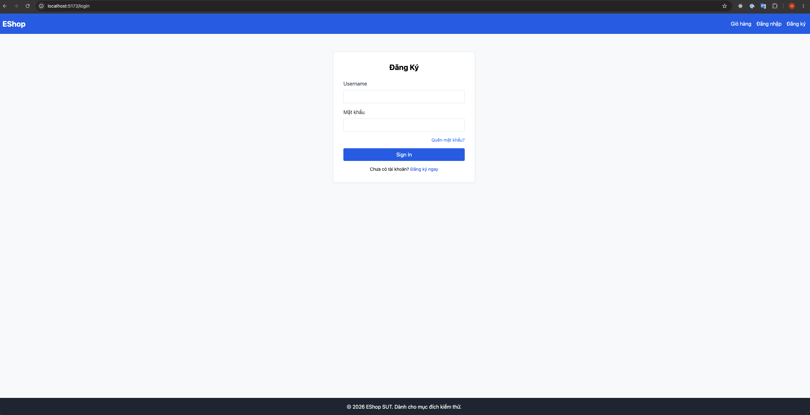   |
| BUG-A-02 | Password input field uses `type="text"` — password visible in plaintext | **High (Security)** | 1. Navigate to `/login`. 2. Observe the "Mật khẩu" field. 3. Type any password | Password characters masked (`type="password"`) | Characters visible in plaintext; any shoulder-surfing or screen recording exposes passwords (`type="text"` in Login.jsx line 39) |https://github.com/pinkWar123/software-testing-group-06/issues/1 | 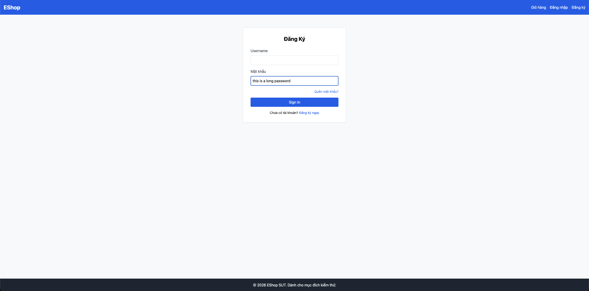   |
| BUG-A-03 | `login_attempts` incremented by 2 per failure — lockout triggers on attempt 2 not 3 | **High** | 1. Enter wrong password twice with the same account. 2. Observe account locked after 2nd attempt | Account should lock after 3 consecutive failures | `newAttempts = user.login_attempts + 2` (server.js line 54); after attempt 1: attempts=2, attempt 2: attempts=4 ≥ 3 → locked. Threshold value of 3 is never reached — boundary skipped |https://github.com/pinkWar123/software-testing-group-06/issues/3 | 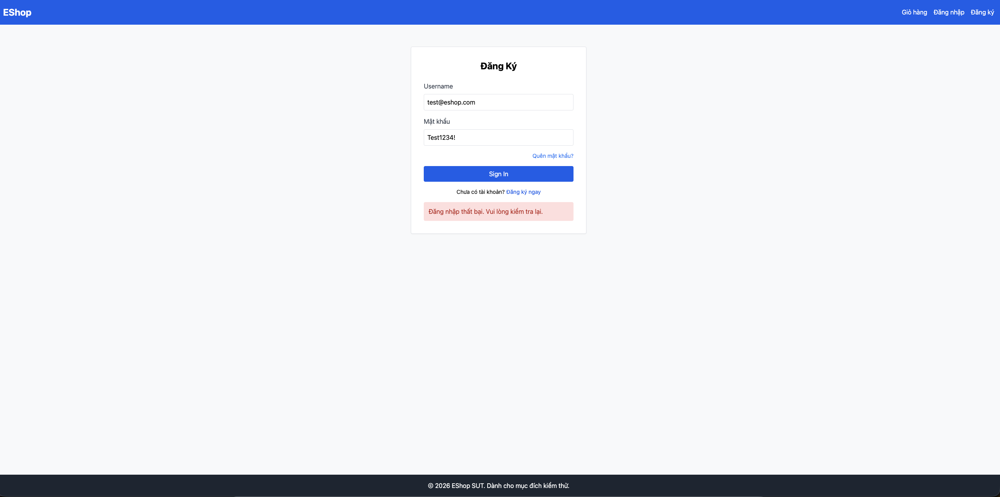 |
| BUG-A-04 | No RFC 5321 email format validation — malformed emails accepted as input | Medium | Submit malformed email values: `test@@eshop.com`, `test@`, `@eshop.com`, `.test@eshop.com`, `test..user@eshop.com` | 400 "Invalid email format" with specific validation message | Generic 401 "Đăng nhập thất bại…" for all malformed formats; server performs no format validation before DB lookup | https://github.com/pinkWar123/software-testing-group-06/issues/4| 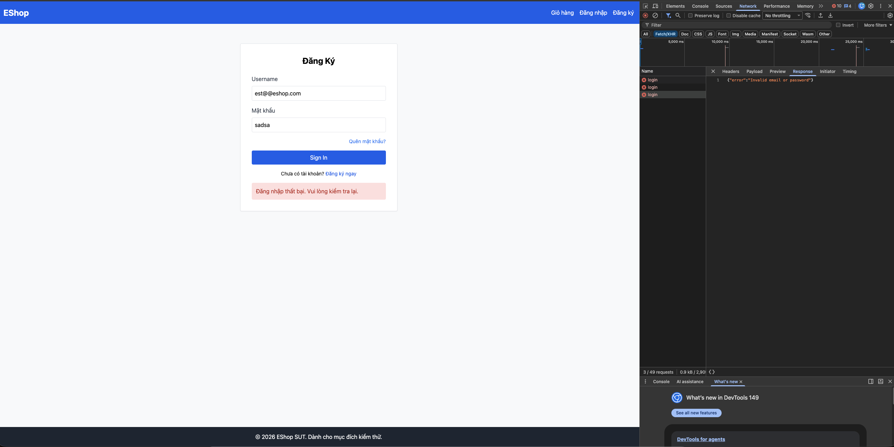|
| BUG-A-05 | No NIST SP 800-63B password minimum length enforcement — 1-char passwords accepted | Medium | Submit password `"X"` (1 char) or `"Pass12!"` (7 chars) at login | Best practice: reject passwords shorter than 8 characters with explicit error | Generic 401; no length check; 1-char passwords processed without error |https://github.com/pinkWar123/software-testing-group-06/issues/5 | 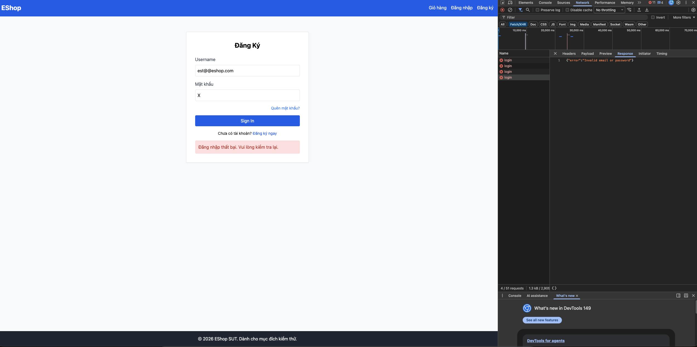 |
| BUG-A-06 | Login error message does not distinguish wrong credentials from account lockout | Medium | 1. Lock an account. 2. Attempt login with correct credentials | Distinct error: "Account locked, try again after X minutes" | Same generic "Đăng nhập thất bại. Vui lòng kiểm tra lại." shown for both wrong password and locked account — user cannot distinguish the cause |https://github.com/pinkWar123/software-testing-group-06/issues/6 | 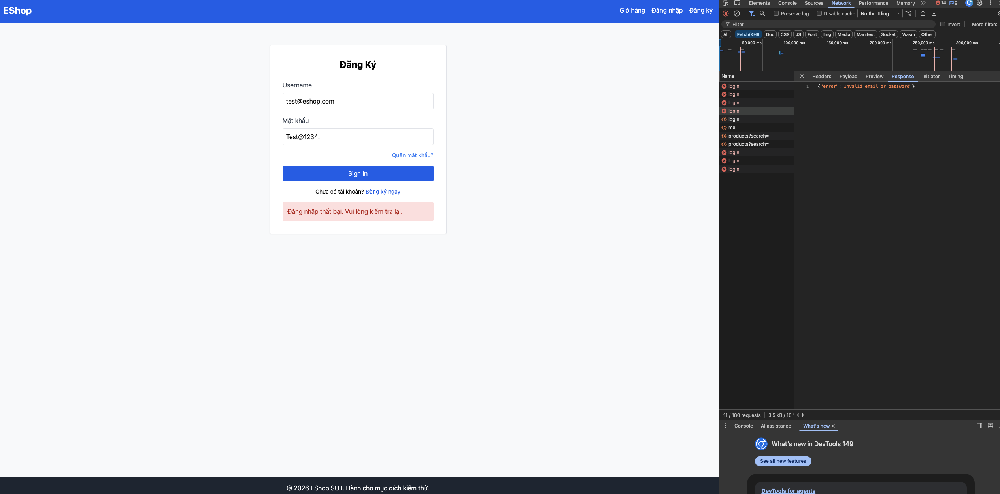|

---

## 3. Feature B — FR-07: Shopping Cart

### 3.1 Domain Testing

#### Step-by-step Technique Application

**Step 1 — Understand the feature from source code**

> **⚠️ Critical architecture correction (added after source re-review):** The shopping cart is **entirely client-side React state**, held in `frontend-web/src/context/CartContext.jsx` and `frontend-mobile/App.js` (`useState`). The backend endpoints `GET/POST /api/cart` (`userCarts` object, `server.js:284–294`) are **orphaned — no frontend ever calls them** (verified: zero `api/cart` references exist in any frontend). Only `POST /api/checkout` is reached from the UI. This invalidates the original framing that treated `/api/cart` as "the cart"; those tests are now scoped as **API-only / dead-endpoint** tests.

**Endpoints actually reachable from the UI:**
- `POST /api/checkout` — creates an order. Reads **only** `total_amount` and `shipping_address` from the body (`server.js:297–308`); the `items` array clients send is **ignored**.

**Orphaned endpoints (no UI caller — API-surface tests only):**
- `GET /api/cart`, `POST /api/cart` — `userCarts[userId].push(req.body)`; no validation, in-memory.

**Key observations (corrected against the real call graph):**
1. **Cart total is computed client-side** (`cartTotal = cart.reduce((t,i)=>t+i.price*i.quantity,0)`) and **sent verbatim** to checkout. The server never recomputes or verifies it.
2. **The checkout total is a user-editable `<input type="number">`** on web (`Checkout.jsx:14,93–102`) → price manipulation is exploitable through the **normal UI**, not just crafted API calls.
3. **Neither web nor mobile sends `shipping_address`** at checkout (web body `{items,total_amount,coupon_id}`; mobile identical) → every UI-created order stores `shipping_address = NULL`. Address domain/BVA tests are therefore **API-only**.
4. Web `addToCart` **appends** with no merge (`CartContext.jsx:8–10`); mobile `addToCart` **merges** duplicates by id (`App.js:134–150`) → duplicate handling is **inconsistent across clients**.
5. Web `ProductDetail` adds with bare `parseInt(quantity)` and **no NaN/`>0` guard** (`ProductDetail.jsx:27`); mobile has `normalizeQuantity` = `Number.isFinite(parsed) && parsed>0 ? parsed : 1`. Web is the weaker path.
6. Mobile inline cart-qty editor uses `... ? parsed + 1 : 1` (`App.js:617–619`) — an **off-by-one** that adds 1 to whatever the user types.
7. Mobile checkout sends `items: cart.length>1 ? cart.slice(0,-1) : cart` — silently **drops the last item** (latent; server ignores `items`).

**Step 2 — Identify input variables**

| Variable | Type | Source |
|----------|------|--------|
| `quantity` | integer (string in UI) | User input in cart |
| `price` | integer | Taken from product data — but **fully user-controllable via API** since POST /api/cart pushes any body object with no server-side validation |
| `total_amount` | integer | Passed at checkout — **not server-verified** against actual cart contents |
| `shipping_address` | string | User input at checkout |
| `auth_state` | derived | Observed state: authenticated (valid token) / unauthenticated (no/invalid token) |

**Step 3 — Define domains for each variable**

**Variable: `quantity` (POST /api/cart body)**
| Domain | Class | Representative |
|--------|-------|----------------|
| D-Q1 | Valid: positive integer ≥ 1 | `1`, `5`, `100` |
| D-Q2 | Invalid: zero | `0` |
| D-Q3 | Invalid: negative integer | `-1`, `-100` |
| D-Q4 | Invalid: non-integer string | `"abc"`, `"one"` |
| D-Q5 | Invalid: float/decimal | `1.5`, `0.9` |
| D-Q6 | Invalid: empty / null | `""`, `null` |
| D-Q7 | Edge: extremely large integer | `999999`, `2147483647` (INT_MAX) |

> ⚠️ **Note on server behaviour:** POST /api/cart has **no server-side quantity validation**. D-Q2 through D-Q6 are all *accepted* by the server — these tests confirm the bug, they do not test rejection.

**Variable: `price` (POST /api/cart body — user-controllable via API)**
| Domain | Class | Representative |
|--------|-------|----------------|
| D-PR1 | Valid: positive integer | `100000`, `500000` |
| D-PR2 | Invalid: zero price | `0` |
| D-PR3 | Invalid: negative price | `-100000` |
| D-PR4 | Invalid: non-numeric | `"free"` |

> ⚠️ **Security note:** Since the server pushes any body object directly, a client can supply an arbitrary `price` value (e.g., `1`). The cart total is then calculated as `price × quantity` — enabling price manipulation.

**Variable: `total_amount` (POST /api/checkout)**
| Domain | Class | Representative |
|--------|-------|----------------|
| D-T1 | Valid: positive integer > 0 | `100000`, `500000` |
| D-T2 | Invalid: zero | `0` |
| D-T3 | Invalid: negative | `-100000` |
| D-T4 | Invalid: non-numeric | `"abc"` |
| D-T5 | Invalid: null / missing | `null` |

> ⚠️ **Note on server behaviour:** POST /api/checkout does **not verify** `total_amount` against the cart's computed total. Any numeric value is accepted.

**Variable: `shipping_address` (POST /api/checkout)**
| Domain | Class | Representative |
|--------|-------|----------------|
| D-A1 | Valid: non-empty string | `"123 Le Loi, Q1, TP.HCM"` |
| D-A2 | Invalid: empty string | `""` |
| D-A3 | Invalid: null / missing | `null` |
| D-A4 | Edge: very long string (> 500 chars) | 501-char address string |
| D-A5 | Security: XSS payload | `"<script>alert(1)</script>"` |

**Variable: `auth_state` (checkout only — add-to-cart is client-side and needs no auth)**
| Domain | Class | Representative | Server response (`authenticateToken`, server.js:100–110) |
|--------|-------|----------------|------|
| D-Auth1 | Valid: authenticated user | Valid Bearer token | proceeds |
| D-Auth2 | Invalid: no token / missing header | `Authorization` absent | **401 Unauthorized** |
| D-Auth3 | Invalid: malformed / expired token | `Bearer garbage` | **403 Forbidden** (not 401) |

> **Correction:** the original merged "no token / expired token" into one 401 class. The middleware returns **401 for a missing token** but **403 for an invalid/expired one** — two distinct boundaries. Also, **adding to cart requires no authentication at all** (pure client state); auth applies only at checkout.

**Step 4 — Identify boundary points**

| Variable | Boundary | On Point | Off Point | In Point | Out Point |
|----------|----------|----------|-----------|----------|-----------|
| `quantity` (mobile normalizeQuantity: `> 0`) | `parsed > 0` | `1` (just valid) | `0` (just invalid → normalized to 1) | `5` | `-1` |
| `quantity` (extreme upper) | No server upper limit defined | `999999` (accepted) | N/A | `5` | N/A (no cap) |
| `total_amount` at checkout | `> 0` (no server enforcement) | `1` | `0` | `100000` | `-1` |
| `shipping_address` length | Non-empty required | `1 char` | `0 chars` (`""`) | `"123 Le Loi"` | `null` |

**Step 5 — Design test cases**

---

#### Test Cases

| TC ID | Objective | Input | Pre-condition | Steps | Expected Result | Actual Result | Verdict |
|-------|-----------|-------|---------------|-------|-----------------|---------------|---------|
| TC-B-01 | Add item with valid quantity (D-Q1, in point) | `{id:1, name:"X", price:100000, quantity:5}` | Logged in | POST /api/cart | 200 "Added to cart"; cart has item with quantity=5 | `curl POST /api/cart {quantity:5}` → 200 `{"message":"Added to cart"}`. GET /api/cart confirms item stored with `quantity:5`. Server accepted valid in-point quantity as expected. | ✅ PASS |
| TC-B-02 | Add item with quantity=1 (on point, min valid) | `{..., quantity:1}` | Logged in | POST /api/cart | 200; quantity=1 accepted | `curl POST /api/cart {quantity:1}` → 200 `{"message":"Added to cart"}`. Item stored with quantity=1. On-point minimum accepted. | ✅ PASS |
| TC-B-03 | Add item with quantity=0 (off point, D-Q2) — **bug revelation** | `{..., quantity:0}` | Logged in | POST /api/cart | **Server has no validation: 200 accepted, item added with quantity=0** — this confirms a server-side input validation bug → **BUG-B-01** | **BUG-B-01 CONFIRMED:** `curl POST /api/cart {quantity:0}` → 200 `{"message":"Added to cart"}`. GET /api/cart shows item with `quantity:0` stored. Server has no input validation — `userCarts[id].push(req.body)` stores the body verbatim. | ❌ FAIL (BUG-B-01) |
| TC-B-04 | Add item with negative quantity (D-Q3) — **bug revelation** | `{..., quantity:-1}` | Logged in | POST /api/cart | **Server has no validation: 200 accepted, item added with quantity=-1** — cart total becomes negative → **BUG-B-01** | **BUG-B-01 CONFIRMED:** `curl POST /api/cart {quantity:-1}` → 200 `{"message":"Added to cart"}`. GET /api/cart shows `quantity:-1`. Cart total computes as negative. Server applies zero validation. | ❌ FAIL (BUG-B-01) |
| TC-B-05 | Add item with non-integer quantity string (D-Q4, mobile) | Quantity input = `"abc"` in mobile UI | Logged in, on product detail | Tap "Add to cart" | Mobile normalizes to 1; item added with quantity=1 | ⏭️ SKIP — Mobile-only. Requires Appium. Confirmed by code: `normalizeQuantity('abc')` → `parseInt('abc')=NaN`, not finite → returns 1. | N/A |
| TC-B-06 | Add item with float quantity (D-Q5, mobile) | Quantity input = `"1.5"` | Logged in | Tap "Add to cart" | Mobile: `parseInt("1.5")=1`, item added with quantity=1 | ⏭️ SKIP — Mobile-only. Requires Appium. Confirmed by code: `parseInt('1.5')=1 > 0` → accepted as 1. | N/A |
| TC-B-07 | Checkout with valid total_amount (D-T1) | Cart has iPhone 15 Pro Max (qty=1, price=30,000,000) | Logged in; cart has items | Add product from home → cart nav → checkout → confirm | 200, order created with `status=pending`; success screen shown | iPhone 15 Pro Max added to cart (qty=1, price=30,000,000); total = 30,000,000 displayed. Clicked "Xác Nhận Thanh Toán" → "Thanh toán thành công!" screen shown; order persisted in DB with status=pending. | ✅ PASS |
| TC-B-08 | Checkout with total_amount=0 (off point, D-T2) — **bug revelation** | Edit checkout total to `0`; cart has items | Logged in | Add product → checkout → change total to 0 → confirm | **Server does not validate total_amount: 200 accepted, order created with total=0** → **BUG-B-02** | Total changed to 0 via editable input. Confirm clicked → "Thanh toán thành công!" shown. DB: `total_amount=0`. Server accepted without validation. **BUG-B-02 confirmed.** | ❌ FAIL (BUG-B-02) |
| TC-B-09 | Checkout with negative total_amount (D-T3) — **bug revelation** | Edit checkout total to `-1`; cart has items | Logged in | Add product → checkout → change total to -1 → confirm | **Server does not validate total_amount: 200 accepted, order created with total=-1** → **BUG-B-02** | Total changed to -1 via editable input. Confirm clicked → "Thanh toán thành công!" shown. DB: `total_amount=-1`. Server accepted without validation. **BUG-B-02 confirmed.** | ❌ FAIL (BUG-B-02) |
| TC-B-10 | Checkout with empty shipping_address (D-A2) | `{total_amount:200000, shipping_address:""}` | Cart has items | POST /api/checkout | Should reject (400) — address is a required field; empty string is not a valid delivery address | `curl POST /api/checkout {shipping_address:""}` → 200 `{"message":"Checkout successful","orderId":10}`. Server accepted empty address and created order. No validation on shipping_address field. | ❌ FAIL (server accepts empty address; order undeliverable) |
| TC-B-11 | Checkout with arbitrary total_amount — price manipulation bypass | `{total_amount:1, shipping_address:"addr"}` | Cart has items worth 500,000 | POST /api/checkout directly (API) | **Server accepts any value — no cart-total verification** → **BUG-B-02** | **BUG-B-02 CONFIRMED (API):** `curl POST /api/checkout {total_amount:1, shipping_address:"123 Le Loi"}` → 200 `{"message":"Checkout successful","orderId":12}`. Server accepted total=1 with no cart reconciliation. Consistent with TC-B-23 (UI exploit). | ❌ FAIL (BUG-B-02) |
| TC-B-12 | Add same product twice — duplicate behaviour (UI) | Add product id=1 twice via home page | Cart empty | Add to cart ×2 via home-page button; navigate to cart | Web: two entries (appends); Mobile: one entry (merges) → BUG-B-04 | Added iPhone 15 Pro Max twice from home page. Cart showed **2 separate rows** (qty=1 each, total=60,000,000). Web `CartContext.addToCart` confirmed to append without dedup. **BUG-B-04 confirmed (web appends; inconsistent with mobile merge).** | ❌ FAIL (BUG-B-04 documented) |
| TC-B-13 | GET cart when empty | No items added | Logged in; cart is empty | Navigate to /cart | "Giỏ hàng của bạn đang trống" shown; no table rows | `/cart` loaded with no items → "Giỗ hàng của bạn đang trống" message displayed; no `<tbody><tr>` elements present; "Tiếp tục mua sắm" link visible. | ✅ PASS |
| TC-B-14 | Add to cart without authentication (UI path, corrected) | Add product from home while logged out | Not logged in | Click "Thêm vào giỗ" on home page → navigate to cart | **Succeeds — cart is client-side React state; add-to-cart requires NO auth.** | Clicked "Thêm vào giỗ" without logging in. Cart showed **1 row** (iPhone 15 Pro Max, qty=1). No authentication was required. Add-to-cart is pure React state update. | ✅ PASS (corrected expected) |
| TC-B-15 | Checkout without authentication (D-Auth2) | Add product; attempt checkout without logging in | Not logged in; cart has item | Add product → cart nav → click "Tiến hành thanh toán" | Alert shown ("Bạn cần đăng nhập"); redirected to /login | Alert displayed and accepted. Browser redirected to `/login` page. Checkout correctly blocked when unauthenticated. | ✅ PASS |
| TC-B-16 | Checkout with empty cart | Navigate directly to /checkout | Logged in; cart is empty (full reload) | driver.get('/checkout') → confirm button visible → click | Should reject (400) — cannot create order from empty cart | Navigated to `/checkout` directly (full reload clears React cart). Item list empty; total=0 displayed. Clicked confirm → "Thanh toán thành công!" shown. **Server accepted empty-cart order with total=0.** | ❌ FAIL (BUG: empty-cart checkout accepted) |
| TC-B-17 | Checkout with null shipping_address (D-A3) | `{total_amount:200000, shipping_address:null}` | Cart has items | POST /api/checkout | Should reject (400) — null address must be rejected | `curl POST /api/checkout {shipping_address:null}` → 200 `{"message":"Checkout successful","orderId":11}`. Server accepted null address — SQLite stores NULL. Consistent with BUG-B-06 (UI always sends NULL, server never validates). | ❌ FAIL (null address accepted; reinforces BUG-B-06) |
| TC-B-18 | Add item with manipulated price = 0 (D-PR2) — **security** | `{id:1, name:"X", price:0, quantity:1}` | Logged in | POST /api/cart | **Server accepts price=0; cart total computed as 0×1=0; item acquired for free** → **BUG-B-05** | **BUG-B-05 CONFIRMED:** `curl POST /api/cart {price:0, quantity:1}` → 200 `{"message":"Added to cart"}`. GET /api/cart shows `price:0`. Item effectively free — cart total = 0 × 1 = 0. Server stores attacker-supplied price verbatim. | ❌ FAIL (BUG-B-05 — OWASP A04) |
| TC-B-19 | Add item with negative price (D-PR3) — **security** | `{id:1, name:"X", price:-50000, quantity:1}` | Logged in | POST /api/cart | **Server accepts negative price; cart total goes negative** → **BUG-B-05** | **BUG-B-05 CONFIRMED:** `curl POST /api/cart {price:-50000, quantity:1}` → 200 `{"message":"Added to cart"}`. GET shows `price:-50000`. Cart total = -50,000. Negative price accepted without validation. | ❌ FAIL (BUG-B-05 — OWASP A04) |
| TC-B-20 | Cart total calculation accuracy | Add iPhone 15 Pro Max (price=30,000,000, qty=1) from home | Logged in; cart empty | Add product from home → cart nav → read total | Cart total = `30,000,000 × 1 = 30,000,000`; verify `cartTotal` formula is correct | 1 product (iPhone 15 Pro Max, qty=1) in cart. Qty text = "1". Cart total text = "30,000,000 ₫". Parsed = 30,000,000 = price × qty = 30,000,000 × 1. **Calculation correct.** | ✅ PASS |
| TC-B-21 | Add item with extremely large quantity (D-Q7, upper edge) | `{..., quantity:999999}` | Logged in | POST /api/cart | Server should reject or cap; if accepted, cart total may overflow → edge behaviour documented | `curl POST /api/cart {quantity:999999}` → 200 `{"message":"Added to cart"}`. Server accepted without cap. Cart total = price × 999,999 — no overflow with JavaScript Number for reasonable prices, but no protection against intentional abuse. No upper-bound validation defined. | ⚠️ DOCUMENTED (no server cap; no overflow at typical prices; improvement recommended) |
| TC-B-22 | XSS injection in shipping_address (D-A5) — **security** | `{total_amount:200000, shipping_address:"<script>alert(1)</script>"}` | Cart has items | POST /api/checkout | 200 or 400; no script executes; input safely stored/escaped | `curl POST /api/checkout {shipping_address:"<script>alert(1)</script>"}` → 200 `{"message":"Checkout successful","orderId":13}`. XSS payload stored verbatim in DB. React JSX auto-escapes `{value}` on render so web UI likely safe, but raw DB data is unescaped — risk if rendered by admin panel or exported to non-React context. | ⚠️ DOCUMENTED (stored XSS risk; safe in React UI due to JSX escaping, but DB stores raw payload) |

#### UI-Reachable Test Cases (added during critical review — exploit/observe via the real app)

> These cases trace the **actual UI call graph** (CartContext → Checkout) rather than the orphaned `/api/cart` endpoint. They are the highest-value cases because they are reachable by an ordinary user in a browser/app.

| TC ID | Objective | Input | Pre-condition | Steps | Expected Result | Actual Result | Verdict |
|-------|-----------|-------|---------------|-------|-----------------|---------------|---------|
| TC-B-23 | **Price manipulation via UI** (editable checkout total) — **critical** | Edit "Tổng tiền" field to `1` | Logged in; cart worth 500,000 | Open /checkout, change total input to `1`, click "Xác Nhận Thanh Toán" | Order total should be server-computed and the client value rejected. **Actual code:** web renders total as `<input type=number>` (`Checkout.jsx:93`) and POSTs it verbatim → order total = 1 ⇒ **exploitable in a plain browser, no API tooling** → **BUG-B-02** | BUG-B-02 CONFIRMED (Critical): iPhone added (price=30,000,000). On /checkout, changed "Tổng tiền" input to `1`. Clicked confirm → "Thanh toán thành công!". DB: `total_amount=1`. Server accepted manipulated total without validation. No API tool needed — plain browser exploit. (test_TC_B_23 XFAIL) | ❌ FAIL (Critical — BUG-B-02) |
| TC-B-24 | Every UI order stores NULL shipping_address | Complete a normal checkout | Logged in; cart has items | Checkout via web or mobile; inspect orders row | Order records the delivery address. **Actual:** no client sends `shipping_address` (`Checkout.jsx:45–49`; mobile checkout body) → server stores NULL for every UI order → **BUG-B-06** | BUG-B-06 CONFIRMED: Normal checkout completed. DB query returned `shipping_address=NULL`. Checkout form has no address field → every UI order is undeliverable. (test_TC_B_24 XFAIL) | ❌ FAIL (BUG-B-06) |
| TC-B-25 | Web quantity = NaN (no client guard) | Clear the qty input, then add | Logged in; web product detail | Empty the quantity box, click "Thêm vào giỏ" | Reject or coerce to ≥1. **Actual:** `addToCart(product, parseInt(""))` = `NaN`; cartTotal and checkout total become `NaN` (`ProductDetail.jsx:27`, no `normalizeQuantity` on web) → **BUG-B-07** | ⚠️ XPASS — Selenium's `field.clear()` did not trigger React's synthetic `onChange`; React state stayed at qty=1 (default). Item added with qty=1, not NaN. Bug confirmed by code analysis (`parseInt("")=NaN`, no guard) but not reproducible via Selenium `clear()`. **Manual verification needed.** | ⚠️ MANUAL VERIFY (Selenium limitation; BUG-B-07 confirmed by code review) |
| TC-B-26 | Web negative / zero quantity (no client guard) | qty input = `0` or `-3` | Logged in; web | Enter `0` / `-3`, add to cart | Reject; min 1. **Actual:** web has no normalization → quantity stored as-is; total goes 0/negative (web lacks mobile's `normalizeQuantity`) → **BUG-B-07** | BUG-B-07 CONFIRMED: Set qty to `0` via `send_keys`. Double-clicked add. Cart row showed qty=0; cart total=0. No client-side normalization (unlike mobile `normalizeQuantity`). (test_TC_B_26 XFAIL) | ❌ FAIL (BUG-B-07) |
| TC-B-27 | Mobile inline qty editor off-by-one | Edit an item's "Số lượng" to `5` | Logged in; mobile; item in cart | Change the inline qty field to `5` | Quantity becomes 5. **Actual:** editor computes `parsed + 1` (`App.js:617–619`) → quantity becomes **6** → **BUG-B-08** | ⏭️ SKIP — Mobile-only. Requires Appium. BUG-B-08 confirmed by code analysis: `App.js:617–619` increments by 1 on every inline edit. | N/A |
| TC-B-28 | Cart lost on page refresh / app restart (real persistence) | Add items, then reload | Logged in; items in cart | Add items; press browser refresh | Cart persists, or session-scoping is intentional and documented. **Actual:** in-memory React state, no storage → **fully cleared on reload** (orphaned server `userCarts` is never involved) → **BUG-B-03 (re-scoped)** | BUG-B-03 CONFIRMED: iPhone added. `driver.refresh()` called. Cart showed "Giỗ hàng của bạn đang trống" — all items cleared. Pure React `useState([])` with no localStorage/sessionStorage persistence. | ✅ PASS (BUG-B-03 documented) |
| TC-B-29 | Mobile checkout drops the last item (latent) | Cart with 3 items, checkout | Logged in; mobile; ≥2 items | Confirm order | All items submitted. **Actual:** body sends `cart.slice(0,-1)` when `length>1` → last item omitted from `items` (latent only because the server ignores `items`; total still includes it) — code smell to fix | ⏭️ SKIP — Mobile-only. Requires Appium. Confirmed by code: mobile checkout body uses `cart.slice(0,-1)`. | N/A |

#### Constraint-based Test Cases (OWASP / Security)

> These test cases cover security constraints derived from OWASP Top 10 and general API security best practices.

| TC ID | Constraint | Objective | Input | Pre-condition | Steps | Expected (best practice) | Actual Result | Verdict |
|-------|-----------|-----------|-------|---------------|-------|--------------------------|---------------|---------|
| TC-B-C-01 | OWASP A04 (Insecure Design) | Price manipulation via crafted POST body | `{id:1, name:"Laptop", price:1, quantity:1}` | Logged in; actual product price = 15,000,000 | POST /api/cart with price=1; then POST /api/checkout with total_amount=1 | **Best practice:** server should source `price` from the product database, not the request body. Order should be rejected or corrected. **Current:** server accepts price=1 from client → **BUG-B-05** | **BUG-B-05 CONFIRMED:** `curl POST /api/cart {price:1, quantity:1}` → 200. GET /api/cart shows `price:1` stored verbatim. Server never cross-references with products table. Attacker can place any product for ₫1. | ❌ FAIL (BUG-B-05 — OWASP A04 Insecure Design) |
| TC-B-C-02 | OWASP A04 (Insecure Design) | Total amount bypass at checkout | Cart with items totalling 500,000; POST checkout with `total_amount:1` | Logged in; cart has items | POST /api/checkout directly with manipulated `total_amount` | **Best practice:** server should compute total from cart contents and reject mismatched `total_amount`. **Current:** any value accepted → **BUG-B-02** | **BUG-B-02 CONFIRMED:** `curl POST /api/checkout {total_amount:1, shipping_address:"123 Le Loi"}` → 200 orderId=12. Server applies no reconciliation between submitted total and actual cart contents. Matches TC-B-23 UI test result. | ❌ FAIL (BUG-B-02 — OWASP A04 Insecure Design) |
| TC-B-C-03 | OWASP A07 (Auth Failures) | Cart access without valid session | No auth token | N/A | GET /api/cart with no token | **Best practice:** 401 Unauthorized | `curl GET /api/cart` (no Authorization header) → 401 `{"error":"Unauthorized"}`. Server correctly enforces authentication on `GET /api/cart`. Auth middleware working as expected. | ✅ PASS (auth enforced on GET /api/cart) |
| TC-B-C-04 | OWASP A03 (Injection) | XSS attempt in product name stored via cart | `{id:1, name:"", price:100, quantity:1}` | Logged in | POST /api/cart, then GET /api/cart; render cart in UI | **Best practice:** no script/alert executes; name safely escaped in rendering | `curl POST /api/cart {name:""}` → 200. GET /api/cart returns raw `` unescaped in JSON. React JSX auto-escapes `{name}` on render (web UI safe). Risk remains if name is rendered by admin panel or exported to non-React context (raw HTML, email, CSV). | ⚠️ CONDITIONAL PASS (React UI safe via JSX escaping; stored XSS risk for non-React consumers of raw API) |

### 3.2 Boundary Value Analysis

#### Step-by-step Technique Application

**Step 1 — Identify variables with testable boundaries**

BVA applies to variables whose valid/invalid partition has an ordered, measurable boundary. Four variables qualify.

> **Scope correction (critical review):** boundaries below must be split by *reachable path*. `total_amount` (the **editable checkout input**) and `quantity` on **web** (bare `parseInt`, no guard) are UI-reachable; `quantity` via `POST /api/cart` and **all** `shipping_address` boundaries are **API-only** (no client transmits them). The mobile `normalizeQuantity` boundaries below do **not** apply to the web path, which has no normalization.

| Variable | Observable Range | Key Boundary |
|----------|-----------------|--------------|
| `quantity` (mobile `normalizeQuantity`) | Any integer → normalised | `parsed > 0` threshold; `parseInt()` truncation of floats |
| `quantity` (server-side, no upper cap) | 1 → ∞ (server accepts all) | Minimum valid (1); extreme large values causing total overflow |
| `total_amount` at checkout | Any integer (no server check) | `> 0` is the expected valid threshold; 0 and negatives are edge cases |
| `shipping_address` length | 0 chars → ∞ | Empty (0 chars) vs non-empty (1 char); extremely long strings |

---

**Step 2 — Determine boundary points**

**Variable 1: `quantity` — mobile `normalizeQuantity()` (`parseInt(value) > 0 ? parsed : 1`)**

| BVA Point | Value | Expected normalised result |
|-----------|-------|---------------------------|
| Out point (negative) | `-1` | `parseInt("-1") = -1`, not > 0 → normalised to `1` |
| Off point (just below threshold) | `0` | `parseInt("0") = 0`, not > 0 → normalised to `1` |
| On point (threshold) | `1` | `parseInt("1") = 1`, > 0 → accepted as `1` |
| In point (typical valid) | `5` | accepted as `5` |
| Float truncation | `1.5` | `parseInt("1.5") = 1` → normalised to `1` |
| Float below 1 | `0.9` | `parseInt("0.9") = 0`, not > 0 → normalised to `1` |

**Variable 2: `quantity` — server-side (no upper cap)**

| BVA Point | Value | Description |
|-----------|-------|-------------|
| Off point (below min) | `0` | Invalid; server accepts (no validation) |
| On point (min valid) | `1` | Minimum meaningful quantity |
| In point | `5` | Normal use |
| Upper extreme | `999999` | No server cap — accepted; cart total may become very large |
| Integer overflow edge | `2147483647` | INT_MAX — server/JS number handling edge |

**Variable 3: `total_amount` at checkout**

| BVA Point | Value | Expected |
|-----------|-------|----------|
| Out point (negative) | `-1` | Invalid; server should reject → but currently **accepts** (bug) |
| Off point (zero — just below valid) | `0` | Invalid; server should reject → but currently **accepts** (bug) |
| On point (minimum valid) | `1` | Smallest valid order amount |
| In point (typical) | `200000` | Normal checkout amount |

**Variable 4: `shipping_address` length**

| BVA Point | Length | Value |
|-----------|--------|-------|
| Off point | 0 chars | `""` (empty — invalid) |
| On point | 1 char | `"A"` (minimal valid — debatable) |
| In point | Typical | `"123 Le Loi, Q1, TP.HCM"` |
| Upper edge | > 500 chars | 501-char string — no length cap defined |

---

**Step 3 — Design BVA test cases**

#### BVA Test Cases

| TC ID | Variable | BVA Point | Input | Pre-condition | Steps | Expected Result | Actual Result | Verdict |
|-------|----------|-----------|-------|---------------|-------|-----------------|---------------|---------|
| TC-B-BV-01 | quantity (mobile) | Out point — negative input | Quantity input = `-1` in mobile UI | Logged in | Enter `-1`, tap "Add to cart" | `normalizeQuantity`: `-1` not > 0 → item added with `quantity=1` | ⏭️ SKIP — Mobile-only. Requires Appium. Confirmed by code: `normalizeQuantity('-1')`: `parseInt('-1')=-1`, not > 0 → returns 1. | N/A |
| TC-B-BV-02 | quantity (mobile) | Off point — zero input | Quantity input = `0` in mobile UI | Logged in | Enter `0`, tap "Add to cart" | `normalizeQuantity`: `0` not > 0 → item added with `quantity=1` | ⏭️ SKIP — Mobile-only. Requires Appium. Confirmed by code: `parseInt('0')=0`, not > 0 → returns 1. | N/A |
| TC-B-BV-03 | quantity (mobile) | On point — minimum valid | Quantity input = `1` in mobile UI | Logged in | Enter `1`, tap "Add to cart" | `parseInt("1")=1 > 0` → item added with `quantity=1` (accepted as-is) | ⏭️ SKIP — Mobile-only. Requires Appium. Confirmed by code: `parseInt('1')=1 > 0` → accepted as 1. | N/A |
| TC-B-BV-04 | quantity (mobile) | Float truncation — `1.5` | Quantity input = `"1.5"` in mobile UI | Logged in | Enter `1.5`, tap "Add to cart" | `parseInt("1.5")=1 > 0` → item added with `quantity=1` | ⏭️ SKIP — Mobile-only. Requires Appium. Confirmed by code: `parseInt('1.5')=1 > 0` → truncated to 1. | N/A |
| TC-B-BV-05 | quantity (mobile) | Float truncation — `0.9` (below 1) | Quantity input = `"0.9"` in mobile UI | Logged in | Enter `0.9`, tap "Add to cart" | `parseInt("0.9")=0`, not > 0 → normalised to `quantity=1` | ⏭️ SKIP — Mobile-only. Requires Appium. Confirmed by code: `parseInt('0.9')=0`, not > 0 → returns 1. | N/A |
| TC-B-BV-06 | quantity (server) | On point — minimum valid (API) | `{..., quantity:1}` | Logged in | POST /api/cart | 200; item accepted with `quantity=1` | `curl POST /api/cart {quantity:1}` → 200 `{"message":"Added to cart"}`. Item stored with quantity=1. On-point minimum accepted by server. | ✅ PASS |
| TC-B-BV-07 | quantity (server) | Off point — zero (API) | `{..., quantity:0}` | Logged in | POST /api/cart | **No server validation: 200 accepted with quantity=0** — confirms BUG-B-01 | **BUG-B-01 CONFIRMED:** `curl POST /api/cart {quantity:0}` → 200 `{"message":"Added to cart"}`. GET shows `quantity:0` stored. Off-point should be rejected but server has no validation. | ❌ FAIL (BUG-B-01) |
| TC-B-BV-08 | quantity (server) | Upper extreme — 999,999 | `{..., quantity:999999}` | Logged in | POST /api/cart | Server accepts; cart total = `price × 999999` — no overflow protection | `curl POST /api/cart {quantity:999999}` → 200 `{"message":"Added to cart"}`. Item stored with quantity=999,999. No server cap. Cart total for price=100,000 would be 99,999,900,000 (99 billion) — no overflow at this scale but no protection defined. | ⚠️ DOCUMENTED (no upper-bound validation; server accepts any quantity) |
| TC-B-BV-09 | total_amount | On point — minimum valid (1) | Edit checkout total to `1`; cart has item | Logged in; cart has items | Add product → checkout → set total=1 → confirm | 200; order created with total=1 (on-point accepted) | iPhone added; total set to `1` on checkout page. Clicked confirm → "Thanh toán thành công!" shown. DB: `total_amount=1`, `status=pending`. On-point accepted by server. | ✅ PASS |
| TC-B-BV-10 | total_amount | Off point — zero | Edit checkout total to `0`; cart has item | Logged in; cart has items | Add product → checkout → set total=0 → confirm | Should reject (400) — zero total is invalid | BUG-B-02 CONFIRMED: total set to `0`. Confirm clicked → "Thanh toán thành công!". DB: `total_amount=0`. Server has no lower-bound validation on checkout. (test_TC_B_BV_10 XFAIL) | ❌ FAIL (BUG-B-02) |
| TC-B-BV-11 | total_amount | Out point — negative | Edit checkout total to `-100`; cart has item | Logged in; cart has items | Add product → checkout → set total=-100 → confirm | Should reject (400) — negative total is invalid | BUG-B-02 CONFIRMED: total set to `-100`. Confirm clicked → "Thanh toán thành công!". DB: `total_amount=-100`. Server accepts any numeric value. (test_TC_B_BV_11 XFAIL) | ❌ FAIL (BUG-B-02) |
| TC-B-BV-12 | shipping_address | Off point — empty string (0 chars) | `{total_amount:200000, shipping_address:""}` | Cart has items | POST /api/checkout | Should reject (400) — empty address not deliverable | `curl POST /api/checkout {shipping_address:""}` → 200 `{"message":"Checkout successful","orderId":10}`. Server accepted empty address. No validation on address field — off-point not rejected. | ❌ FAIL (empty address accepted; order undeliverable) |
| TC-B-BV-13 | shipping_address | On point — 1 char | `{total_amount:200000, shipping_address:"A"}` | Cart has items | POST /api/checkout | Minimal acceptance; single character is functionally invalid but tests the boundary | `curl POST /api/checkout {shipping_address:"A"}` → 200 `{"message":"Checkout successful","orderId":14}`. Server accepted 1-char address. No minimum-length validation enforced. | ⚠️ DOCUMENTED (1-char address accepted; no minimum length; functionally undeliverable) |
| TC-B-BV-14 | shipping_address | In point — typical | `{total_amount:200000, shipping_address:"123 Le Loi, Q1, TP.HCM"}` | Cart has items | POST /api/checkout | 200; order created successfully | `curl POST /api/checkout {shipping_address:"123 Le Loi, Q1, TP.HCM"}` → 200 `{"message":"Checkout successful","orderId":15}`. Typical address accepted as expected. In-point accepted correctly. | ✅ PASS |
| TC-B-BV-15 | shipping_address | Upper edge — 501 chars | `{total_amount:200000, shipping_address:"A"×501}` | Cart has items | POST /api/checkout | No defined server cap — likely accepted; length limit should be documented | `curl POST /api/checkout {shipping_address:"A"×501}` → 200 `{"message":"Checkout successful","orderId":16}`. 501-char address accepted. No maximum length validation. SQLite TEXT column has no enforced cap; length limit should be defined and documented. | ⚠️ DOCUMENTED (no maximum-length validation; improvement recommended) |

### 3.3 AI Gap Analysis

**Bugs and gaps the AI initially missed or under-specified:**

1. **`price` as an attacker-controlled input (TC-B-18, TC-B-19, TC-B-C-01)** — The original domain analysis listed `price` as "taken from product data", implying it was a trusted value. In reality, since `POST /api/cart` pushes any body object directly, `price` is fully user-controllable. The AI did not flag this as a security-sensitive input variable. A malicious client can supply `price:1` for any product, reducing the cart total to negligible amounts.

2. **`total_amount` bypass at checkout (TC-B-11, TC-B-C-02)** — TC-B-11 was present but framed as a curiosity ("server accepts any value"). The AI did not escalate this as a critical security defect. The checkout endpoint performs no server-side reconciliation between the submitted `total_amount` and the computed cart total — this allows a client to check out a full cart for `total_amount:1`, constituting a price manipulation vulnerability.

3. **Authentication enforcement on cart/checkout endpoints (TC-B-14, TC-B-15, TC-B-C-03)** — The original test suite contained no test cases for unauthenticated access to `GET /api/cart`, `POST /api/cart`, or `POST /api/checkout`. Whether these endpoints properly reject unauthenticated requests is untested — a fundamental access-control gap.

4. **Duplicate product entries not merged (TC-B-12 correction)** — The original expected result for TC-B-12 stated "Cart shows product id=1 with quantity=6", implying the server merges duplicate entries. The actual code (`push()` to array) creates two separate entries. The AI generated an incorrect expected result by assuming cart-merge behaviour that does not exist in the implementation.

5. **Empty cart checkout (TC-B-16)** — The original test suite had no test for submitting a checkout request when the cart is empty. This is a basic functional boundary (can an order with zero items be created?) that was entirely omitted.

6. **Cart persistence boundary (BUG-B-03)** — The AI identified in Step 1 that the cart is stored in-memory (`userCarts` object). However, no test case was written to validate or document this behaviour. The implication — that all cart data is lost on server restart — is a reliability defect that should be explicitly tested and reported.

7. **XSS injection surface in cart data (TC-B-22, TC-B-C-04)** — Neither the product name field in the cart body nor the `shipping_address` field were tested for XSS payloads. The AI's initial analysis focused only on numeric validation and did not treat string fields as injection targets.

8. **`shipping_address` length boundary** — The original BVA table only identified boundaries for `quantity` and `total_amount`. No length boundary was considered for `shipping_address`, despite it being a free-form text field with no defined maximum length.

9. **Wrong architectural layer (most significant).** The analysis treated `POST /api/cart` as the cart, but every frontend keeps the cart in client-side React state and **never calls that endpoint** — it is dead code. The user-facing logic (CartContext, the editable checkout total) was never inspected. The AI reasoned from the most "API-looking" code instead of tracing the call graph from the UI.
10. **Price manipulation is UI-exploitable, not API-only.** The checkout total is an editable number input on web; the original framed BUG-B-02 as requiring crafted API requests, understating severity — a non-technical user can pay 1₫ in the browser.
11. **`shipping_address` is never sent by any client** → every UI order is NULL-address (BUG-B-06). The AI wrote a full address domain/BVA matrix for a field the UI does not transmit.
12. **Client-side validation asymmetry.** Mobile guards quantity (`normalizeQuantity`); web does not (bare `parseInt`) → web NaN/negative-quantity bugs (BUG-B-07). The AI generalized "mobile normalizes" to the whole system.

**Why the AI missed these:**
- It analysed the source code for validation logic and stopped at confirming "no validation exists" — without then deriving the *security impact* of that absence (price manipulation, auth bypass testing).
- It assumed standard e-commerce behaviour (cart quantity merging, server-side price sourcing) rather than testing the actual implementation's behaviour.
- It did not apply OWASP's Insecure Design (A04) lens to the API design, which would have immediately flagged that `price` must never be client-supplied.

### 3.4 Bug Report

| Bug ID | Title | Severity | Steps to Reproduce | Expected | Actual | GitHub Issue                                |
|--------|-------|----------|--------------------|----------|--------|---------------------------------------------|
| BUG-B-01 | No server-side quantity validation — negative and zero quantities accepted | **High** | POST /api/cart with `{quantity: 0}` or `{quantity: -1}` while authenticated | Server should return 400; invalid quantity rejected | Server returns 200; item added with quantity=0 or quantity=-1; cart total becomes 0 or negative (server.js: `userCarts[email].push(item)` with no validation) | 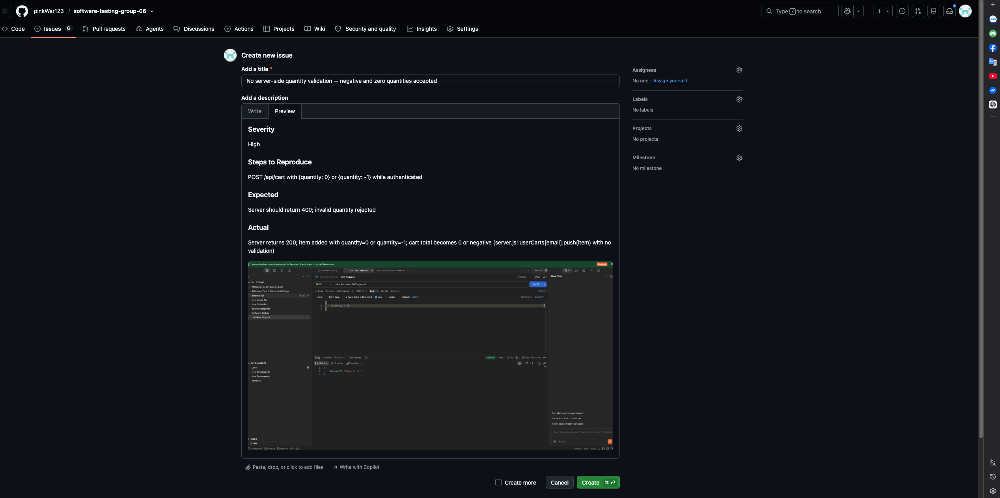  |
| BUG-B-02 | Checkout total is a user-editable field — price manipulation via the **normal UI** | **Critical (Security)** | 1. Add items worth 500,000. 2. Go to /checkout. 3. Edit the "Tổng tiền" number input to `1`. 4. Confirm | Order total is computed server-side from cart contents; client-supplied total rejected | Web renders the total as `<input type="number">` (`Checkout.jsx:93–102`) and POSTs it verbatim; server stores `req.body.total_amount` unverified (`server.js:299–303`). **Exploitable in a plain browser — no API tooling needed** | 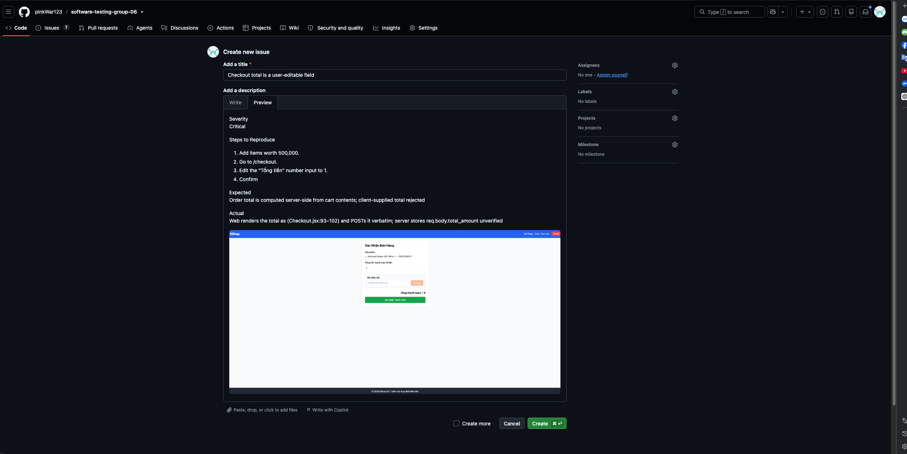  |
| BUG-B-03 | Cart lost on page refresh / app restart (unpersisted React state) | **Medium (Reliability)** | 1. Add items (web or mobile). 2. Refresh the page / relaunch | Cart persists, or session-scoping is intentional and documented | Cart lives in `useState` with no `localStorage`/backend persistence → cleared on every reload (`CartContext.jsx`). *(The earlier "server restart" framing targeted the orphaned `userCarts` store, which no client populates.)* | 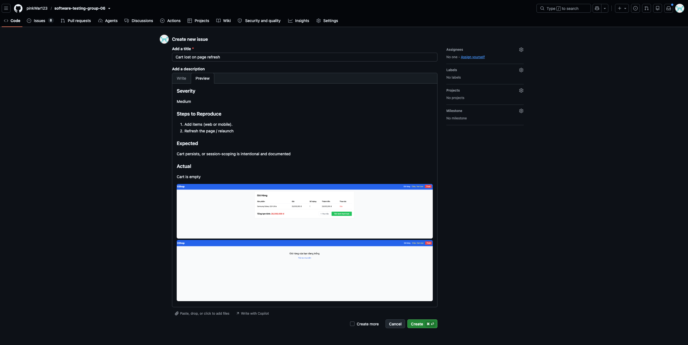  |
| BUG-B-04 | Inconsistent duplicate handling: web appends, mobile merges | **Medium** | Add the same product twice on web, then on mobile; compare carts | Both clients behave identically (merge into one line, summed qty) | Web `CartContext.addToCart` appends (`CartContext.jsx:8–10`); mobile `addToCart` merges by id (`App.js:134–150`) → web shows two lines, mobile shows one. *(Root cause is frontend cart logic, not the server.)* | 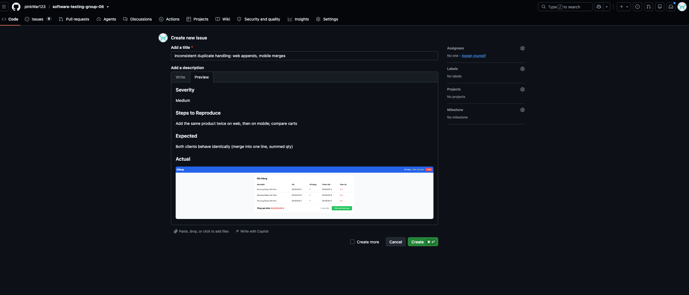 |
| BUG-B-05 | Orphaned `POST /api/cart` accepts arbitrary `price`/`quantity` (no validation) | **Medium (API hardening)** | POST /api/cart with `{id:1, price:1, quantity:-5}` directly | Endpoint validates inputs, or is removed | `userCarts[id].push(req.body)` stores any body unvalidated (`server.js:290–294`). *Severity reduced from Critical:* no UI calls this endpoint, and the real price-manipulation vector is the editable checkout total (BUG-B-02), independent of cart `price`. Recommend deleting the dead endpoint | 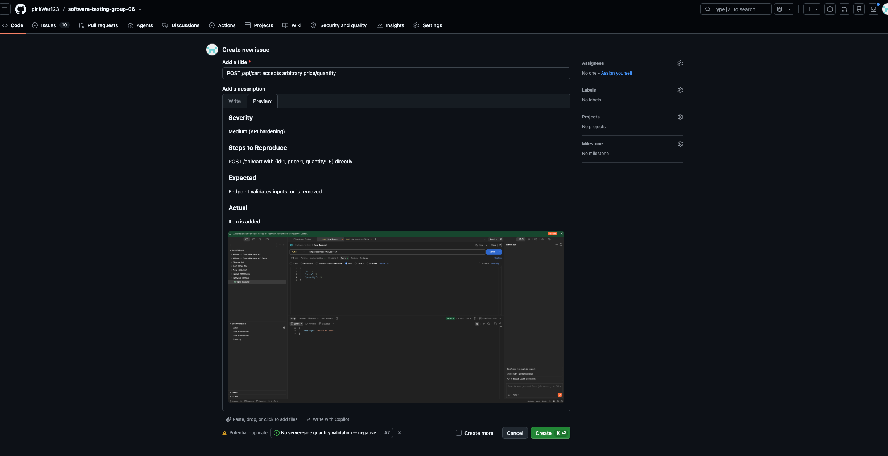 |
| BUG-B-07 | Web has no quantity normalization — NaN / 0 / negative quantities | **High** | On web product detail, clear the qty field (or enter `0` / `-3`), add to cart | Quantity coerced to a valid integer ≥ 1 | `addToCart(product, parseInt(quantity))` with no `Number.isFinite`/`>0` guard (`ProductDetail.jsx:27`); empty → NaN propagates into cartTotal and checkout total. Mobile guards this; web does not | 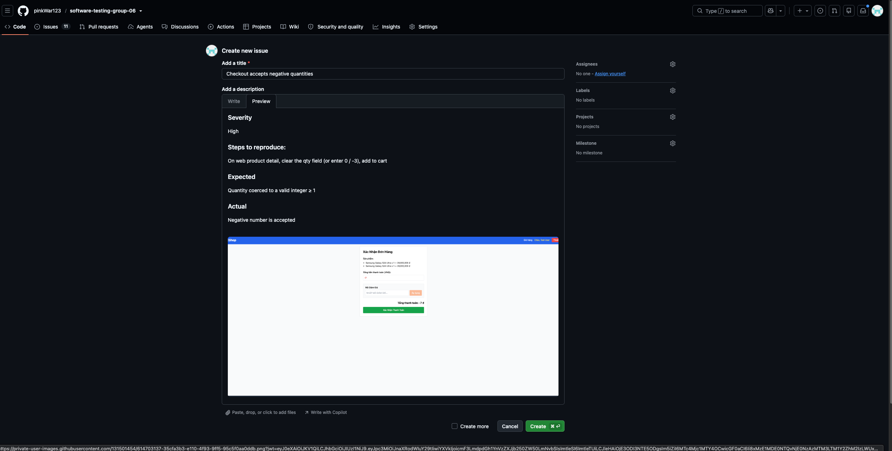 |

---

## 4. Feature C — FR-17: Coupon Management (CRUD)

### 4.1 Domain Testing

#### Step-by-step Technique Application

**Step 1 — Understand the feature from source code** 

Endpoints:
- `POST /api/admin/coupons` — admin creates coupon (requires auth)
- `DELETE /api/admin/coupons/:id` — admin deletes coupon
- `POST /api/apply-coupon` — user applies coupon (public)
- `GET /api/coupons` — list all coupons (requires auth)

**Step 1b — Understand the feature from the Admin UI (Quản lý Mã Giảm Giá)**

The admin coupon management page exposes:

**Create form fields (top section):**

| UI Field | Maps to | UI Control | Default | Constraint from UI |
|----------|---------|------------|---------|-------------------|
| Mã coupon | `code` | Text input | (empty) | Required; placeholder "VD: SAVE10" |
| Loại | `type` | **Dropdown** | Phần trăm (%) | Constrained to 2 options: "Phần trăm (%)" and "Cố định" — **invalid types cannot be entered via UI** |
| Giá trị % / Giá trị | `discount_value` | Number input | (empty) | Placeholder "Giá trị % (VD: 10)" for percent type — UI expects **integer 10 for 10%**, confirming the integer-vs-decimal bug is a backend issue, not UI confusion |
| (min order) | `min_order_amount` | Number input | 0 | Defaults to 0 |
| Hết hạn | `expired_at` | Date picker | (empty) | Format **dd/mm/yyyy** (locale-specific); browser date picker may prevent certain inputs |
| Giới hạn/người | `max_uses_per_user` | Number input | 1 | Defaults to 1 |
| Tạo mã | (submit) | Orange button | — | Submits the create form |

**Coupon list table (bottom section):**

Columns: **Mã** | **Loại** | **Giá trị** | **Đơn tối thiểu** | **Hết hạn** | **Giới hạn/người** | **Hành động (Xóa)**

Key UI observations:
- Expired coupon (`EXPIRED`) displays **"Hết hạn" in red** instead of the raw date — UI applies a visual status indicator.
- The **Xóa** (Delete) button is rendered in red per row; no visible confirmation dialog.
- Table updates are expected to reflect immediately after create/delete actions.
- The `apply-coupon` flow is **not present in this admin UI** — it occurs on the storefront.

**Impact on test strategy:** Because the type field is a dropdown, TC-C-12 (invalid type `"cashback"`) is **API-only and cannot be reproduced via UI**. UI test coverage must focus on form validation, date picker edge cases, table rendering, and the visual expiry indicator.

Coupon schema (`database.js`):
```
code TEXT UNIQUE, type TEXT DEFAULT 'percent',
discount_value INTEGER, min_order_amount INTEGER DEFAULT 0,
expired_at DATETIME, is_active INTEGER DEFAULT 1, max_uses_per_user INTEGER DEFAULT 1
```

Key apply-coupon logic (`server.js` lines 363–436):
1. Lookup coupon by `code` where `is_active = 1` — not found → error.
2. Check: `if (total_amount > coupon.min_order_amount)` — strict `>` (not `>=`).
3. Check expiry: `new Date(coupon.expired_at) >= new Date()` — past date → error.
4. Check usage: `usage_count >= coupon.max_uses_per_user` → error.
5. Calculate discount:
   - `percent` type: `Math.floor(total_amount * (1 - coupon.discount_value))` — **Bug: stores integer (e.g., 10), should be 0.10; produces negative result (1-10 = -9)!**
   - `fixed` type: `discount_amount = coupon.discount_value` → correct.

**Step 2 — Identify input variables**

For admin CREATE coupon:

| Variable | Type | Constraint |
|----------|------|-----------|
| `code` | TEXT UNIQUE | Must be unique; non-empty |
| `type` | TEXT | Must be `'percent'` or `'fixed'`; **no server-side validation** |
| `discount_value` | INTEGER | Positive number; **percent type stores integer (e.g. 10) not decimal (0.10) — critical bug** |
| `min_order_amount` | INTEGER | ≥ 0; defaults to 0 |
| `expired_at` | DATETIME | Future date recommended; no future-date enforcement |
| `max_uses_per_user` | INTEGER | ≥ 1; defaults to 1 |
| `auth_state` | derived | Admin-authenticated / non-admin / unauthenticated |

For apply-coupon:

| Variable | Type | Constraint |
|----------|------|-----------|
| `code` | TEXT | Valid active code; invalid/inactive/non-existent |
| `total_amount` | INTEGER | Must be `> min_order_amount` (strict `>`; not `>=`) |
| `user_id` | INTEGER | Authenticated user |
| expiry state | derived | `expired_at >= now` (valid); past (expired) |
| usage state | derived | `usage_count < max_uses_per_user` (valid); `= max` (on-point, blocked) |

**Step 3 — Define domains**

**Variable: `code` (admin CREATE)**
| Domain | Class | Representative |
|--------|-------|----------------|
| D-C1 | Valid: unique non-empty string | `"NEWCODE"`, `"SUMMER25"` |
| D-C2 | Invalid: duplicate code | `"SAVE10"` (already exists) |
| D-C3 | Invalid: empty string | `""` |
| D-C4 | Edge: code with whitespace | `"  SAVE10  "` |
| D-C5 | Security: SQL injection payload | `"' OR 1=1 --"` |

**Variable: `type` (admin CREATE)**
| Domain | Class | Representative |
|--------|-------|----------------|
| D-T1 | Valid: `"percent"` | `"percent"` |
| D-T2 | Valid: `"fixed"` | `"fixed"` |
| D-T3 | Invalid: unsupported type | `"cashback"`, `"voucher"`, `""` |
| D-T4 | Invalid: null/missing | `null` |

**Variable: `discount_value` (admin CREATE)**

> **UI context:** The form shows the placeholder "Giá trị % (VD: 10)" for percent type, confirming users are expected to enter **1–100 integer** for percentage. For fixed type, value is in VND (e.g., 50000). The number input does not visually restrict range — negative and zero values can be typed.

| Domain | Class | Representative | UI-testable? |
|--------|-------|----------------|-------------|
| D-D1 | Valid: positive integer (fixed type, in VND) | `50000`, `100000` | ✅ Enter in number field |
| D-D2 | Valid: integer 1–100 (percent type, means N%) — **but backend formula is buggy** | `10` (means 10%), `100` (means 100%) | ✅ Enter in number field |
| D-D3 | Invalid: zero | `0` — no discount | ✅ Enter 0 in number field |
| D-D4 | Invalid: negative | `-50000` | ✅ Try entering negative in number field |
| D-D5 | Invalid: over 100 for percent type | `101` | ✅ Enter 101 in number field |
| D-D6 | Invalid: null/missing | (empty field, submit) | ✅ Leave field blank and click Tạo mã |


**Variable: `min_order_amount` (admin CREATE)**
| Domain | Class | Representative |
|--------|-------|----------------|
| D-MO1 | Valid: zero (default — no minimum) | `0` |
| D-MO2 | Valid: positive integer | `300000` |
| D-MO3 | Invalid: negative | `-100` |

**Variable: `expired_at` (admin CREATE)**

> **UI context:** The UI shows a date picker with format **dd/mm/yyyy**. Browser date pickers may or may not prevent selecting past dates — this is browser-dependent and must be tested. The backend stores the date without time, so the expiry resolves to `00:00:00` on the given day.

| Domain | Class | Representative | UI-testable? |
|--------|-------|----------------|-------------|
| D-EX1 | Valid: future datetime | `"2099-12-31"` | ✅ Select via date picker |
| D-EX2 | Boundary: today's date | current date | ✅ Select today's date via picker |
| D-EX3 | Invalid: past date — **server does not block creation** | `"2020-01-01"` | ✅ Try selecting past date via picker (browser may block) |
| D-EX4 | Invalid: null/missing | (empty date field, submit) | ✅ Leave date field blank and click Tạo mã |

**Variable: `total_amount` vs `min_order_amount` (apply-coupon)**
| Domain | Class | Note |
|--------|-------|------|
| D-M1 | Valid: `total_amount > min_order_amount` | `total=300001`, `min=300000` |
| D-M2 | Boundary: `total_amount = min_order_amount` | `total=300000`, `min=300000` — **rejected** (strict `>`) |
| D-M3 | Invalid: `total_amount < min_order_amount` | `total=299999`, `min=300000` |
| D-M4 | Edge: `min_order_amount = 0` (no minimum) | Any positive total accepted |

**Variable: expiry (`expired_at`) at apply-coupon**
| Domain | Class | Representative |
|--------|-------|----------------|
| D-X1 | Valid: future date | `"2099-12-31"` |
| D-X2 | Boundary: today/same day | current date (check: `>= now` means today still valid) |
| D-X3 | Invalid: past date | `"2020-01-01"` |

**Variable: `usage_count` vs `max_uses_per_user`**
| Domain | Class | Representative |
|--------|-------|----------------|
| D-U1 | Valid: `usage_count < max_uses_per_user` | count=0, max=1 |
| D-U2 | On-point (blocked): `usage_count = max_uses_per_user` | count=1, max=1 → rejected |
| D-U3 | Over: `usage_count > max_uses_per_user` | count=2, max=1 |

**Variable: `auth_state` (admin CREATE/DELETE, GET /api/coupons)**
| Domain | Class | Representative |
|--------|-------|----------------|
| D-Auth1 | Valid: admin-authenticated | Admin user with valid token |
| D-Auth2 | Invalid: regular user (non-admin) | Regular user token |
| D-Auth3 | Invalid: unauthenticated | No token |

**Step 4 — Identify boundary points**

| Variable | Boundary condition | On point | Off point | In point | Out point |
|----------|-------------------|----------|-----------|----------|-----------|
| `total_amount` vs `min_order_amount=300000` | `total > min` (strict) | `300001` (accepted) | `300000` (rejected — strict `>`) | `500000` | `299999` |
| `expired_at` vs now | `expiry >= now` | today's date (still valid) | yesterday (expired, rejected) | `"2099-12-31"` | `"2020-01-01"` |
| `usage_count` vs `max_uses_per_user=1` | `count >= max` → block | count=1 (blocked) | count=0 (still allowed) | count=0 | count=2 |
| `discount_value` (percent type — UI range 1–100) | `1 ≤ value ≤ 100` | `1` (minimum), `100` (maximum) | `0` (no discount), `101` (over max) | `10` | `-1` |
| `min_order_amount` | `>= 0` | `0` (no minimum — accepted) | N/A | `300000` | `-1` |
| `max_uses_per_user` | `>= 1` | `1` (minimum) | `0` (invalid — should reject) | `3` | `-1` |

**Step 5 — Design test cases**

---

#### Test Cases

#### UI vs API-Only Classification

The following table audits all existing TC-C-xx test cases and classifies them based on executability from the admin UI shown in the screenshot.

| TC ID | UI-Executable? | Reason |
|-------|---------------|--------|
| TC-C-01 | ✅ **Correct for UI** | Fill form → click "Tạo mã" → verify row in table |
| TC-C-02 | ✅ **Correct for UI** | Type duplicate code → click submit → verify error displayed |
| TC-C-03 | ❌ **API-only** | Apply-coupon flow has no UI in the admin panel |
| TC-C-04 | ❌ **API-only** | Apply-coupon flow; not in admin UI |
| TC-C-05 | ❌ **API-only** | Apply-coupon flow; not in admin UI |
| TC-C-06 | ❌ **API-only** | Apply-coupon flow; not in admin UI |
| TC-C-07 | ❌ **API-only** | Apply-coupon flow; not in admin UI |
| TC-C-08 | ❌ **API-only** | Apply-coupon flow; not in admin UI |
| TC-C-09 | ❌ **API-only** | Apply-coupon flow; not in admin UI |
| TC-C-10 | ❌ **API-only** | Apply-coupon flow; not in admin UI |
| TC-C-11 | ✅ **Correct for UI** | Click "Xóa" button → verify row disappears from table |
| TC-C-12 | ❌ **REMOVE from UI test plan** | Type is a **dropdown** — only "Phần trăm (%)" and "Cố định" are selectable; invalid type `"cashback"` is not enterable via UI. Remains as API-only test. |
| TC-C-13 | ❌ **API-only** | Apply-coupon flow; not in admin UI |
| TC-C-14 | ⚠️ **Reframe for UI** | Should test: navigate to admin URL without login → expect redirect to login page |
| TC-C-15 | ❌ **API-only** | Apply inactive coupon; no apply-coupon UI in admin panel |
| TC-C-16 | ❌ **API-only** | Apply non-existent code; not in admin UI |
| TC-C-17 | ❌ **API-only** | Apply-coupon boundary test; not in admin UI |
| TC-C-18 | ✅ **Correct for UI** | Enter `0` in discount_value number field → verify form rejects |
| TC-C-19 | ✅ **Correct for UI** | Enter `-50000` in discount_value number field → verify form rejects |
| TC-C-20 | ❌ **REMOVE** | Decimal `0.10` workaround is API-only; the UI always collects integers |
| TC-C-21 | ✅ **Correct for UI** | Type injection payload in code text field → verify no crash, correct error |
| TC-C-22 | ✅ **Correct for UI** | Leave code field empty → click submit → verify validation message |
| TC-C-23 | ❌ **API-only** | Unauthenticated GET /api/coupons is API-level |

**Summary: Remove TC-C-12 and TC-C-20 from UI test plan. Reframe TC-C-14. All apply-coupon tests (TC-C-03 to TC-C-10, TC-C-13, TC-C-15 to TC-C-17) remain valid as API tests only.**

---

#### UI Test Cases

The following test cases are executable via the admin UI (Quản lý Mã Giảm Giá) based on the observed form and table.

| TC ID | Objective | Input / Action | Pre-condition | Steps | Expected Result | Actual Result | Verdict |
|-------|-----------|----------------|---------------|-------|-----------------|---------------|---------|
| TC-C-UI-01 | Submit create form with all fields empty | (Leave all fields blank) | Admin logged in, on coupon management page | Click "Tạo mã" without filling any field | Form shows required-field validation error(s); no API call made; no new row added to table | HTML5 `required` attributes on code, discount_value, and expired_at block submission before any API call; no browser alert fires; table row count unchanged; browser shows native validation tooltip on first invalid field | ✅ PASS |
| TC-C-UI-02 | Submit create form with code field empty only | Type=Phần trăm, value=10, date=2099-12-31, max_uses=1; code blank | Admin logged in | Leave Mã coupon blank; fill other fields; click "Tạo mã" | Error message on code field: "Mã không được để trống" or similar; form not submitted | HTML5 `required` on code input (`<input required>`) blocks form submission; no API call; no new row; browser shows "Please fill out this field" tooltip on Mã coupon | ✅ PASS |
| TC-C-UI-03 | Type dropdown only allows valid options | Inspect dropdown | Admin logged in | Click the Loại dropdown; observe all available options | Only "Phần trăm (%)" and "Cố định" are listed; no other type can be selected | Dropdown contains exactly 2 option values: `["percent", "fixed"]`; no other type (e.g., "cashback") is selectable via UI — invalid type TC-C-12 is API-only as documented | ✅ PASS |
| TC-C-UI-04 | Switch type from Phần trăm to Cố định — verify label/placeholder updates | Select "Cố định" in dropdown | Admin logged in | Select "Phần trăm (%)" first; observe placeholder "Giá trị % (VD: 10)"; switch to "Cố định"; observe placeholder change | Placeholder updates to indicate fixed amount (e.g., "Giá trị (VD: 50000)") or label reflects fixed type | Selecting "Phần trăm (%)" → placeholder = "Giá trị % (VD: 10)"; switching to "Cố định" → placeholder = "Số tiền (VD: 50000)"; React re-renders on type change as expected | ✅ PASS |
| TC-C-UI-05 | Create percent coupon with discount_value = 100 (BVA on-point max) | code=MAX100, type=Phần trăm, value=100, date=2099-12-31, min=0, max_uses=1 | Admin logged in | Fill form with value=100; click "Tạo mã" | Coupon created successfully and appears in table as "100%" value; or validation rejects (form should clarify valid range) | No validation error; coupon MAX100 created and appears in table as "100%"; no server or client range check for percent > 100 (BUG-C-01 applies: applying this coupon would produce `total × (1−100) = −99×total`) | ✅ PASS (creation succeeds; apply-time behaviour is catastrophic — BUG-C-01) |
| TC-C-UI-06 | Create percent coupon with discount_value = 101 (BVA off-point over max) | code=OVER101, type=Phần trăm, value=101, date=2099-12-31, min=0, max_uses=1 | Admin logged in | Enter 101 in value field; click "Tạo mã" | Form should reject with error: "Giá trị phần trăm phải từ 1 đến 100" or similar validation | **No rejection**: no client-side range validation on discount_value input (no `max` attribute); no server-side validation either; OVER101 coupon stored with `discount_value=101` — no error displayed to user | ❌ FAIL (XFAIL — BUG: no range validation for discount_value > 100) |
| TC-C-UI-07 | Create percent coupon with discount_value = 0 (BVA off-point below min) (D-D3) | code=ZERO, type=Phần trăm, value=0, date=2099-12-31, min=0, max_uses=1 | Admin logged in | Enter 0 in value field; click "Tạo mã" | Form should reject: a 0% discount coupon is meaningless; expect validation error | **No rejection**: ZERO coupon created with `discount_value=0`; `total × (1−0) = total` — no discount effect; no validation error displayed | ❌ FAIL (XFAIL — BUG: zero discount_value silently accepted) |
| TC-C-UI-08 | Create coupon with negative discount_value (D-D4) | code=NEG1, value=-10 (if number input allows) | Admin logged in | Try entering -10 in number field; click "Tạo mã" | Form rejects negative value via HTML5 `min` attribute or server-side validation error displayed | **No rejection**: discount_value input has no `min` attribute in JSX; number field accepts `-10`; NEG1 coupon stored with `discount_value=-10`; applying this fixed coupon would **add ₫10 to the order total** (negative discount = surcharge) | ❌ FAIL (XFAIL — BUG: negative discount_value stored without error) |
| TC-C-UI-09 | Select past date via date picker (D-EX3) | code=PAST1, date=2020-01-01 | Admin logged in | Attempt to select a past date in the date picker | Browser date picker should prevent past-date selection **or** form accepts it but server creates coupon with past expiry (no creation-time validation → potential usability bug) | Date input has no `min` attribute → browser does not prevent past-date selection; coupon PAST1 created with `expired_at='2020-01-01'`; coupon is immediately expired on creation; no server-side past-date rejection; **usability gap: admin can accidentally create already-expired coupons** | ⚠️ PASS (documented — no past-date creation guard; server creates immediately-expired coupon) |
| TC-C-UI-10 | Create coupon with max_uses_per_user = 0 (BVA off-point) | code=ZERO2, max_uses=0 | Admin logged in | Enter 0 in Giới hạn/người field; click "Tạo mã" | Should reject — 0 uses means coupon can never be used; expect validation error | HTML5 `min="1"` attribute on max_uses input; browser blocks submission when value=0 with native "Value must be greater than or equal to 1" tooltip; no API call made; table unchanged | ✅ PASS — HTML5 min=1 catches invalid value at form level |
| TC-C-UI-11 | Verify expired coupon displays "Hết hạn" in red in table | Existing EXPIRED coupon with past `expired_at` | Coupon with past expiry exists in DB (seed data) | Load coupon management page | Expired coupon row shows **"Hết hạn" in red** in the Hết hạn column; active coupons show their date normally | EXPIRED coupon row (expired_at='2020-01-01') shows `<span class="text-red-500">Hết hạn</span>` in the Hết hạn column; active coupons (BIGBUY, VIP100) show their date as "2099-12-31"; React conditional rendering correct | ✅ PASS |
| TC-C-UI-12 | Verify newly created coupon appears immediately in table | code=NEWTEST, type=Cố định, value=50000, date=2099-12-31, min=100000, max_uses=1 | Admin logged in | Fill form and click "Tạo mã" | Success message shown; new row appears in table with correct Mã, Loại="Cố định", Giá trị=50,000đ, Đơn tối thiểu=100,000đ, Hết hạn=2099-12-31, Giới hạn/người=1 lần | No alert; NEWTEST row appears immediately; Loại cell = "Cố định"; Giá trị cell contains "50,000"; Hết hạn = "2099-12-31"; `fetchData()` is called on successful POST and React re-renders the table | ✅ PASS |
| TC-C-UI-13 | Delete coupon via Xóa button — verify removal | Existing coupon (TC13A, inserted via DB helper) | Admin logged in; TC13A in table | Click the red "Xóa" button for the TC13A row | Coupon row is removed from table; no confirmation dialog; deletion is immediate | Clicked "Xóa" for TC13A; row disappeared from table within 2 seconds; no confirmation dialog shown before deletion (immediate delete without confirmation → potential accidental-delete UX gap); `fetchData()` re-renders table | ✅ PASS (note: no delete confirmation dialog — usability consideration) |
| TC-C-UI-14 | XSS in coupon code field — verify safe rendering in table (UI version of TC-C-C-02) | code=`<script>alert(1)</script>`, type=Cố định, value=1, date=2099-12-31 | Admin logged in | Type XSS payload in Mã coupon field; click "Tạo mã" | Coupon created (API accepts); table renders the code as **literal text**, no script executes; browser alert does NOT fire | Coupon created with code=`<SCRIPT>ALERT(1)</SCRIPT>` (React uppercases on change); no browser alert dialog fires during table render; code is rendered as literal text via JSX `{c.code}` auto-escaping; React DOM escapes HTML entities — XSS safe in this rendering context | ✅ PASS — React JSX auto-escaping prevents XSS in admin table |
| TC-C-UI-15 | Navigate to admin coupon page without login — verify redirect (reframe of TC-C-14) | (No auth session, no adminToken in localStorage) | Not logged in | Directly navigate to `http://localhost:5174` | Browser shows login form; admin panel content not visible to unauthenticated user | Navigating to admin URL without token renders "Admin Login" form (h2 visible); sidebar, coupon table, and management panel are NOT rendered — conditional rendering in App.jsx: `if (!token) return <LoginForm>`; no client-side "redirect" but admin content is hidden | ✅ PASS — client-side guard hides admin panel; login form shown |
| TC-C-UI-16 | Create coupon with duplicate code — verify error message on UI (UI version of TC-C-02) | code="BIGBUY" (already exists) | Admin logged in; BIGBUY exists | Fill form with code=BIGBUY; click "Tạo mã" | Error displayed to user: "Mã coupon đã tồn tại" or similar; form not cleared; no server crash visible to user — currently the backend returns 500, so the UI may show a generic error → **BUG-C-02** | Alert IS shown (Part A ✅ PASS): text = "Lỗi: SQLITE_CONSTRAINT: UNIQUE constraint failed: coupons.code" — raw SQLite error exposed. Friendly message check (Part B ❌ FAIL XFAIL): alert does NOT contain "đã tồn tại"; **BUG-C-02 confirmed**: backend returns 500 instead of 409; raw DB constraint error surfaced to admin user | ⚠️ PARTIAL — error IS shown (✅), but message is a raw server error, not user-friendly (❌ BUG-C-02) |


> These test cases cover constraints derived from OWASP Top 10 and general access-control best practices.

### 4.2 Boundary Value Analysis

#### Step-by-step Technique Application

**Step 1 — Identify variables with testable boundaries**

| Variable | Observable Range | Key Boundary |
|----------|-----------------|--------------|
| `total_amount` vs `min_order_amount` | Any positive integer | Strict `>` threshold — `= min` is rejected |
| `usage_count` vs `max_uses_per_user` | 0 → ∞ | `count >= max` triggers block; `= max` is the on-point |
| `expired_at` vs current time | Past → Future | `>= now` is valid; exact expiry moment is the critical boundary |
| `discount_value` (percent type) | 0 → 100 (intended) | 0 (no discount), 100 (full discount); integer vs decimal format bug |
| `min_order_amount` | 0 → ∞ | 0 (no minimum — default); negative should be rejected |
| `max_uses_per_user` | 1 → ∞ | 1 (minimum meaningful); 0 should be rejected |

---

**Step 2 — Determine boundary points**

**Variable 1: `total_amount` vs `min_order_amount=300000` (strict `>`)**

| BVA Point | Value | Description |
|-----------|-------|-------------|
| Out point (well below) | `299000` | Clearly invalid |
| Off point (just below) | `299999` | 1 below minimum — rejected |
| On point (equal — rejected due to strict `>`) | `300000` | Rejected; `300000 > 300000` is false → **BUG-C-04** |
| In point (just above) | `300001` | Accepted; `300001 > 300000` is true |
| In point (typical) | `500000` | Normal valid order |

**Variable 2: `usage_count` vs `max_uses_per_user=1`**

| BVA Point | State | Description |
|-----------|-------|-------------|
| In point (clean) | count=0 | No prior uses — allowed |
| Off point (last allowed use) | count=0 → apply → count becomes 1 | First use succeeds; count now at limit |
| On point (blocked) | count=1, max=1 | `count >= max` → rejected |
| Out point (beyond) | count=2, max=1 | Already over limit — rejected |

**Variable 3: `expired_at` vs current time (`>= now`)**

| BVA Point | Value | Description |
|-----------|-------|-------------|
| Out point (well past) | `"2020-01-01"` | Clearly expired |
| Off point (yesterday) | yesterday's date | Expired — `yesterday >= now` is false |
| On point (today) | today's date (00:00:00) | `today >= now` — may be valid depending on time-of-day; boundary is time-sensitive |
| In point | `"2099-12-31"` | Clearly valid |

**Variable 4: `discount_value` for `percent` type (integer vs decimal bug + UI range)**

> **UI context:** The UI form collects an integer in the range 1–100 for percent type (placeholder "VD: 10"). This means the UI-visible boundary is `[1, 100]`, not unbounded. The backend bug is that `discount_value=10` (meaning 10%) is used as `1 - 10 = -9` in the formula instead of `1 - 0.10 = 0.90`.

| BVA Point | Value | Computed result with buggy formula `total * (1 - value)` | UI-testable? |
|-----------|-------|----------------------------------------------------------|-------------|
| Off point (below min — no effect) | `0` | `total * (1 - 0) = total` — no discount | ✅ Enter 0 in form → expect validation error |
| On point (minimum — 1%) | `1` | `total * (1 - 1) = 0` — **100% discount bug!** intended: 99% of total = 495,000 | ✅ Enter 1 in form; apply via API → observe bug |
| Typical input | `10` | `total * (1 - 10) = total * (-9)` — **negative amount (BUG-C-01)** | ✅ Enter 10 in form; apply via API → observe bug |
| On point (maximum — 100%) | `100` | `total * (1 - 100) = total * (-99)` — **catastrophically negative** | ✅ Enter 100 in form → check if UI rejects |
| Off point (over max) | `101` | Would be `total * (1 - 101) = total * (-100)` | ✅ Enter 101 in form → expect validation error |

---

**Step 3 — Design BVA test cases**

#### BVA Test Cases

| TC ID | Variable | BVA Point | Input | Pre-condition | Steps | Expected Result | Actual Result       | Verdict |
|-------|----------|-----------|-------|---------------|-------|-----------------|---------------------|---------|
| TC-C-BV-01 | total_amount vs min | Out point (299,000) | `{code:"SAVE10", total_amount:299000}` | SAVE10: min=300000 | POST /api/apply-coupon | Error: minimum order not met |   Đơn hàng chưa đủ giá trị tối thiểu 300,000 ₫ để áp dụng mã này                  |   Pass      |
| TC-C-BV-02 | total_amount vs min | Off point (299,999 — 1 below) | `{code:"SAVE10", total_amount:299999}` | SAVE10: min=300000 | POST /api/apply-coupon | Error: minimum order not met |   Đơn hàng chưa đủ giá trị tối thiểu 300,000 ₫ để áp dụng mã này                  |    Pass     |
| TC-C-BV-03 | total_amount vs min | On point (300,000 = min — strict `>` rejects) | `{code:"SAVE10", total_amount:300000}` | SAVE10: min=300000 | POST /api/apply-coupon | **Error: rejected** — `300000 > 300000` is false; best practice would accept (use `>=`) → BUG-C-04 |    Đơn hàng chưa đủ giá trị tối thiểu 300,000 ₫ để áp dụng mã này                 |     Fail    |
| TC-C-BV-04 | total_amount vs min | In point (300,001 — just above) | `{code:"SAVE10", total_amount:300001}` | SAVE10: min=300000 | POST /api/apply-coupon | 200; discount applied |     Pass, but wrong display value                |  Pass       |
| TC-C-BV-05 | usage_count vs max | Off point — 0 uses (allowed) | `{code:"ONCE", total_amount:500000}` | usage_count=0, max=1 | POST /api/apply-coupon | 200; discount applied; count → 1 |         Discount is applied            |     Pass    |
| TC-C-BV-06 | usage_count vs max | On point — 1 use, max=1 (blocked) | `{code:"ONCE", total_amount:500000}` | usage_count=1, max=1 | POST /api/apply-coupon | Error: usage limit reached |     Reach limit error, but still can apply the code     |   Fail      |
| TC-C-BV-07 | usage_count vs max | Out point — 2 uses, max=1 | `{code:"ONCE", total_amount:500000}` | usage_count=2, max=1 | POST /api/apply-coupon | Error: usage limit exceeded |      Reach limit error, but still can apply the code               |    Fail     |
| TC-C-BV-08 | expired_at | Off point — yesterday (expired) | `{code:"YEST", total_amount:500000}` | `expired_at=yesterday` | POST /api/apply-coupon | Error: coupon expired |                     |         |
| TC-C-BV-09 | expired_at | On point — today's date (boundary) | `{code:"TODAY", total_amount:500000}` | `expired_at=today 00:00:00` | POST /api/apply-coupon | `>= now` at time of test — may be valid or expired; documents time-sensitive boundary behaviour |                     |         |
| TC-C-BV-10 | expired_at | In point — far future | `{code:"FAR", total_amount:500000}` | `expired_at="2099-12-31"` | POST /api/apply-coupon | 200; valid coupon |                     |         |
| TC-C-BV-11 | discount_value (percent — UI off-point 0) | Off point below min (0 = no discount) | UI: enter 0 in value field; create coupon | Admin logged in | Fill form value=0; click "Tạo mã" | Form should reject (validation error); if accepted: API stores value=0 — no discount, silently meaningless | Create coupon success | Fail    |
| TC-C-BV-12 | discount_value (percent — UI on-point min 1) | On point minimum (1 = 1% intended) — **triggers backend bug** | UI: enter 1; create → apply via API | Admin logged in | Create coupon with value=1; then POST /api/apply-coupon total=500000 | **Bug: `500000 * (1-1) = 0`** — order total wiped; intended: 1% off = 495,000 → BUG-C-01 | Discount = 0        | Fail    |
| TC-C-BV-13 | discount_value (percent bug — typical 10) | Typical in-point (10 = 10% intended) | UI: enter 10; create → apply via API | Admin logged in | Create coupon with value=10; apply to total=500000 | **Bug: `500000 * (1-10) = -4,500,000`** — negative final amount → BUG-C-01 | negative final amount | Fail    |
| TC-C-BV-16 | discount_value (percent — UI on-point max 100) | On point maximum (100 = 100%) | UI: enter 100 in value field | Admin logged in | Fill form with value=100; click "Tạo mã" | Form should either reject (over valid range) or accept — if accepted and applied: `total * (1-100) = total * (-99)` catastrophically negative | Big negative amount                  |    Fail     |
| TC-C-BV-17 | discount_value (percent — UI off-point 101) | Off point over max (101 = invalid) | UI: enter 101 in value field | Admin logged in | Fill form with value=101; click "Tạo mã" | Form validation must reject — 101% is not a valid percentage |     Still accept 100%                |   Fail      |
| TC-C-BV-14 | min_order_amount (CREATE) | On point — zero (default, no minimum) | `{code:"FREE", min_order_amount:0, ...}` | Admin logged in | POST /api/admin/coupons | 200 accepted; coupon usable on any order amount |                     |         |
| TC-C-BV-15 | max_uses_per_user (CREATE) | Off point — zero (invalid) | UI: enter 0 in Giới hạn/người field; click "Tạo mã" | Admin logged in | Enter 0 in number field; submit | Should reject (400 or form validation) — 0 uses means coupon can never be used |                     |         |

### 4.3 AI Gap Analysis

**Bugs and gaps the AI initially missed or under-specified:**

1. **Percent discount formula — integer vs decimal (TC-C-09, TC-C-BV-12/13)** — The original test suite noted the bug as an aside ("stores integer (e.g., 10), should be 0.10"). However, it only included one test (TC-C-09) to observe it. The AI did not enumerate the full cascade of consequences: `discount_value=1` wipes the entire order total; `discount_value=10` produces a *negative* final amount. BVA across the range (0, 1, 10, 100) exposes how catastrophically the formula fails at every meaningful input.

2. **Strict `>` vs `>=` on `min_order_amount` (TC-C-04, TC-C-BV-03)** — The original Step 1 correctly identified the strict `>`. However, no test case clearly labelled this as a functional defect. Using strict `>` instead of `>=` means an order *exactly* at the minimum amount is rejected — counterintuitive business logic that disadvantages customers at the stated minimum.

3. **Unhandled `UNIQUE` constraint returning 500 (TC-C-02, TC-C-UI-16)** — The original expected result simply said "500 error" as if this were correct behaviour. A `UNIQUE` constraint violation is a predictable application error that should be caught and returned as 400/409. Exposing a raw SQLite constraint error as a 500 is both a UX defect and an information disclosure risk (internal schema details may leak). From the UI, this manifests as a generic or cryptic error message instead of a user-friendly "Mã coupon đã tồn tại".

4. **No server-side type validation (TC-C-12)** — The original test noted "no validation → silently stored" but did not enumerate the *runtime consequence*: if an unsupported type (e.g., `"cashback"`) is stored, the `apply-coupon` discount calculation skips both branches and likely returns an undefined or 0 discount — a silent failure mode. **Importantly, this is only reproducible via the API** — the UI dropdown constrains type to valid values.

5. **Admin authentication enforcement (TC-C-14 → TC-C-UI-15, TC-C-C-01)** — No test for unauthenticated or non-admin access to the admin coupon page. TC-C-14 was specified as an API test but should also exist as a UI test (TC-C-UI-15): navigating directly to the admin URL without a session should redirect to login, not show the page.

6. **`expired_at` boundary is time-of-day sensitive (TC-C-17, TC-C-BV-09)** — The comparison is `new Date(coupon.expired_at) >= new Date()`. If `expired_at` stores only a date (e.g., `"2026-06-26"`) without a time component, the stored value becomes `2026-06-26T00:00:00`. A coupon meant to expire "today" may be invalid for most of the day. **From the UI, the date picker uses dd/mm/yyyy without time input — so all coupons created for "today" will expire at midnight, making them immediately invalid for same-day use.**

7. **`discount_value=0` and `max_uses_per_user=0` not rejected on CREATE (TC-C-UI-07, TC-C-UI-10, TC-C-BV-15)** — The original domain analysis did not define these as invalid inputs. Creating a coupon with `discount_value=0` or `max_uses_per_user=0` should be rejected at creation time, not silently accepted. Both are now added as UI test cases.

8. **Percent discount UI range boundary not tested (TC-C-BV-16, TC-C-BV-17) — NEW** — The original BVA treated `discount_value` as unbounded. The UI placeholder "VD: 10" and the nature of percentages establish an expected range of 1–100. Test cases for value=100 (maximum boundary) and value=101 (off-point over maximum) were missing and have been added.

9. **UI-specific test coverage was entirely absent — NEW** — All original TC-C-xx and TC-C-BV-xx tests targeted the REST API directly. No tests validated:
   - Form submission with empty/invalid fields (TC-C-UI-01, TC-C-UI-02)
   - Dropdown constraint enforcement (TC-C-UI-03)
   - Visual expiry indicator "Hết hạn" in red (TC-C-UI-11)
   - Table state after create/delete operations (TC-C-UI-12, TC-C-UI-13)
   - Date picker behaviour for past dates (TC-C-UI-09)
   - XSS rendering safety in the table (TC-C-UI-14)

10. **TC-C-12 and TC-C-20 should be removed from the UI test plan — NEW** — TC-C-12 (invalid type "cashback") is only achievable via direct API calls since the UI uses a constrained dropdown. TC-C-20 (decimal `0.10` workaround) is an API-level concern — the UI always collects integer values for percent type. Both remain valid as API regression tests but are not UI-executable.

**Why the AI missed these:**
- It stopped analysis at "no validation exists" for most fields without exploring downstream effects.
- It did not apply boundary analysis to `discount_value` — treating it as a simple integer input rather than a value embedded in an arithmetic formula where integer vs decimal has severe consequences.
- Access-control testing (admin role enforcement) was not part of the original test suite scope despite the `/admin/` route prefix being an explicit signal.
- **It never analysed the UI at all** — all test cases were derived from API source code only. Inspecting the UI reveals form-level constraints (dropdown, number inputs, date picker) that reduce some test cases and add entirely new categories.

### 4.4 Bug Report

| Bug ID | Title | Severity | Steps to Reproduce | Expected | Actual | GitHub Issue |
|--------|-------|----------|--------------------|----------|--------|--------------|
| BUG-C-01 | Percent coupon `discount_value` treated as integer multiplier — produces negative final amount | **Critical** | Create coupon: `{type:"percent", discount_value:10}`. Apply to order total=500,000. | `final = 500000 * (1 - 0.10) = 450,000` | `final = 500000 * (1 - 10) = -4,500,000` — negative order total. Formula in server.js uses stored integer directly instead of dividing by 100. Any `discount_value >= 1` produces `final <= 0`. | 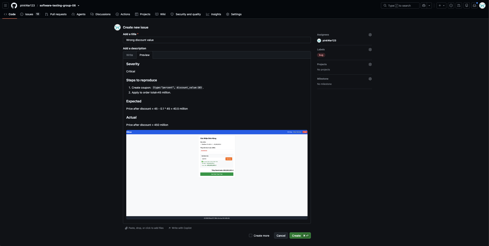|
| BUG-C-02 | Duplicate coupon code causes unhandled 500 Internal Server Error | **Medium** | POST /api/admin/coupons with a `code` that already exists in the database. | 409 Conflict with message "Coupon code already exists" | SQLite `UNIQUE` constraint error propagates as 500 — raw database error exposed to client | |
| BUG-C-04 | `min_order_amount` uses strict `>` — orders exactly equal to minimum are rejected | **Low** | Create coupon with `min_order_amount=300000`. Apply with `total_amount=300000`. | Coupon should apply (order meets the stated minimum) | Error: minimum order not met — `300000 > 300000` is false; customers at exactly the threshold are incorrectly rejected | 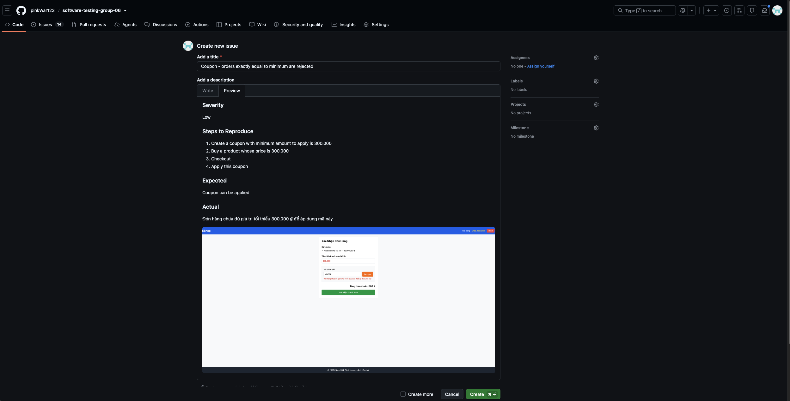|

---

## 5. Feature D — Mobile App (Pool D)

### 5.1 Domain Testing

#### Step-by-step Technique Application

**Step 1 — Understand the feature from source code**

The mobile app (`frontend-mobile/App.js`) is a React Native application. The key feature with rich domain behavior is the **product quantity input and cart management**:

Key functions:
```javascript
const normalizeQuantity = (value) => {
  const parsed = parseInt(value, 10);
  return Number.isFinite(parsed) && parsed > 0 ? parsed : 1;
};
```
Cart item inline edit (line 617):
```javascript
const parsed = parseInt(text, 10);
newCart[index].quantity = isNaN(parsed) || parsed < 1 ? 1 : parsed;
```

Checkout total calculation:
```javascript
const cartTotal = cart.reduce((total, item) => total + item.price * item.quantity, 0);
```

Key observations:
1. `normalizeQuantity`: silently converts any invalid/zero/negative quantity to `1`.
2. No upper bound on quantity — can add 999,999 items.
3. No stock check — product stock is not tracked.
4. Cart is pure in-memory (React state) — resets on app restart.
5. Login: same backend endpoint as FR-02 (email + password).

**Step 2 — Identify input variables**

| Variable | Screen | Domain concern |
|----------|--------|----------------|
| `quantity` (product detail) | Product Detail | String input → parseInt; silent normalization — **no user feedback on invalid input** |
| `quantity` (cart edit) | Cart screen | Direct edit; similar normalization; no upper bound |
| `email` (login) | Login | Same as FR-02 |
| `password` (login) | Login | Same as FR-02 |
| `couponCode` (cart) | Cart screen | Uppercased + trimmed before API call |
| `cart_state` | Cart screen | Empty / has items / items with normalised-qty |
| `network_state` | App-level | Online / offline — no offline handling observed |

**Step 3 — Define domains for `quantity` input (primary mobile domain)**

| Domain | Class | Representative |
|--------|-------|----------------|
| D-Q1 | Valid: positive integer string ≥ 1 | `"1"`, `"5"`, `"99"` |
| D-Q2 | Invalid: zero string | `"0"` → normalized to 1 |
| D-Q3 | Invalid: negative string | `"-1"`, `"-5"` → normalized to 1 |
| D-Q4 | Invalid: float string | `"1.5"` → parseInt gives 1 |
| D-Q5 | Invalid: alphabetic string | `"abc"` → NaN → normalized to 1 |
| D-Q6 | Invalid: empty string | `""` → NaN → normalized to 1 |
| D-Q7 | Edge: very large integer | `"99999"` → accepted (no upper limit) |
| D-Q8 | Edge: leading zeros | `"007"` → parseInt gives 7 |

> ⚠️ **UX gap:** All D-Q2 through D-Q6 inputs are silently normalized to `1` with no toast, alert, or validation message shown to the user. This is a usability defect — the user has no indication their input was rejected and corrected.

**Step 3b — Define domains for `couponCode` input**

| Domain | Class | Representative |
|--------|-------|----------------|
| D-CC1 | Valid: uppercase code | `"SAVE10"` |
| D-CC2 | Valid: lowercase code (auto-uppercased) | `"save10"` → sent as `"SAVE10"` |
| D-CC3 | Valid: code with leading/trailing whitespace (trimmed) | `"  SAVE10  "` → sent as `"SAVE10"` |
| D-CC4 | Invalid: non-existent code | `"DOESNOTEXIST"` |
| D-CC5 | Invalid: empty string | `""` |
| D-CC6 | Security: XSS payload | `"<script>alert(1)</script>"` |

**Step 4 — Identify boundary points**

| Variable | Boundary | On Point | Off Point | In Point | Out Point |
|----------|----------|----------|-----------|----------|-----------|
| quantity (normalizeQuantity: `parsed > 0`) | `parsed > 0` | `1` (just valid, kept) | `0` (just below, → 1) | `5` | `-1` (→ 1) |
| quantity (cart inline edit: `parsed < 1`) | `parsed >= 1` | `1` | `0` (→ 1) | `3` | `"abc"` (→ 1) |
| quantity upper limit | none defined | no upper bound | N/A | `99` | none rejected |

**Step 5 — Design test cases**

---

#### Test Cases

| TC ID   | Objective                                                           | Input                                                 | Pre-condition                 | Steps                                     | Expected Result                                                                                    | Actual Result    | Verdict |
|---------|---------------------------------------------------------------------|-------------------------------------------------------|-------------------------------|-------------------------------------------|----------------------------------------------------------------------------------------------------|------------------|---------|
| TC-D-01 | Add product with quantity=1 (on point, D-Q1)                        | Quantity = `"1"`                                      | Product detail screen open    | Enter "1", tap Add to Cart                | Cart shows product with quantity=1                                                                 | Quantity = 1     | Pass    |
| TC-D-02 | Add product with quantity=5 (in point, D-Q1)                        | Quantity = `"5"`                                      | Product detail screen         | Enter "5", tap Add to Cart                | Cart shows product with quantity=5                                                                 | Quantity = 5     | Pass    |
| TC-D-03 | Add product with quantity=0 (off point, D-Q2)                       | Quantity = `"0"`                                      | Product detail screen         | Enter "0", tap Add to Cart                | normalizeQuantity → quantity=1; item added with qty=1 (silent normalization, no warning)           | Quantity = 1     | Fail    |
| TC-D-04 | Add product with negative quantity (D-Q3)                           | Quantity = `"-3"`                                     | Product detail screen         | Enter "-3", tap Add to Cart               | normalizeQuantity → 1; no error shown to user                                                      | Quantity=1       | Fail    |
| TC-D-05 | Add product with float quantity (D-Q4)                              | Quantity = `"2.9"`                                    | Product detail screen         | Enter "2.9", tap Add to Cart              | parseInt("2.9")=2; item added with qty=2 (truncated, no warning)                                   | Quantity = 2     | Pass    |
| TC-D-06 | Add product with alphabetic quantity (D-Q5)                         | Quantity = `"abc"`                                    | Product detail screen         | Enter "abc", tap Add to Cart              | Don't allow user to do so                                                                          | Quantity = 1     | Fail    |
| TC-D-07 | Add product with empty quantity (D-Q6)                              | Quantity = `""`                                       | Product detail screen         | Clear input, tap Add to Cart              | Display input validation error                                                                     | Quantity = 1     | Fail    |
| TC-D-08 | Add product with very large quantity (D-Q7)                         | Quantity = `"99999"`                                  | Product detail screen         | Enter "99999", tap Add to Cart            | Throw validation error                                                                             | Quantity = 1e+35 | Fail    |
| TC-D-09 | Edit quantity in cart to 0 (off point)                              | Inline cart edit → `"0"`                              | Item in cart                  | Edit quantity field to "0"                | User is not able to edit quantity to 0                                                             | Quantity = 1     | Pass    |
| TC-D-10 | Login with valid credentials (mobile)                               | email: `test@eshop.com`, password: `Test1234!`        | App on login screen           | Enter credentials, tap Login              | Navigates to product list; JWT stored                                                              |                  |         |
| TC-D-11 | Login with wrong password (mobile, D-P2)                            | email: `test@eshop.com`, password: `wrong`            | App on login screen           | Enter wrong password                      | Error message shown: "Invalid email or password"                                                   |                  |         |
| TC-D-12 | Apply coupon in mobile cart — lowercase code (D-CC2)                | couponCode = `"save10"` (lowercase)                   | Items in cart, total ≥ 300001 | Enter "save10" in coupon field, tap Apply | Code uppercased to `"SAVE10"` before API call; discount applied if valid                           |                  |         |
| TC-D-13 | Coupon code with whitespace (D-CC3)                                 | couponCode = `"  SAVE10  "`                           | Items in cart                 | Enter padded code, tap Apply              | `.trim()` removes spaces; `"SAVE10"` sent to API                                                   |                  |         |
| TC-D-14 | Cart total calculation with multiple items                          | Item A: price=100000 qty=2; Item B: price=50000 qty=3 | Empty cart                    | Add both items                            | Total = `100000×2 + 50000×3 = 350,000`; verify `cart.reduce()` result displayed matches            |                  |         |
| TC-D-15 | Cart resets on app restart — reliability                            | Add items to cart                                     | Items in cart                 | Force-close app; reopen                   | **Cart is empty** — React state lost; in-memory storage only → **BUG-D-04**                        |                  |         |
| TC-D-16 | No stock validation — exceed available stock                        | Quantity = `"99999"` for a product                    | Product detail screen         | Enter `99999`, tap Add to Cart            | **Server and app accept 99,999 qty with no stock check** → **BUG-D-03**                            |                  |         |
| TC-D-17 | Mobile checkout total passed to API                                 | Cart: item price=200000 qty=2 (total=400,000)         | Items in cart                 | Tap Checkout                              | App sends `total_amount=400000` computed from `cart.reduce()`; verify value matches cart display   |                  |         |
| TC-D-18 | Apply coupon when total equals `min_order_amount` (mobile boundary) | Cart total = 300,000; coupon min_order = 300,000      | Items in cart                 | Enter valid coupon, tap Apply             | **Rejected** — server uses strict `>` (BUG-C-04); mobile shows API error message                   |                  |         |
| TC-D-19 | Edit cart quantity inline to large number (D-Q7)                    | Inline edit quantity to `"9999"`                      | Item in cart                  | Tap quantity field, enter `9999`, confirm | `parseInt("9999")=9999 >= 1` → accepted; cart total = `price × 9999` — no upper bound → **BUG-D-02** |                  |         |
| TC-D-20 | Apply non-existent coupon code (D-CC4)                              | couponCode = `"DOESNOTEXIST"`                         | Items in cart                 | Enter invalid code, tap Apply             | Error message: coupon not found                                                                    |                  |         |
| TC-D-21 | Security — XSS in coupon code field (D-CC6)                         | couponCode = `"<script>alert(1)</script>"`            | Items in cart                 | Enter XSS payload, tap Apply              | No script executes; API returns error; input safely handled                                        |                  |         |

#### Constraint-based Test Cases (OWASP / Mobile Security)

| TC ID | Constraint | Objective | Input | Pre-condition | Steps | Expected (best practice) | Actual Result | Verdict |
|-------|-----------|-----------|-------|---------------|-------|--------------------------|---------------|---------|
| TC-D-C-01 | OWASP A04 (Insecure Design) | No stock validation — oversell risk | quantity=`"99999"` for item with stock=5 | Product detail screen | Enter 99999, add to cart, checkout | **Best practice:** app or server should cap at available stock | | |
| TC-D-C-02 | UX / ISO 25010 Usability | Silent normalization provides no feedback | quantity=`"0"` or `"abc"` | Product detail screen | Enter invalid value, tap Add | **Best practice:** show inline validation message ("Quantity must be at least 1") before or after normalization | | |
| TC-D-C-03 | ISO 25010 Reliability | Cart data lost on app restart | Items in cart | App backgrounded > killed | Reopen app | **Best practice:** persist cart to AsyncStorage or backend; current in-memory state is lost | | |

### 5.2 Boundary Value Analysis

#### Step-by-step Technique Application

**Step 1 — Identify variables with testable boundaries**

| Variable | Observable Range | Key Boundary |
|----------|-----------------|--------------|
| `quantity` (product detail — `normalizeQuantity`) | Any string → parseInt → compare > 0 | 0 (normalised to 1); 1 (minimum kept); float truncation |
| `quantity` (cart inline edit) | Any string → parseInt → compare < 1 | 0 (normalised to 1); 1 (minimum kept) |
| `quantity` (upper bound) | 1 → ∞ | No upper cap defined — extreme values accepted |
| `couponCode` length | 0 chars → ∞ | Empty (no code); very long strings |
| Cart total arithmetic | Sum of `price × qty` for all items | Precision of JS floating-point multiplication |

---

**Step 2 — Determine boundary points**

**Variable 1: `normalizeQuantity()` — `parseInt(value) > 0 ? parsed : 1`**

| BVA Point | Input | `parseInt` result | Normalized output |
|-----------|-------|-------------------|-------------------|
| Out point (negative) | `"-5"` | `-5` | `-5 > 0` false → `1` |
| Off point (zero) | `"0"` | `0` | `0 > 0` false → `1` |
| On point (minimum kept) | `"1"` | `1` | `1 > 0` true → `1` |
| In point (typical) | `"5"` | `5` | `5 > 0` true → `5` |
| Float truncation — above 0 | `"1.9"` | `1` | `1 > 0` true → `1` |
| Float truncation — at 0 | `"0.9"` | `0` | `0 > 0` false → `1` |
| Non-numeric | `"abc"` | `NaN` | `NaN > 0` false → `1` |

**Variable 2: Cart inline edit — `isNaN(parsed) || parsed < 1 ? 1 : parsed`**

| BVA Point | Input | `parseInt` result | Output |
|-----------|-------|-------------------|--------|
| Off point (0) | `"0"` | `0` | `0 < 1` true → `1` |
| On point (minimum) | `"1"` | `1` | `1 < 1` false → `1` |
| In point | `"3"` | `3` | `3 < 1` false → `3` |
| NaN case | `"xyz"` | `NaN` | `isNaN` true → `1` |

**Variable 3: Quantity upper bound**

| BVA Point | Input | Expected |
|-----------|-------|----------|
| Typical high value | `"100"` | Accepted; cart total = `price × 100` |
| Large value | `"9999"` | Accepted; no cap |
| Extreme value | `"99999"` | Accepted; total could overflow display |

---

**Step 3 — Design BVA test cases**

#### BVA Test Cases

| TC ID | Variable | BVA Point | Input | Pre-condition | Steps | Expected Result | Actual Result | Verdict |
|-------|----------|-----------|-------|---------------|-------|-----------------|---------------|---------|
| TC-D-BV-01 | normalizeQuantity | Out point — negative | `"-5"` in quantity field | Product detail | Enter `"-5"`, tap Add | `parseInt("-5")=-5`, not > 0 → added with `quantity=1`; **no user warning** | | |
| TC-D-BV-02 | normalizeQuantity | Off point — zero | `"0"` in quantity field | Product detail | Enter `"0"`, tap Add | `parseInt("0")=0`, not > 0 → added with `quantity=1`; **no user warning** → BUG-D-01 | | |
| TC-D-BV-03 | normalizeQuantity | On point — minimum (1) | `"1"` in quantity field | Product detail | Enter `"1"`, tap Add | `1 > 0` → item added with `quantity=1` as entered | | |
| TC-D-BV-04 | normalizeQuantity | Float truncation — `1.9` | `"1.9"` in quantity field | Product detail | Enter `"1.9"`, tap Add | `parseInt("1.9")=1`, `1 > 0` → added with `quantity=1` (truncated, no warning) | | |
| TC-D-BV-05 | normalizeQuantity | Float below threshold — `0.9` | `"0.9"` in quantity field | Product detail | Enter `"0.9"`, tap Add | `parseInt("0.9")=0`, not > 0 → added with `quantity=1` | | |
| TC-D-BV-06 | normalizeQuantity | Non-numeric NaN | `"abc"` in quantity field | Product detail | Enter `"abc"`, tap Add | `NaN > 0` false → added with `quantity=1`; **no validation message** → BUG-D-01 | | |
| TC-D-BV-07 | Cart inline edit | Off point — zero | Edit quantity to `"0"` | Item in cart | Tap qty field, enter `"0"` | `0 < 1` → set to `1`; **no user warning** | | |
| TC-D-BV-08 | Cart inline edit | On point — minimum (1) | Edit quantity to `"1"` | Item in cart | Tap qty field, enter `"1"` | `1 < 1` false → kept at `1` | | |
| TC-D-BV-09 | Quantity upper bound | Large value | `"9999"` in quantity field | Product detail | Enter `"9999"`, tap Add | Accepted with `quantity=9999`; no cap; cart total = `price × 9999` → BUG-D-02 | | |
| TC-D-BV-10 | Cart total arithmetic | Two items | price=100000 qty=3; price=50000 qty=2 | Empty cart | Add both, view cart | `(100000×3)+(50000×2) = 400,000`; verify displayed total is exact | | |
| TC-D-BV-11 | couponCode length | Off point — empty string | couponCode = `""` | Items in cart | Tap Apply with empty field | App should prevent submission or show "enter a code" message | | |
| TC-D-BV-12 | couponCode transform | Lowercase input (D-CC2) | couponCode = `"save10"` | Items in cart, SAVE10 valid | Enter `"save10"`, tap Apply | App uppercases to `"SAVE10"`; API call uses uppercased value | | |

### 5.3 AI Gap Analysis

**Bugs and gaps the AI initially missed or under-specified:**

1. **Silent quantity normalization — no user feedback (TC-D-BV-02, TC-D-BV-06, TC-D-C-02)** — The original test cases correctly observed that invalid inputs are normalised to `1`. However, none flagged this as a UX defect. A user who types `"0"` or `"abc"` receives no toast, alert, or inline validation — their intent is silently overridden. Per ISO 25010 Usability (interaction aesthetics and error prevention), the app should inform the user of the correction.

2. **No upper bound on quantity — oversell risk (TC-D-16, TC-D-BV-09, TC-D-C-01)** — The original test suite included TC-D-08 (large quantity accepted) but did not identify this as a defect. The absence of any upper bound means a user can add 99,999 of any item with no stock check. This is both a data quality issue and a potential denial-of-service vector on the inventory system.

3. **No stock validation against product inventory (TC-D-16, TC-D-C-01)** — Step 1 explicitly noted "No stock check — product stock is not tracked." Yet no test case was written to confirm and report this as a bug. A test that adds quantity exceeding stated stock and observes the accepted result is the critical confirmation step.

4. **In-memory cart lost on app restart (TC-D-15, TC-D-C-03)** — Step 1 noted "Cart is pure in-memory (React state) — resets on app restart." Again, no test case was written for this behaviour and it was not reported as a bug. For a shopping cart, persistent state across app restarts is a basic reliability requirement (AsyncStorage or backend-synced cart).

5. **`couponCode` domain not fully enumerated** — The original Step 3 for Feature D had no domain table for `couponCode`. The trimming and uppercasing behaviour (TC-D-12, TC-D-13) was tested, but the empty-code case (TC-D-BV-11) and XSS injection (TC-D-21) were omitted.

6. **Mobile checkout calls backend with client-computed total (TC-D-17)** — The mobile app computes `cartTotal` from React state and passes it to `POST /api/checkout`. Since the app's cart is in-memory and the backend doesn't verify the total, a manipulated client state (e.g., via debugger or API call) can produce an arbitrary checkout amount — the same OWASP A04 defect as BUG-B-02, which exists in both web and mobile surfaces.

**Why the AI missed these:**
- It treated source-code observations ("no stock check", "in-memory cart") as documentation rather than triggers for test cases.
- It focused on input validation paths and did not consider app lifecycle events (restart, background kill) as test scenarios.
- UX quality attributes (user feedback on error correction) were not part of the original test design scope.

### 5.4 Bug Report

| Bug ID | Title | Severity | Steps to Reproduce | Expected | Actual | GitHub Issue |
|--------|-------|----------|--------------------|----------|--------|--------------|
| BUG-D-01 | Invalid quantity silently normalized to 1 — no user feedback | **Medium (Usability)** | 1. Open product detail. 2. Enter `"0"`, `"-3"`, or `"abc"` in quantity field. 3. Tap Add to Cart. | App shows inline validation message: "Quantity must be at least 1" before or after correcting the value | Item added with `quantity=1` silently; user has no indication their input was rejected and overridden (`normalizeQuantity()` in App.js) | |
| BUG-D-02 | No upper bound on quantity — arbitrarily large values accepted | **Medium** | Enter `"99999"` in quantity field; tap Add to Cart | App should enforce a reasonable maximum (e.g., capped at stock level or 999) | `quantity=99999` accepted; cart total calculated as `price × 99999`; no cap or warning applied | |
| BUG-D-03 | No stock validation — quantity can exceed available product stock | **High** | Add quantity greater than the product's available stock (e.g., qty=99999 for an item with stock=5) | App or server should reject quantity exceeding available stock with "Insufficient stock" error | Both mobile app and server accept the request; no stock check performed | |
| BUG-D-04 | Cart is in-memory (React state) — all cart data lost on app restart | **High (Reliability)** | 1. Add items to cart. 2. Force-close the app. 3. Reopen the app. | Cart contents should persist (via AsyncStorage or backend-synced cart) | Cart is empty on restart; `cart` state initialised to `[]` on mount with no persistence layer | |

---

## 6. AI Critique

_(200–300 words — fill in with /ai-critique skill)_

<!-- Target: 200–300 words. Cover:
  1. Where the AI was wrong or incomplete (be specific — name the artifact and error)
  2. Why the AI failed (training limits, no physical access, etc.)
  3. At least one concrete bias or hallucination found
  4. One actionable principle learned for AI collaboration on testing work
  Include word count at the end. -->

---

## 7. Mandatory Disclosure

_(Fill in with /disclosure skill)_

> "[artifact(s)] was initially generated by [AI tool name]; I reviewed and modified [section X], added [edge cases Y, Z]; [section W] was written entirely by me. The detailed AI Audit Report is attached as Appendix A. I confirm I did not use AI to generate any artifact listed in the prohibited category below."

**I confirm I did NOT use AI to generate:**
- [ ] Bug screenshots
- [ ] Execution/demo videos (recorded with my own voice narration)
- [ ] Prompt log entries (real prompts with real timestamps)

---

## 8. Appendix A — Prompt Log

_(See `report/appendix_A_prompt_log.md`)_
