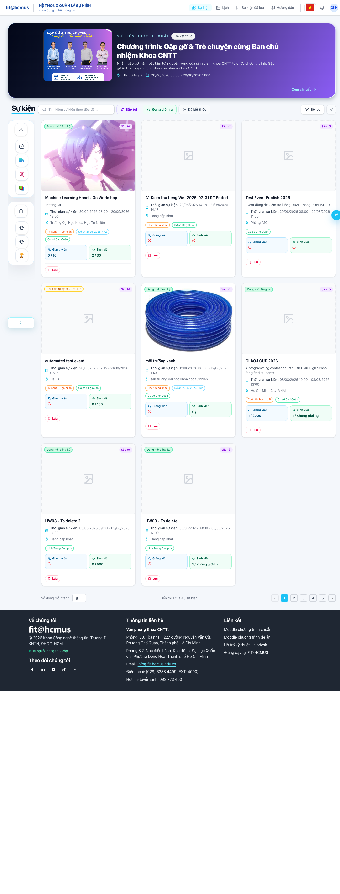
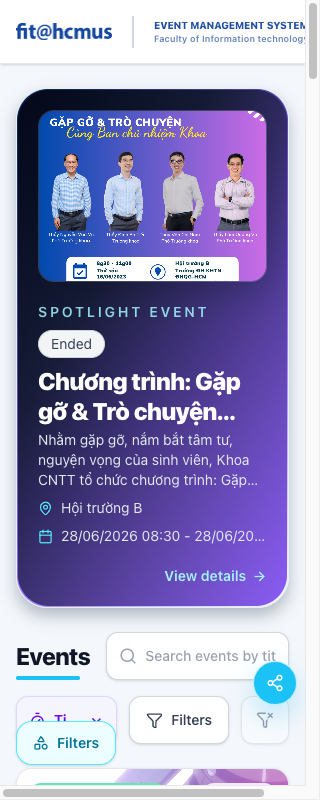
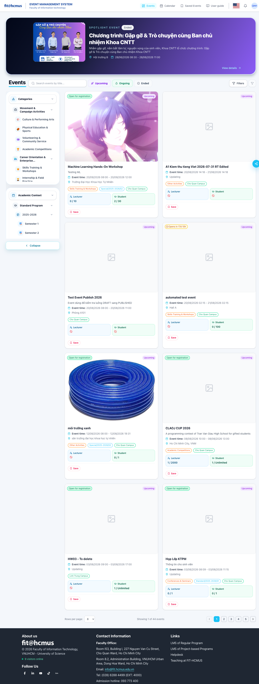
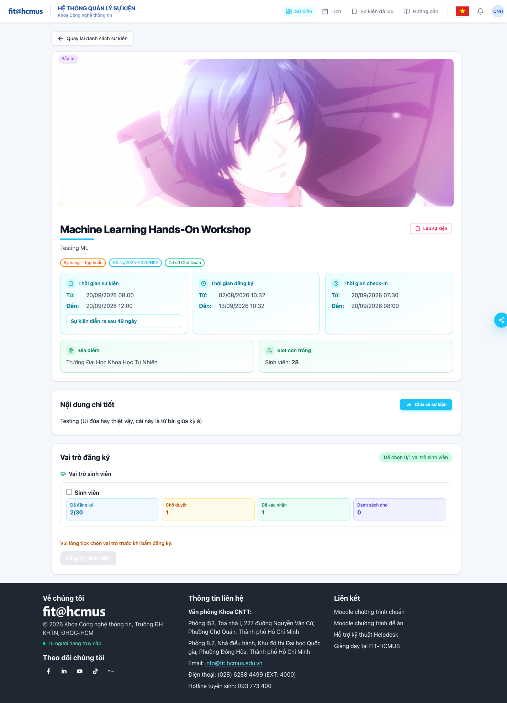
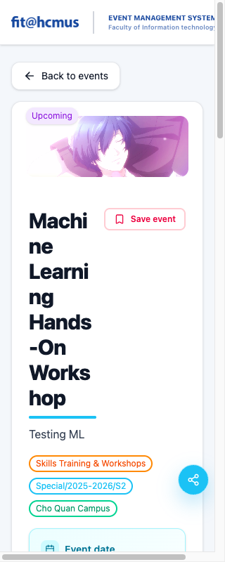
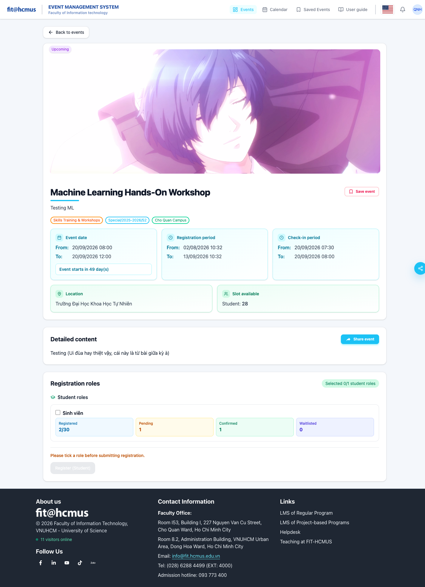
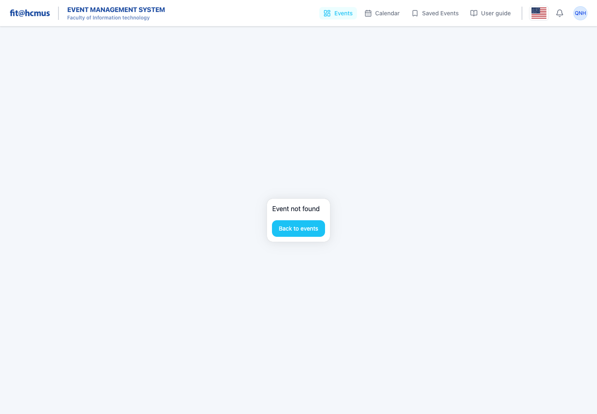
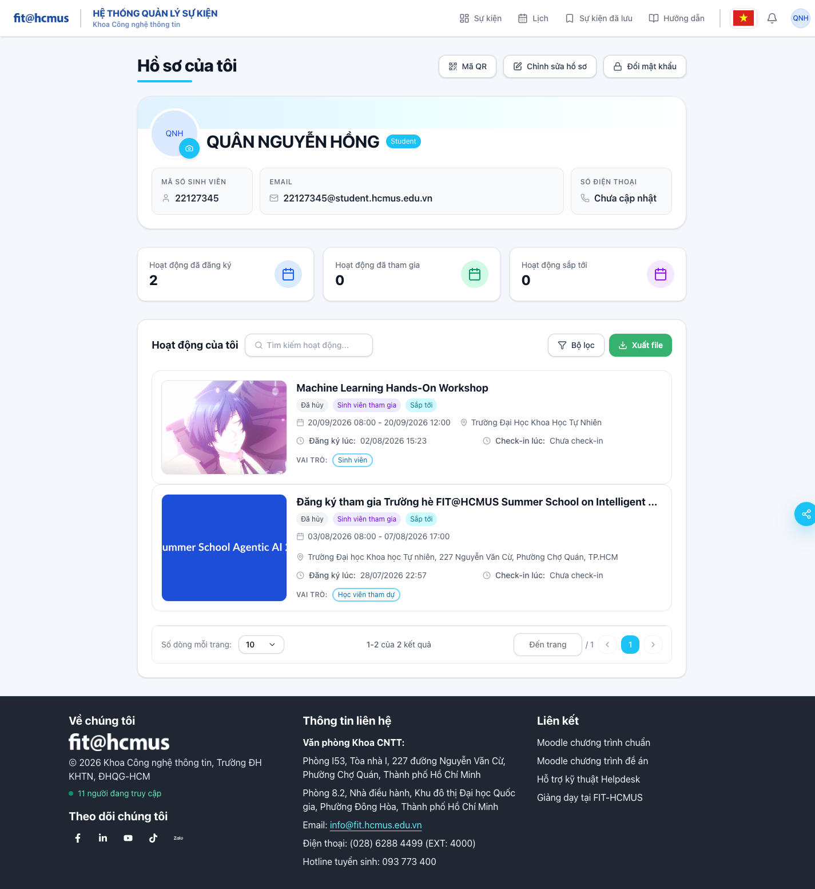
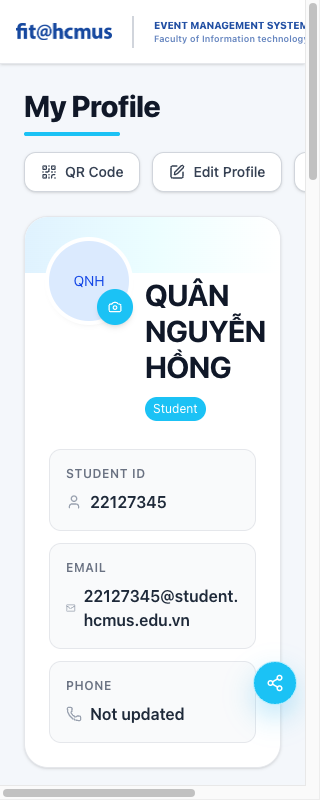
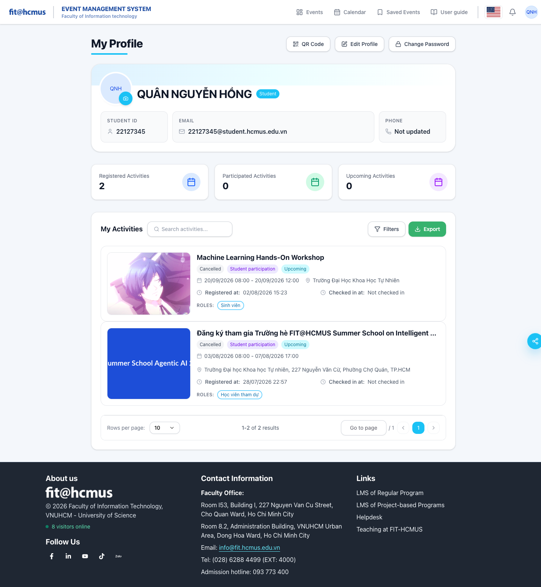

# Task 1B – Shared Checklist Execution

**Student:** Nguyễn Hồng Quân (22127345)

**Scenario:** B – User registers to attend an event

**SUT:** `https://prod-dev.ems-fitus.cloud/`

**Execution date:** 02/08/2026

**Desktop viewport:** 1440 × 1000

**Mobile viewport:** 320 × 800
**Accessibility target:** WCAG 2.1 A/AA using axe-core 4.12 through Playwright/Chrome

## Result convention and evidence boundary

Every one of the 48 shared items has a binary result on each selected screen (144 rows). `Passed` means no violation was observed in the controls and states present on that screen during this execution. Where the screen does not contain the widget named by a checklist item, the binary-only convention treats the item as Passed because no contrary behavior was observable; it does **not** claim that the absent widget was tested.

The completed execution included visual inspection, EN/VI switching, responsive checks, accessibility scans, keyboard interaction, empty-search handling, valid and invalid deep links, registration/cancellation behavior, fault handling, duplicate-submit protection, recovery behavior, toast presentation, and real-time state checks.

## Screen selection and rationale

| Screen | Route/state | Function in Scenario B | Selection rationale |
| --- | --- | --- | --- |
| B1 – Home / Events listing | `/dashboard` | Discover events using carousel, search, categories, filters, and pagination | Entry point for the participant journey and the richest navigation/list screen in Scenario B. |
| B2 – Event detail | `/events/68` – “Machine Learning Hands-On Workshop” | Review schedule, capacity, roles, and start/cancel registration | Event 68 was upcoming and open for Student registration during execution, so it exposed the complete registration decision state. |
| B4 – My Profile / Activities and QR | `/profile` | Review participation history/status and open the check-in QR | Production EMS has no distinct B3 registration-form route: role selection and registration occur on B2. B4 provides a third distinct suggested Scenario B screen and covers status/history/QR behavior. |

## B1 – Home / Events listing

| Checklist ID | Interface aspect | Result | Notes required if Failed | Screenshot reference |
| --- | --- | --- | --- | --- |
| GUI-01-01 | IA-01 | Passed |  |  |
| GUI-01-02 | IA-01 | Passed |  |  |
| GUI-01-03 | IA-01 | Passed |  |  |
| GUI-01-04 | IA-01 | Passed |  |  |
| GUI-01-05 | IA-01 | Passed |  |  |
| GUI-01-06 | IA-01 | Passed |  |  |
| GUI-01-07 | IA-01 | Failed | Vietnamese mode leaves the browser title as “Dashboard” and accessible control names such as “Switch language” and “Notifications” in English. |  |
| GUI-01-08 | IA-01 | Passed |  |  |
| GUI-01-09 | IA-01 | Passed |  |  |
| GUI-01-10 | IA-01 | Failed | At 320 px, the header and controls overflow horizontally; a horizontal scrollbar is visible and navigation content is clipped. |  |
| GUI-01-11 | IA-01 | Failed | Axe found critical unnamed buttons and an unnamed select, invalid ARIA, serious low-contrast text/badges, and SVG images without accessible text. |  |
| GUI-01-12 | IA-01 | Passed |  |  |
| GUI-02-01 | IA-02 | Passed |  |  |
| GUI-02-02 | IA-02 | Failed | The visible filter `<select>` has no accessible name or associated label (`select-name`, critical). |  |
| GUI-02-03 | IA-02 | Passed |  |  |
| GUI-02-04 | IA-02 | Passed |  |  |
| GUI-02-05 | IA-02 | Passed |  |  |
| GUI-02-06 | IA-02 | Passed |  |  |
| GUI-02-07 | IA-02 | Passed |  |  |
| GUI-02-08 | IA-02 | Passed |  |  |
| GUI-02-09 | IA-02 | Passed |  |  |
| GUI-02-10 | IA-02 | Passed |  |  |
| GUI-02-11 | IA-02 | Passed |  |  |
| GUI-02-12 | IA-02 | Passed |  |  |
| GUI-02-13 | IA-02 | Passed |  |  |
| GUI-03-01 | IA-03 | Passed |  |  |
| GUI-03-02 | IA-03 | Passed |  |  |
| GUI-03-03 | IA-03 | Passed |  |  |
| GUI-03-04 | IA-03 | Passed |  |  |
| GUI-03-05 | IA-03 | Failed | Search and filters are visible, but the listing does not expose the total number of matching results; pagination also has unnamed previous/next controls. |  |
| GUI-03-06 | IA-03 | Passed |  |  |
| GUI-03-07 | IA-03 | Passed |  |  |
| GUI-03-08 | IA-03 | Passed |  |  |
| GUI-03-09 | IA-03 | Passed |  |  |
| GUI-03-10 | IA-03 | Passed |  |  |
| GUI-03-11 | IA-03 | Failed | The filter select has no accessible name and the pagination arrow buttons have no discernible names, preventing reliable screen-reader/keyboard identification. |  |
| GUI-03-12 | IA-03 | Passed |  |  |
| GUI-04-01 | IA-04 | Passed |  |  |
| GUI-04-02 | IA-04 | Passed |  |  |
| GUI-04-03 | IA-04 | Passed |  |  |
| GUI-04-04 | IA-04 | Failed | The featured carousel has no visible pause/stop control, and axe found SVG images exposed with image roles but without accessible text. |  |
| GUI-04-05 | IA-04 | Passed |  |  |
| GUI-04-06 | IA-04 | Passed |  |  |
| GUI-04-07 | IA-04 | Passed |  |  |
| GUI-04-08 | IA-04 | Passed |  |  |
| GUI-04-09 | IA-04 | Passed |  |  |
| GUI-04-10 | IA-04 | Passed |  |  |
| GUI-04-11 | IA-04 | Passed |  |  |

## B2 – Event detail

| Checklist ID | Interface aspect | Result | Notes required if Failed | Screenshot reference |
| --- | --- | --- | --- | --- |
| GUI-01-01 | IA-01 | Passed |  |  |
| GUI-01-02 | IA-01 | Passed |  |  |
| GUI-01-03 | IA-01 | Passed |  |  |
| GUI-01-04 | IA-01 | Passed |  |  |
| GUI-01-05 | IA-01 | Passed |  |  |
| GUI-01-06 | IA-01 | Passed |  |  |
| GUI-01-07 | IA-01 | Failed | In Vietnamese mode, the Student-role checkbox keeps the mixed-language accessible name “Select Sinh viên”; common header control names also remain English. |  |
| GUI-01-08 | IA-01 | Passed |  |  |
| GUI-01-09 | IA-01 | Passed |  |  |
| GUI-01-10 | IA-01 | Failed | At 320 px, a horizontal scrollbar appears and the event title is forced into extremely narrow one/two-syllable lines while the header is clipped. |  |
| GUI-01-11 | IA-01 | Failed | Axe found invalid ARIA, six low-contrast nodes, nested interactive controls, and SVG images without accessible text. |  |
| GUI-01-12 | IA-01 | Passed |  |  |
| GUI-02-01 | IA-02 | Failed | A registration role must be selected before the Register button enables, but the role choice has no required marker or explanation of the required-field convention. |  |
| GUI-02-02 | IA-02 | Passed |  |  |
| GUI-02-03 | IA-02 | Passed |  |  |
| GUI-02-04 | IA-02 | Passed |  |  |
| GUI-02-05 | IA-02 | Passed |  |  |
| GUI-02-06 | IA-02 | Passed |  |  |
| GUI-02-07 | IA-02 | Passed |  |  |
| GUI-02-08 | IA-02 | Passed |  |  |
| GUI-02-09 | IA-02 | Passed |  |  |
| GUI-02-10 | IA-02 | Passed |  |  |
| GUI-02-11 | IA-02 | Passed |  |  |
| GUI-02-12 | IA-02 | Passed |  |  |
| GUI-02-13 | IA-02 | Passed |  |  |
| GUI-03-01 | IA-03 | Passed |  |  |
| GUI-03-02 | IA-03 | Failed | Axe reports the registration-role card as a nested interactive control with focusable descendants, creating ambiguous focus and screen-reader behavior. |  |
| GUI-03-03 | IA-03 | Passed |  |  |
| GUI-03-04 | IA-03 | Passed |  |  |
| GUI-03-05 | IA-03 | Passed |  |  |
| GUI-03-06 | IA-03 | Passed |  |  |
| GUI-03-07 | IA-03 | Passed |  |  |
| GUI-03-08 | IA-03 | Failed | Deep-linking to missing event `/events/999999` renders a blank content area with only “Back to events”; it does not explain that the event is missing/unavailable. |  |
| GUI-03-09 | IA-03 | Passed |  |  |
| GUI-03-10 | IA-03 | Passed |  |  |
| GUI-03-11 | IA-03 | Passed |  |  |
| GUI-03-12 | IA-03 | Passed |  |  |
| GUI-04-01 | IA-04 | Passed |  |  |
| GUI-04-02 | IA-04 | Passed |  |  |
| GUI-04-03 | IA-04 | Passed |  |  |
| GUI-04-04 | IA-04 | Failed | The role/status region contains nested interactive semantics and axe found SVG images with image roles but no accessible text. |  |
| GUI-04-05 | IA-04 | Passed |  |  |
| GUI-04-06 | IA-04 | Passed |  |  |
| GUI-04-07 | IA-04 | Passed |  |  |
| GUI-04-08 | IA-04 | Passed |  |  |
| GUI-04-09 | IA-04 | Passed |  |  |
| GUI-04-10 | IA-04 | Passed |  |  |
| GUI-04-11 | IA-04 | Passed |  |  |

## B4 – My Profile / Activities and QR

| Checklist ID | Interface aspect | Result | Notes required if Failed | Screenshot reference |
| --- | --- | --- | --- | --- |
| GUI-01-01 | IA-01 | Passed |  |  |
| GUI-01-02 | IA-01 | Passed |  |  |
| GUI-01-03 | IA-01 | Passed |  |  |
| GUI-01-04 | IA-01 | Passed |  |  |
| GUI-01-05 | IA-01 | Passed |  |  |
| GUI-01-06 | IA-01 | Passed |  |  |
| GUI-01-07 | IA-01 | Failed | In Vietnamese mode, accessible names remain English (“Switch language,” “Notifications,” and “Go to page”), producing mixed-language assistive output. |  |
| GUI-01-08 | IA-01 | Passed |  |  |
| GUI-01-09 | IA-01 | Passed |  |  |
| GUI-01-10 | IA-01 | Failed | At 320 px, the header and action row exceed the viewport, the third action is clipped, and a horizontal scrollbar is visible. |  |
| GUI-01-11 | IA-01 | Failed | Axe found invalid ARIA, two critical unnamed pagination buttons, three serious contrast failures, and SVG images without accessible text. |  |
| GUI-01-12 | IA-01 | Passed |  |  |
| GUI-02-01 | IA-02 | Passed |  |  |
| GUI-02-02 | IA-02 | Passed |  |  |
| GUI-02-03 | IA-02 | Passed |  |  |
| GUI-02-04 | IA-02 | Passed |  |  |
| GUI-02-05 | IA-02 | Passed |  |  |
| GUI-02-06 | IA-02 | Passed |  |  |
| GUI-02-07 | IA-02 | Passed |  |  |
| GUI-02-08 | IA-02 | Passed |  |  |
| GUI-02-09 | IA-02 | Passed |  |  |
| GUI-02-10 | IA-02 | Passed |  |  |
| GUI-02-11 | IA-02 | Passed |  |  |
| GUI-02-12 | IA-02 | Passed |  |  |
| GUI-02-13 | IA-02 | Passed |  |  |
| GUI-03-01 | IA-03 | Passed |  |  |
| GUI-03-02 | IA-03 | Failed | Escape does not close the QR overlay, and Tab can move focus to the underlying “Edit Profile” button instead of remaining trapped in the open dialog. |  |
| GUI-03-03 | IA-03 | Passed |  |  |
| GUI-03-04 | IA-03 | Passed |  |  |
| GUI-03-05 | IA-03 | Failed | Activity pagination does not display the total matching result count, and previous/next controls have no discernible accessible names. |  |
| GUI-03-06 | IA-03 | Passed |  |  |
| GUI-03-07 | IA-03 | Passed |  |  |
| GUI-03-08 | IA-03 | Passed |  |  |
| GUI-03-09 | IA-03 | Passed |  |  |
| GUI-03-10 | IA-03 | Passed |  |  |
| GUI-03-11 | IA-03 | Passed |  |  |
| GUI-03-12 | IA-03 | Passed |  |  |
| GUI-04-01 | IA-04 | Passed |  |  |
| GUI-04-02 | IA-04 | Passed |  |  |
| GUI-04-03 | IA-04 | Passed |  |  |
| GUI-04-04 | IA-04 | Failed | Axe found SVG images exposed as images without accessible text; unnamed pagination controls also communicate state/action only visually. |  |
| GUI-04-05 | IA-04 | Passed |  |  |
| GUI-04-06 | IA-04 | Passed |  |  |
| GUI-04-07 | IA-04 | Passed |  |  |
| GUI-04-08 | IA-04 | Passed |  |  |
| GUI-04-09 | IA-04 | Passed |  |  |
| GUI-04-10 | IA-04 | Passed |  |  |
| GUI-04-11 | IA-04 | Failed | The QR overlay cannot be dismissed with Escape and does not trap focus; this violates two of the required consistent overlay behaviors. |  |

## Bug reports

| Bug ID | Screen | Steps to reproduce | Expected | Actual | Severity | Screenshot |
| --- | --- | --- | --- | --- | --- | --- |
| BUG-I18N-01 | B1, B2, B4 | Log in; switch language to Tiếng Việt; inspect visible strings, tab titles, and accessible names. | All UI strings and accessible names use Vietnamese; title and locale state are consistent. | English names remain in all three screens; B1 title remains “Dashboard”; B2 exposes “Select Sinh viên”; B4 exposes “Switch language,” “Notifications,” and “Go to page.” | Medium | `B1_GUI-01-07_BUG-B1-I18N.png`, `B2_GUI-01-07_BUG-B2-I18N.png`, `B4_GUI-01-07_BUG-B4-I18N.png` |
| BUG-B1-RESP-01 | B1 | Open `/dashboard`; resize viewport to 320 × 800. | Content reflows without horizontal scrolling and all navigation remains reachable. | A horizontal scrollbar appears and header/control content is clipped. | High | `B1_GUI-01-10_BUG-B1-MOBILE-OVERFLOW.png` |
| BUG-B2-RESP-01 | B2 | Open `/events/68`; resize viewport to 320 × 800. | Event detail reflows into readable mobile lines without horizontal scrolling. | Horizontal overflow occurs and the title collapses into extremely narrow fragments. | High | `B2_GUI-01-10_BUG-B2-MOBILE-OVERFLOW.png` |
| BUG-B4-RESP-01 | B4 | Open `/profile`; resize viewport to 320 × 800. | Profile actions and content fit within the viewport. | Horizontal overflow appears and an action control is clipped off-screen. | High | `B4_GUI-01-10_BUG-B4-MOBILE-OVERFLOW.png` |
| BUG-B1-A11Y-01 | B1 | Open `/dashboard`; run axe with WCAG 2.1 A/AA tags. | No critical/serious accessibility violations. | Critical unnamed buttons/select and invalid ARIA plus serious contrast and SVG-text violations are reported. | High | `B1_GUI-01-11_BUG-B1-A11Y.png` |
| BUG-B2-A11Y-01 | B2 | Open `/events/68`; run the same axe scan. | Role selection has valid, non-nested semantics and sufficient contrast. | Invalid ARIA, nested interactive controls, contrast failures, and unlabeled SVG images are reported. | High | `B2_GUI-01-11_BUG-B2-A11Y.png` |
| BUG-B4-A11Y-01 | B4 | Open `/profile`; run the same axe scan. | All controls have names and text meets contrast requirements. | Two pagination buttons have no names; contrast, invalid ARIA, and SVG text-alternative violations are reported. | High | `B4_GUI-01-11_BUG-B4-A11Y.png` |
| BUG-B2-NAV-01 | B2 | Navigate directly to `/events/999999`. | Explain that the event is unavailable and provide a safe next action. | Main content is blank; only a Back to events button appears, with no diagnosis. | Medium | `B2_GUI-03-08_BUG-B2-DEAD-DEEPLINK.png` |
| BUG-B2-FORM-01 | B2 | Open event 68 while unregistered; inspect role selection before interacting. | Required role selection is marked and its convention explained. | Role is required to enable Register but has no required marker/explanation. | Medium | `B2_GUI-01-11_BUG-B2-A11Y.png` |
| BUG-B4-QR-01 | B4 | Open QR Code; press Escape; press Tab repeatedly. | Escape closes the overlay and focus stays inside until dismissal. | Escape leaves it open and focus reaches underlying profile actions. | High | `B4_GUI-04-11_BUG-B4-QR-ESC.png` |
| BUG-B1-NAV-01 | B1 | Open dashboard and inspect search/filter/pagination metadata and accessible names. | Show total matching results and give every pagination/filter control a name. | No total result count; previous/next and filter select names are missing. | Medium | `B1_GUI-01-11_BUG-B1-A11Y.png` |
| BUG-B4-NAV-01 | B4 | Open profile activities and inspect pagination metadata/controls. | Show total matching activities and named pagination controls. | No total result count; previous/next buttons have no accessible names. | Medium | `B4_GUI-01-11_BUG-B4-A11Y.png` |

## Execution side effect

To discover whether B3 existed, the Student role was selected on event 68 and the Register action was invoked. Production EMS registered immediately instead of opening a form. The registration was then cancelled through its confirmation dialog, returning the account to an unregistered state. EMS retains a cancelled participation entry in Profile → My Activities at timestamp **02/08/2026 15:23**; the UI provides no deletion mechanism for that history record.
