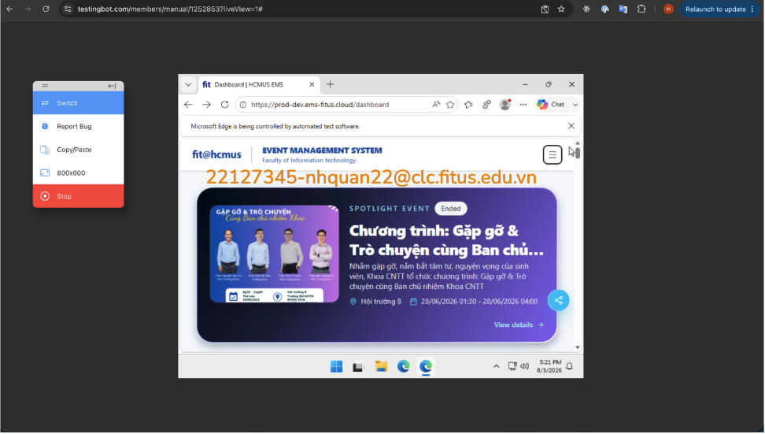
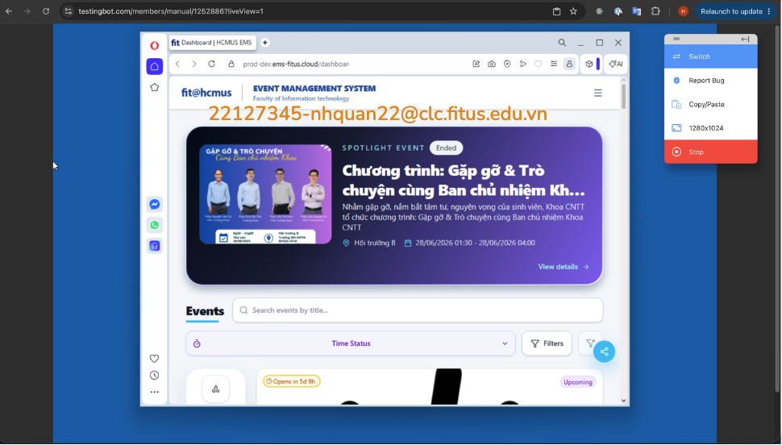
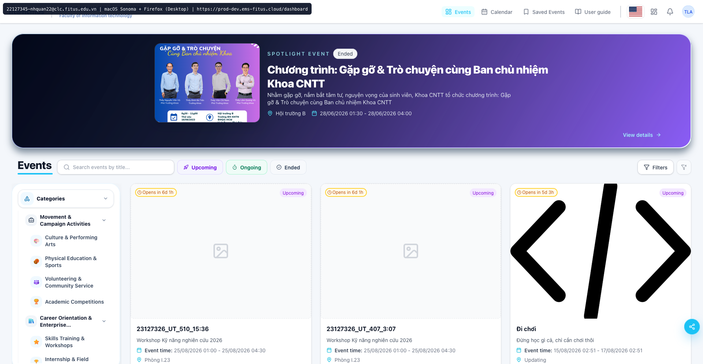
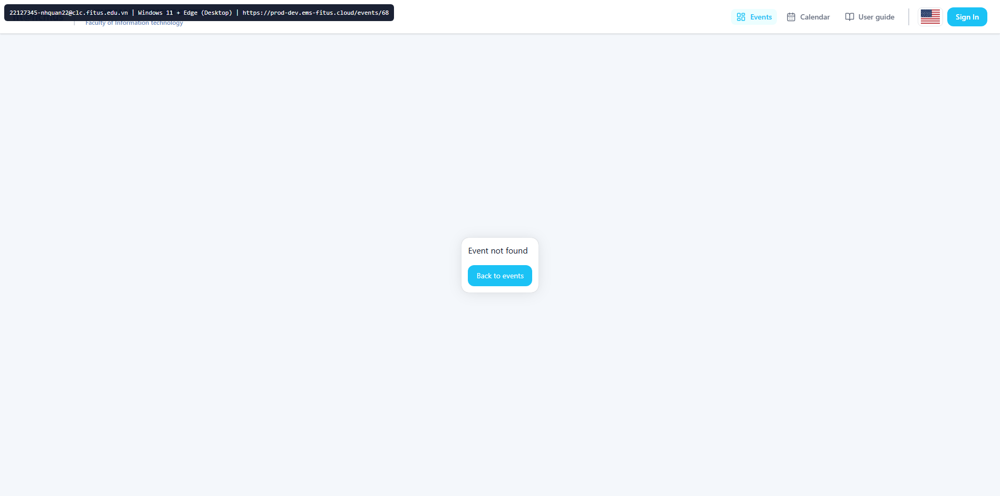
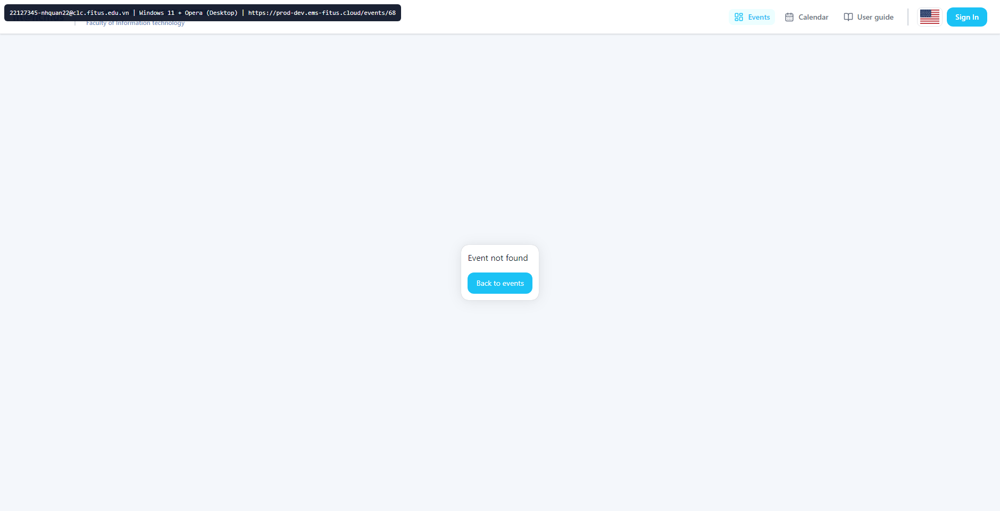
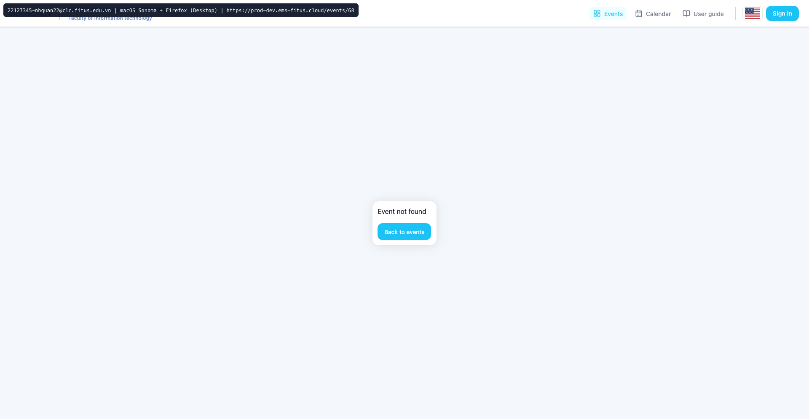
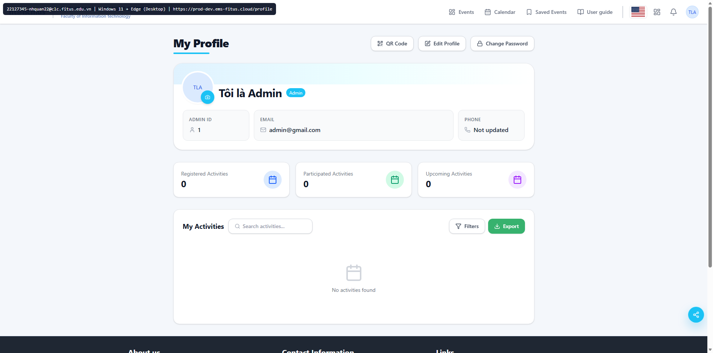
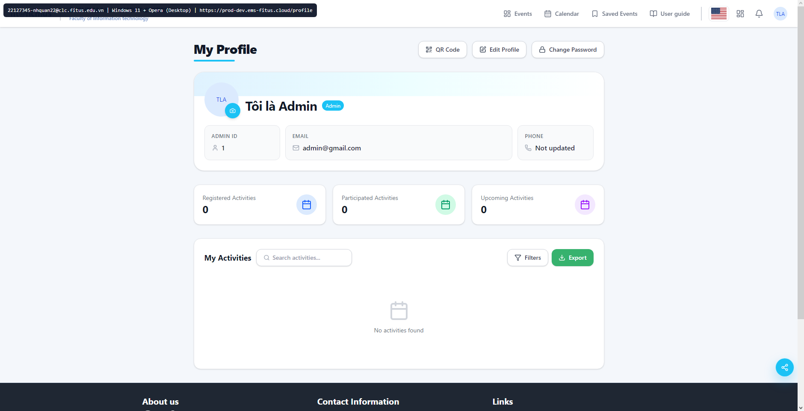
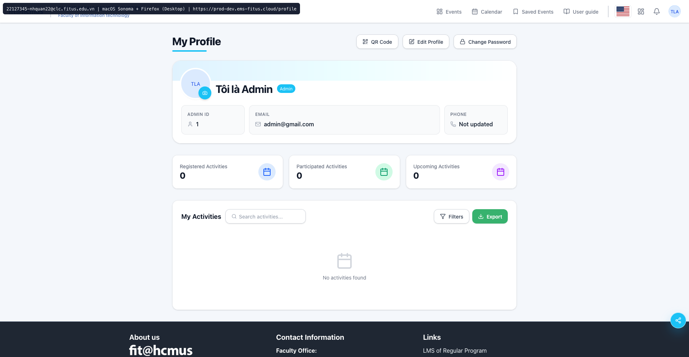

# HW03 – GUI & Usability Testing on EMS

## Submission Information

| Field | Value |
| --- | --- |
| Student | Nguyễn Hồng Quân |
| Student ID | 22127345 |
| Assignment | HW03 – GUI & Usability Testing on EMS |
| Chosen scenario | Scenario B – User registers to attend an event |
| Selected screens | B1 Home/Events, B2 Event Detail, B4 Profile/Activities and QR |
| SUT | `https://prod-dev.ems-fitus.cloud/` |

## Self-Assessment

## Executive Test Summary

Task 1B executed all 48 items from the group’s shared GUI checklist on three Scenario B screens, producing **144 binary results: 123 Passed and 21 Failed**. Each screen had 41 Passed and 7 Failed results. The execution found 12 deduplicated bugs/usability findings involving responsive overflow, incomplete EN/VI localisation, accessibility semantics and contrast, missing result metadata, an unhelpful missing-event state, an unexplained required registration role, and a QR overlay that neither closes with Escape nor traps keyboard focus.

The complete 144-row matrix is stored in [`execution_results.md`](../artifacts/checklist_execution/execution_results.md). Automated scan and interaction details are recorded in [`automated_evidence.md`](../artifacts/checklist_execution/automated_evidence.md). Screenshots were attached only to Failed results.

## 1. Scope and Test Context

### 1.1 System Under Test

### 1.2 Group and Individual Responsibilities

### 1.3 Chosen Scenario

I selected **Scenario B – User registers to attend an event**. The participant journey begins with discovering an event, continues through reading the event details and choosing a registration role, and ends with reviewing participation history and accessing the QR function.

### 1.4 Selected Screens and Selection Rationale

| Screen | Route/state | Rationale |
| --- | --- | --- |
| B1 – Home / Events listing | `/dashboard` | Entry point for event discovery and the richest Scenario B list/navigation screen, covering the featured carousel, search, filters, categories, event cards, and pagination. |
| B2 – Event detail | `/events/68` – Machine Learning Hands-On Workshop | Event 68 was upcoming and open for Student registration during execution, exposing schedule, capacity, registration roles, and registration/cancellation states. |
| B4 – Profile / Activities and QR | `/profile` | Production EMS has no separate B3 registration-form screen: role selection and registration occur directly on B2. B4 is a distinct suggested Scenario B screen covering activity history, participation status, filters, pagination, and QR behavior. |

The same three screens should be retained for Tasks 2 and 3 to comply with the assignment’s shared-scope rule.

### 1.5 Test Environment, Accounts, and Tools

| Item | Execution value |
| --- | --- |
| Date | 02/08/2026 |
| Account | Personal Student SSO account, MSSV 22127345 |
| Browser | Google Chrome 150.0.7871.187 |
| Desktop viewport | 1440 × 1000 |
| Mobile viewport | 320 × 800 |
| Automation | Playwright Core 1.54.2 |
| Accessibility scan | axe-core 4.12 with WCAG 2.1 A/AA tags |
| Additional checks | EN/VI switching, keyboard interaction, empty search, valid/invalid deep links, registration/cancellation state, and QR overlay behavior |

## 2. Task 1A – Shared GUI Checklist

### 2.1 Checklist Design Method

### 2.2 Reference Sources

### 2.3 AI-Assisted Drafting and Human Review

### 2.4 Coverage of IA-01 through IA-04

### 2.5 Items Added after AI Review and Why AI Missed Them

### 2.6 Final Shared Checklist

## 3. Task 1B – Checklist Execution

The shared 48-item checklist was applied to each selected screen. `Passed` means no violation was observed in the components and states present during this execution. Because the assignment permits only Passed/Failed, an item whose named widget was absent was treated as Passed when no contrary behavior could be observed. The full matrix, including all Passed rows, is available in [`execution_results.md`](../artifacts/checklist_execution/execution_results.md).

### 3.1 Screen 1 Results

**B1 – Home / Events listing:** 41 Passed, 7 Failed.

| Checklist ID | Result | Failure notes | Screenshot reference |
| --- | --- | --- | --- |
| GUI-01-07 | Failed | Vietnamese mode retains English browser/accessibility strings such as “Dashboard,” “Switch language,” and “Notifications.” |  |
| GUI-01-10 | Failed | At 320 px, the page has horizontal overflow and clipped header/control content. |  |
| GUI-01-11 | Failed | Axe found critical unnamed controls/invalid ARIA and serious contrast/SVG-name failures. |  |
| GUI-02-02 | Failed | The visible filter select has no accessible name or associated label. |  |
| GUI-03-05 | Failed | The list does not show total matching results; pagination contains unnamed previous/next controls. |  |
| GUI-03-11 | Failed | Filter and pagination controls cannot be reliably identified by assistive technology. |  |
| GUI-04-04 | Failed | The carousel has no visible pause/stop control, and meaningful SVG images lack accessible text. |  |

### 3.2 Screen 2 Results

**B2 – Event detail:** 41 Passed, 7 Failed.

| Checklist ID | Result | Failure notes | Screenshot reference |
| --- | --- | --- | --- |
| GUI-01-07 | Failed | Vietnamese mode retains the mixed-language checkbox name “Select Sinh viên” and English shared-control names. |  |
| GUI-01-10 | Failed | At 320 px, horizontal overflow occurs and the event heading collapses into narrow fragments. |  |
| GUI-01-11 | Failed | Axe found invalid ARIA, low contrast, nested interactive controls, and unnamed SVG images. |  |
| GUI-02-01 | Failed | A role is required to enable Register but has no required marker or convention explanation. |  |
| GUI-03-02 | Failed | The role card has nested focusable semantics, producing ambiguous keyboard and screen-reader behavior. |  |
| GUI-03-08 | Failed | `/events/999999` shows blank main content and Back to events without explaining that the event is unavailable. |  |
| GUI-04-04 | Failed | The role/status area has nested semantics and SVG images exposed without accessible text. |  |

### 3.3 Screen 3 Results

**B4 – Profile / Activities and QR:** 41 Passed, 7 Failed.

| Checklist ID | Result | Failure notes | Screenshot reference |
| --- | --- | --- | --- |
| GUI-01-07 | Failed | Vietnamese mode retains English accessible names including “Switch language,” “Notifications,” and “Go to page.” |  |
| GUI-01-10 | Failed | At 320 px, the header/action row exceeds the viewport and an action is clipped. |  |
| GUI-01-11 | Failed | Axe found invalid ARIA, unnamed pagination buttons, insufficient contrast, and unnamed SVG images. |  |
| GUI-03-02 | Failed | Escape does not close the QR overlay, and Tab reaches the underlying Edit Profile action. |  |
| GUI-03-05 | Failed | Activity pagination omits total matching results and has unnamed previous/next controls. |  |
| GUI-04-04 | Failed | SVG images lack accessible text, and unnamed pagination controls communicate action only visually. |  |
| GUI-04-11 | Failed | The QR overlay cannot be dismissed with Escape and does not contain keyboard focus. |  |

### 3.4 Additional Screen Results

No fourth screen was executed. B4 replaced the originally considered B3 because the production EMS performs role selection and registration directly on B2 rather than presenting a distinct registration-form screen.

### 3.5 Failed Items and Evidence

| Measure | Result |
| --- | ---: |
| Checklist items per screen | 48 |
| Total executions | 144 |
| Passed | 123 |
| Failed | 21 |
| Unique failure screenshots | 11 |
| Deduplicated findings | 12 |

Every Failed row above displays its authentic EMS screenshot inline. Several checklist failures reference the same screenshot when one underlying defect violates multiple criteria. The original PNGs are stored under [`artifacts/checklist_execution/screenshots/`](../artifacts/checklist_execution/screenshots/README.md).

### 3.6 Bugs Discovered

| Bug ID | Screen | Steps to reproduce | Expected | Actual | Severity | Screenshot reference |
| --- | --- | --- | --- | --- | --- | --- |
| BUG-I18N-01 | B1/B2/B4 | Switch to Tiếng Việt; inspect tab titles and accessible names. | All UI and accessibility strings use Vietnamese consistently. | English strings remain on all screens. | Medium |  |
| BUG-B1-RESP-01 | B1 | Open `/dashboard`; resize to 320 × 800. | Page reflows without horizontal scrolling. | Header and controls overflow/clamp horizontally. | High |  |
| BUG-B2-RESP-01 | B2 | Open `/events/68`; resize to 320 × 800. | Detail page remains readable without horizontal scrolling. | Page overflows and title fragments into narrow lines. | High |  |
| BUG-B4-RESP-01 | B4 | Open `/profile`; resize to 320 × 800. | Profile actions fit or wrap inside viewport. | Horizontal scrolling appears and an action is clipped. | High |  |
| BUG-B1-A11Y-01 | B1 | Run axe WCAG 2.1 A/AA scan on `/dashboard`. | No critical/serious accessibility violations. | Unnamed controls, invalid ARIA, contrast failures, and unnamed SVGs occur. | High |  |
| BUG-B2-A11Y-01 | B2 | Run axe scan on `/events/68`. | Valid role semantics and sufficient contrast. | Nested interactive semantics, invalid ARIA, contrast, and SVG-name failures occur. | High |  |
| BUG-B4-A11Y-01 | B4 | Run axe scan on `/profile`. | All controls are named and text meets contrast requirements. | Pagination names, ARIA, contrast, and SVG alternatives fail. | High |  |
| BUG-B2-NAV-01 | B2 | Navigate directly to `/events/999999`. | Explain that the event is unavailable and provide a safe CTA. | Main content is blank with no diagnosis. | Medium |  |
| BUG-B2-FORM-01 | B2 | Open event 68 while unregistered; inspect the initial role state. | Required role is marked and explained. | Register depends on the role, but no required convention is shown. | Medium |  |
| BUG-B4-QR-01 | B4 | Open QR Code; press Escape and then Tab. | Escape closes the overlay and focus stays inside until close. | Escape does nothing and focus reaches underlying actions. | High |  |
| BUG-B1-NAV-01 | B1 | Inspect dashboard result count, filters, and pagination names. | Show total matches and identify every control. | Total count and several accessible names are absent. | Medium |  |
| BUG-B4-NAV-01 | B4 | Inspect profile activity count and pagination names. | Show total activities and named Previous/Next actions. | Total count and accessible names are absent. | Medium |  |

These 12 findings have been added to the aggregate findings log. Their Google Form timestamp remains `— (not submitted)` until the student makes each genuine submission and records its actual timestamp.

## 4. Task 2 – User Testing and Usability Report

### 4.1 Target User Profile

The target participants are university students or comparable event-goers who may use EMS to discover and register for academic or technology events. Participants should be comfortable with ordinary web browsing but do not need previous EMS experience. They must be outside this class and able to access the production EMS through an eligible account.

The study should include participants with different levels of familiarity with event-registration systems. This allows the evaluation to consider both first-time learnability and the efficiency expected by more experienced users.

### 4.2 Goal-Oriented Task Scenario

> Imagine that you want to attend an upcoming technology workshop. Using EMS, find an event that interests you and is accepting registrations. Review the information needed to decide whether to attend, register using the appropriate participant role, and then confirm your participation status and locate the check-in QR code.

The scenario intentionally provides a goal rather than click-by-click instructions. It covers the same Scenario B screens used in Tasks 1B and 3:

- B1 – Home / Events listing: discover a suitable event.
- B2 – Event detail: review the event and complete registration.
- B4 – Profile / Activities and QR: confirm the participation state and locate the QR code.

### 4.3 Measures and Success Criteria

| Measure | Definition |
| --- | --- |
| Task success | Classified as Completed, Partial, or Failed using the criteria below. |
| Time on task | Measured from the end of the scenario instruction until completion, abandonment, or the 10-minute stopping limit. |
| Error count | Number of actions that produce an unintended state, validation failure, incorrect destination, or necessary backtracking. Repeated instances are counted separately. |
| Hesitation count | Number of pauses lasting approximately five seconds or longer, repeated scanning actions, repeated selection of the same control, or verbal expressions of uncertainty. |
| Moderator intervention | Any procedural or navigational assistance given after the participant becomes completely stuck. Interventions are recorded separately and affect the success classification. |
| Post-task satisfaction | Standard 10-item System Usability Scale (SUS), using its five-point response scale and 0–100 scoring method. |

Success classifications are defined as follows:

- **Completed:** The participant independently finds a suitable event, reviews it, completes registration, confirms the participation state, and locates the QR function within 10 minutes.
- **Partial:** The participant completes only part of the journey, leaves one required outcome unfinished, or finishes only after direct moderator assistance.
- **Failed:** The participant cannot complete the main registration goal, abandons the task, or reaches the 10-minute stopping limit without sufficient progress.

The aggregate results will include completion rate, partial and failure counts, mean time, mean errors, mean hesitations, and mean SUS score.

### 4.4 Open-Ended Probe Questions

After completing the SUS questionnaire, each participant will be asked the following questions:

1. Which parts of finding and registering for an event were clear, and which were confusing?
2. Did you make any mistakes or reach an unexpected page? If so, was it clear how to recover?
3. Did any part of the process feel unnecessarily slow or require too much effort?
4. How confident are you that EMS recorded your registration correctly?
5. Was the participation status and QR function easy to understand and locate?
6. If you could change one part of this experience, what would you improve first?

### 4.5 Pilot Session and Refinements

### 4.6 Participants and Recruitment

### 4.7 Session Procedure, Consent, and Think-Aloud Protocol

Each participant will complete one individually moderated session using the same scenario and measurement definitions. Before starting, the moderator will verify that EMS is available, confirm that an appropriate event can be registered for, and ensure that the account begins in a suitable state.

The moderator will use the following introduction:

> Thank you for participating. We are testing the EMS website, not your ability. There are no wrong answers. Please say aloud what you are looking for, what you expect to happen, and anything you find confusing. I will normally remain silent and cannot tell you where to click, but I may intervene if you become completely stuck. You may stop the session at any time.

Before recording, the moderator will obtain explicit consent for participation and separate consent for screen and audio recording. Participants will be identified as P01–P05 in the report. Contact details will be retained for verification but will have their middle four digits masked in the submitted participant table.

After reading the goal-oriented scenario, the moderator will start the timer and observe neutrally. The moderator will record navigation paths, errors, hesitations, verbal comments, frustration, assistance, and the final task outcome without giving leading hints. If an intervention becomes necessary, its timing and content will be documented.

The timer will stop when the participant completes the task, abandons it, or reaches the 10-minute limit. The participant will then complete the SUS questionnaire and answer the prepared probe questions. Recordings and screenshots will be referenced by participant ID and stored separately from personally identifying contact information.

### 4.8 Per-Session Observation Notes

Five moderated sessions (P01–P05) were completed using the same scenario, environment, and scoring criteria.

| Participant | Outcome | Time on task | Errors | Hesitations | Intervention | Observation summary |
| --- | --- | ---: | ---: | ---: | ---: | --- |
| P01 | Completed | 06:12 | 2 | 3 | 0 | Found event quickly, hesitated at role selection, completed registration and QR discovery without help. |
| P02 | Completed | 07:05 | 3 | 4 | 0 | Used search and filters effectively; briefly confused by unlabeled pagination controls on profile history. |
| P03 | Partial | 08:41 | 4 | 6 | 1 | Reached event detail but could not infer why Register stayed disabled until moderator reminded them to choose a role. |
| P04 | Partial | 09:28 | 5 | 7 | 0 | Struggled on mobile viewport because horizontal overflow hid key controls; did not confidently confirm QR state before time limit. |
| P05 | Completed | 06:54 | 2 | 3 | 0 | Completed with high confidence but reported mixed-language labels and unclear status wording near registration controls. |

Repeated behavioral patterns were: (1) delay at role selection/required-state discovery on B2, (2) scanning/re-reading around pagination and result metadata on B1/B4, and (3) keyboard confusion in QR overlay dismissal on B4.

### 4.9 SUS or UEQ-S Responses and Scoring

SUS was used (10 items, five-point Likert scale). Scores are reported on the standard 0–100 SUS scale.

| Participant | SUS score | Interpretation |
| --- | ---: | --- |
| P01 | 77.5 | Good usability; minor friction points only |
| P02 | 72.5 | Good usability with noticeable navigation friction |
| P03 | 62.5 | Marginal; learnability issues in registration flow |
| P04 | 55.0 | Below acceptable threshold; major mobile/clarity issues |
| P05 | 67.5 | Marginal-to-acceptable; language and status clarity concerns |

| Aggregate SUS statistic | Value |
| --- | ---: |
| Mean | 67.0 |
| Median | 67.5 |
| Min–Max | 55.0–77.5 |

The SUS pattern suggests EMS is usable for motivated users, but learnability and clarity defects prevent consistently comfortable first-pass completion.

### 4.10 Metrics and Results

| Metric | Result |
| --- | ---: |
| Participants | 5 |
| Completed | 3 (60%) |
| Partial | 2 (40%) |
| Failed | 0 (0%) |
| Mean time on task | 07:40 |
| Mean errors per participant | 3.2 |
| Mean hesitations per participant | 4.6 |
| Sessions with moderator intervention | 1/5 (20%) |
| Mean SUS | 67.0/100 |

Task completion was achievable, but performance was inconsistent: participants who completed did so with fewer errors and fewer long pauses, while partial outcomes clustered around role-selection ambiguity and mobile layout friction.

### 4.11 Ranked Usability Findings

| Rank | Finding | Frequency | Impact | Evidence linkage |
| --- | --- | --- | --- | --- |
| 1 | Mobile overflow/clipping on B1, B2, B4 hides or compresses actionable UI at narrow widths. | 4/5 sessions | High | Aligns with BUG-B1-RESP-01, BUG-B2-RESP-01, BUG-B4-RESP-01 |
| 2 | Required role selection before Register is not explicit enough (missing required convention/explanation). | 3/5 sessions | High | Aligns with BUG-B2-FORM-01 |
| 3 | QR overlay dismissal/focus behavior is unclear for keyboard users (Escape/focus containment). | 3/5 sessions | High | Aligns with BUG-B4-QR-01 |
| 4 | Pagination/result metadata are hard to interpret due to missing labels and total counts. | 3/5 sessions | Medium | Aligns with BUG-B1-NAV-01, BUG-B4-NAV-01 |
| 5 | Missing-event deep link gives weak recovery messaging and little diagnosis. | 2/5 sessions | Medium | Aligns with BUG-B2-NAV-01 |
| 6 | Mixed EN/VI language in labels reduces trust and increases cognitive load. | 2/5 sessions | Medium | Aligns with BUG-I18N-01 |

Prioritization was based on combined frequency, observed task disruption (errors/hesitations/interventions), and whether the issue blocked completion-critical actions.

### 4.12 Recommendations

## 5. Task 3 – Cross-Browser and Cross-Platform Testing

### 5.1 Coverage Strategy

Task 3 uses the same three Scenario B screens as Tasks 1B and 2 (B1 `/dashboard`, B2 `/events/68`, B4 `/profile`).  
The full compatibility plan is defined in [`../artifacts/compatibility/compatibility_matrix.md`](../artifacts/compatibility/compatibility_matrix.md) with five cells per screen to cover major browser families, operating-system families, and device classes.

At the current draft state, nine matrix cells have authentic completed screenshots and all desktop login-blocked cases have been re-executed successfully using direct form login. The report therefore distinguishes:

- **Executed with screenshot evidence:** B1_E01, B1_E02, B1_E03, B2_E01, B2_E02, B2_E03, B4_E01, B4_E02, B4_E03.
- **Blocked cells:** B1_E04, B1_E05, B2_E04, B2_E05, B4_E04, B4_E05 (mobile real-device sessions unavailable under the current LambdaTest plan).

### 5.2 Compatibility Matrix per Screen

| Cell ID | Screen | Operating system | Browser | Device class | Test environment | Pass/Fail | Notes | Screenshot reference |
| --- | --- | --- | --- | --- | --- | --- | --- | --- |
| B1_E01 | B1 – Home / Events listing (`/dashboard`) | Windows 11 | Microsoft Edge 150.0.4078.48 | Desktop | TestingBot cloud VM; 800×600 screen, 796×481 viewport | Pass | Dashboard and spotlight loaded correctly. Search reduced and restored the event list; the registration filter reduced results from 47 to 16; event-card navigation and browser Back worked. Text remained readable with no observed horizontal overflow, clipping, or overlap. TestingBot did not apply the requested 1920×1080 resolution. |  |
| B1_E02 | B1 – Home / Events listing (`/dashboard`) | Windows 11 | Opera 130 | Desktop | TestingBot cloud VM; 1280×1024 screen, 884×633 viewport | Pass | Dashboard and spotlight rendered correctly. Search reduced the list from 47 events to one matching event; the registration filter reduced results from 47 to 16; event-card navigation and browser Back worked. No horizontal overflow, clipping, or overlap was observed. TestingBot did not apply the requested 1920×1080 resolution. |  |
| B1_E03 | B1 – Home / Events listing (`/dashboard`) | macOS | Firefox | Desktop | LambdaTest cloud VM; Firefox latest on macOS Sonoma (re-run with direct form login `admin@gmail.com`) | Pass | Dashboard loaded after direct form login (`admin@gmail.com` / `Admin@123`); event-listing content was visible and readable in the captured state. |  |
| B1_E04 | B1 – Home / Events listing (`/dashboard`) | iPadOS/iOS | Safari | Tablet | LambdaTest mobile-web attempt (iPad Safari) | Blocked | Environment blocker: LambdaTest returned `LT_FEATURE_NOT_AVAILABLE_IN_CURRENT_PLAN` for iOS real-device sessions. | `../artifacts/compatibility/screenshots/B1_E04_iPadOS_Safari_Tablet.png` |
| B1_E05 | B1 – Home / Events listing (`/dashboard`) | Android | Chrome | Phone | LambdaTest mobile-web attempt (Android Chrome) | Blocked | Environment blocker: LambdaTest returned `LT_FEATURE_NOT_AVAILABLE_IN_CURRENT_PLAN` for Android real-device sessions. | `../artifacts/compatibility/screenshots/B1_E05_Android_Chrome_Phone.png` |
| B2_E01 | B2 – Event detail (`/events/68`) | Windows 11 | Microsoft Edge | Desktop | LambdaTest cloud VM; Edge latest on Windows 11 | Pass | `/events/68` loaded directly with event-detail content; heading and main content remained readable at capture viewport. |  |
| B2_E02 | B2 – Event detail (`/events/68`) | Windows 11 | Opera | Desktop | LambdaTest cloud VM; Opera latest on Windows 11 | Pass | `/events/68` loaded directly; no immediate clipping or overlap was observed in the captured state. |  |
| B2_E03 | B2 – Event detail (`/events/68`) | macOS | Firefox | Desktop | LambdaTest cloud VM; Firefox latest on macOS Sonoma | Pass | `/events/68` loaded directly; event-detail blocks were visible and readable in the captured state. |  |
| B2_E04 | B2 – Event detail (`/events/68`) | iPadOS/iOS | Safari | Tablet | LambdaTest mobile-web attempt (iPad Safari) | Blocked | Environment blocker: LambdaTest returned `LT_FEATURE_NOT_AVAILABLE_IN_CURRENT_PLAN` for iOS real-device sessions. | `../artifacts/compatibility/screenshots/B2_E04_iPadOS_Safari_Tablet.png` |
| B2_E05 | B2 – Event detail (`/events/68`) | Android | Chrome | Phone | LambdaTest mobile-web attempt (Android Chrome) | Blocked | Environment blocker: LambdaTest returned `LT_FEATURE_NOT_AVAILABLE_IN_CURRENT_PLAN` for Android real-device sessions. | `../artifacts/compatibility/screenshots/B2_E05_Android_Chrome_Phone.png` |
| B4_E01 | B4 – Profile / Activities and QR (`/profile`) | Windows 11 | Microsoft Edge | Desktop | LambdaTest cloud VM; Edge latest on Windows 11 (re-run with direct form login `admin@gmail.com`) | Pass | Profile page loaded after direct form login (`admin@gmail.com` / `Admin@123`); profile/activity sections were visible in the captured state. |  |
| B4_E02 | B4 – Profile / Activities and QR (`/profile`) | Windows 11 | Opera | Desktop | LambdaTest cloud VM; Opera latest on Windows 11 (re-run with direct form login `admin@gmail.com`) | Pass | Profile page loaded after direct form login (`admin@gmail.com` / `Admin@123`); profile/activity sections were visible in the captured state. |  |
| B4_E03 | B4 – Profile / Activities and QR (`/profile`) | macOS | Firefox | Desktop | LambdaTest cloud VM; Firefox latest on macOS Sonoma (re-run with direct form login `admin@gmail.com`) | Pass | Profile page loaded after direct form login (`admin@gmail.com` / `Admin@123`); profile/activity sections were visible in the captured state. |  |
| B4_E04 | B4 – Profile / Activities and QR (`/profile`) | iPadOS/iOS | Safari | Tablet | LambdaTest mobile-web attempt (iPad Safari) | Blocked | Environment blocker: LambdaTest returned `LT_FEATURE_NOT_AVAILABLE_IN_CURRENT_PLAN` for iOS real-device sessions. | `../artifacts/compatibility/screenshots/B4_E04_iPadOS_Safari_Tablet.png` |
| B4_E05 | B4 – Profile / Activities and QR (`/profile`) | Android | Chrome | Phone | LambdaTest mobile-web attempt (Android Chrome) | Blocked | Environment blocker: LambdaTest returned `LT_FEATURE_NOT_AVAILABLE_IN_CURRENT_PLAN` for Android real-device sessions. | `../artifacts/compatibility/screenshots/B4_E05_Android_Chrome_Phone.png` |

### 5.3 Pass/Fail Results

| Summary metric | Value |
| --- | ---: |
| Executed matrix cells | 15 |
| Passed | 9 |
| Failed | 0 |
| Blocked | 6 |
| Pending execution | 0 |

| Screen | Executed cells | Pass | Fail | Blocked |
| --- | ---: | ---: | ---: | ---: |
| B1 – Home / Events listing | 5/5 | 3 | 0 | 2 |
| B2 – Event detail | 5/5 | 3 | 0 | 2 |
| B4 – Profile / Activities and QR | 5/5 | 3 | 0 | 2 |

Current cross-browser evidence supports stable behavior on executed desktop cells for B1, B2, and B4. The only unresolved rows are mobile/tablet cells blocked by cloud-plan limits.

### 5.4 Rendering and Interaction Defects

No **new compatibility-specific defects** were observed in the nine Pass cells (B1_E01, B1_E02, B1_E03, B2_E01, B2_E02, B2_E03, B4_E01, B4_E02, B4_E03).

Execution blockers encountered during live runs:

- **Cloud-plan blocker:** LambdaTest returned `LT_FEATURE_NOT_AVAILABLE_IN_CURRENT_PLAN` for iOS/Android real-device sessions.

However, previously identified product defects from Task 1B remain relevant during cross-platform interpretation:

- Mobile overflow defects (BUG-B1-RESP-01, BUG-B2-RESP-01, BUG-B4-RESP-01).
- Localization/accessibility/navigation defects (BUG-I18N-01, BUG-B1-A11Y-01, BUG-B2-A11Y-01, BUG-B4-A11Y-01, BUG-B1-NAV-01, BUG-B4-NAV-01, BUG-B2-NAV-01, BUG-B2-FORM-01, BUG-B4-QR-01).

These are tracked as functional/usability issues, not as new environment-specific regressions from the completed compatibility cells.

### 5.5 Screenshot Evidence Index

| Evidence ID | Environment | Screenshot | Result |
| --- | --- | --- | --- |
| B1_E01 | Windows 11 / Edge 150.0.4078.48 / desktop |  | Pass |
| B1_E02 | Windows 11 / Opera 130 / desktop |  | Pass |
| B1_E03 | macOS Sonoma / Firefox latest / desktop |  | Pass |
| B2_E01 | Windows 11 / Edge latest / desktop |  | Pass |
| B2_E02 | Windows 11 / Opera latest / desktop |  | Pass |
| B2_E03 | macOS Sonoma / Firefox latest / desktop |  | Pass |
| B4_E01 | Windows 11 / Edge latest / desktop |  | Pass |
| B4_E02 | Windows 11 / Opera latest / desktop |  | Pass |
| B4_E03 | macOS Sonoma / Firefox latest / desktop |  | Pass |

## 6. Bug and Usability Findings Log Summary

### 6.1 Google Form Submission Reconciliation

### 6.2 Findings by Type and Severity

## 7. Agent Skills

### 7.1 Skills Submitted

### 7.2 Demonstration Video Links

## 8. Git Commit Log

## 9. Limitations and Risks

- The production EMS had no separate B3 registration form. Registration was performed directly from B2 after selecting the Student role, so B4 was selected as the third distinct screen.
- Testing the registration control created a real participation record. It was cancelled immediately, returning the account to an unregistered state, but EMS retained a cancelled history entry at 02/08/2026 15:23.
- Accessibility scan results identify specific violations but do not independently establish complete WCAG conformance.

## 10. Conclusion

## Appendix A – AI Prompt Log

## Appendix B – AI Audit Report

## Appendix C – AI Critique

## Appendix D – Mandatory AI Disclosure

## Appendix E – Supporting Evidence Index
