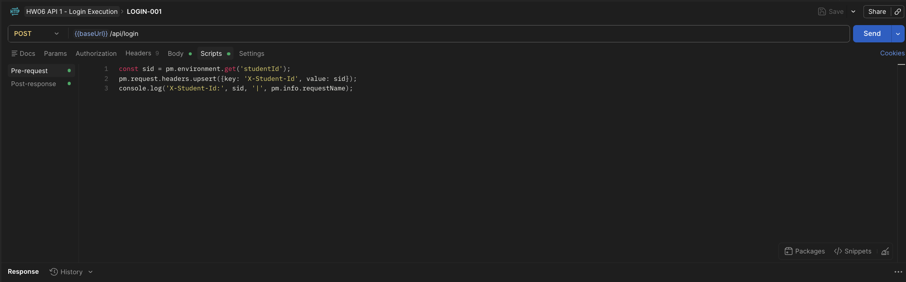
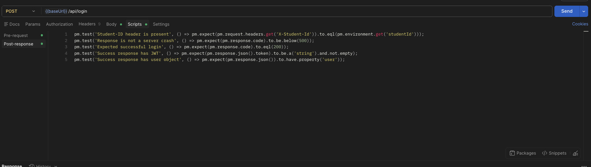
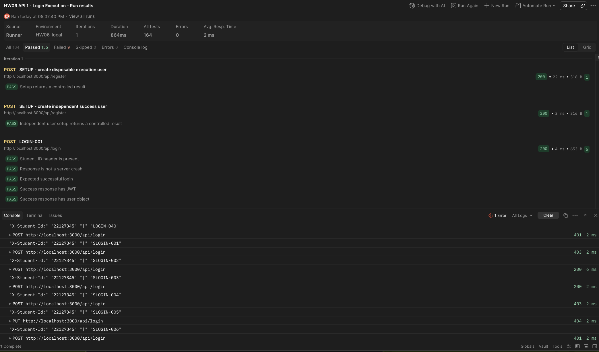
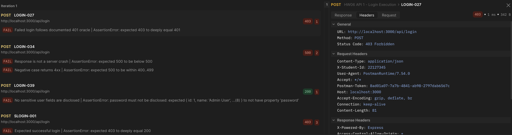

# HW06 – API Testing Report

## 1. Cover Page and Student Information

- **Student ID:** 22127345
- **Assignment:** HW06 – API Testing
- **SUT:** EShop
- **Selected test tool:** Postman + Newman (provisional; default assignment tool)
- **Backend base URL:** `http://localhost:3000`
- **Backend status:** Started from `../eshop-SUT/backend/server.js`; verified during Newman execution on 21/08/2026.

## 2. Executive Summary

API 1 (`POST /api/login`) was executed with the Postman Collection Runner and Newman. The Postman Runner evidence shows **48 requests**, **164 assertions**, **155 passed**, **9 failed**, and **0 errors** in one iteration. The failures confirm implementation defects in lockout behavior, sensitive-field disclosure, account enumeration, and unsafe content-type handling. The required Student-ID screenshots were captured; GitHub Issue evidence remains pending.

## 3. System Under Test and API Specification

The System Under Test is the EShop Vietnamese e-commerce demo application. The API specification is stored in `../eshop-SUT/api_specification.md`. The backend is implemented with Node.js, Express, and SQLite and listens at `http://localhost:3000`.

Initial connectivity evidence collected during setup:

- `GET /api/products` returned the seeded product list.
- `POST /api/login` with the seeded admin account returned a JWT and an admin user object.
- The `X-Student-Id: 22127345` header was included in the login verification request; the required pre-request-script console screenshot will be captured during the Postman execution phase.

## 4. Group API-Selection / Duplication Check

- **Student:** 22127345
- **Provisional three-API selection:** login, checkout, and admin order-status update.
- **Duplication check:** Pending confirmation from group members. This must be confirmed before test-case generation; no final claim of uniqueness is made yet.
- **Required evidence:** written confirmation or an equivalent group-selection record will be attached here.

## 5. Selected APIs

### 5.1 API 1 — Pool A

- **Feature:** FR-02 — Login and account lockout
- **Endpoint:** `POST /api/login`
- **Request body:** `{ "email": "...", "password": "..." }`
- **Expected success:** HTTP 200 with JWT token and user information.
- **Relevant negative/security scope:** invalid credentials, repeated failures and lockout, password handling, injection payloads, response disclosure, and token/schema validation.

### 5.2 API 2 — Pool B

- **Feature:** FR-08 — Checkout
- **Endpoint:** `POST /api/checkout`
- **Authentication:** JWT Bearer token required.
- **Request body in specification:** `{ "total_amount": 200000, "shipping_address": "..." }`
- **Expected behavior:** backend recalculates the order total from the cart, does not trust client-supplied `total_amount`, creates the order, and clears the cart after success.
- **Relevant negative/security scope:** unauthenticated access, tampered total, empty cart, invalid address, cart ownership/IDOR, and response-schema validation.

### 5.3 API 3 — Pool C

- **Feature:** FR-18 — Admin order management / order state transition
- **Endpoint:** `PUT /api/admin/orders/:id/status`
- **Authentication:** JWT Bearer token for an admin account.
- **Request body:** `{ "status": "confirmed" }`; allowed states are `pending`, `confirmed`, `shipping`, `delivered`, and `canceled`.
- **Expected behavior:** only valid transitions are accepted; terminal states cannot transition; users cannot perform admin operations; valid updates return the documented success response.
- **Relevant negative/security scope:** missing/invalid token, user-to-admin escalation, IDOR, invalid transitions, terminal-state transitions, malformed IDs/statuses, and response-schema validation.

## 6. Test Design and Coverage Strategy

The API 1 design applies equivalence partitioning, boundary value analysis, decision tables, state-transition testing, security/error guessing, and response-schema validation. The detailed strategy, conditions, and traceability artifacts are stored in [`artifacts/api1_login_test_strategy.md`](../artifacts/api1_login_test_strategy.md), [`artifacts/api1_login_test_conditions.md`](../artifacts/api1_login_test_conditions.md), and [`artifacts/api1_login_traceability.csv`](../artifacts/api1_login_traceability.csv).

### 6.1 Domain Partitions

The test design partitions known versus unknown emails, correct versus incorrect passwords, missing/null/empty/whitespace values, malformed and overlong emails, hostile payloads, and malformed protocol bodies. Boundary cases include the first, second, and third failed-login attempts and the lockout period.

### 6.2 State Transitions

The planned state model is `UNLOCKED → FAILED(1) → FAILED(2) → LOCKED → UNLOCKED after expiry`, with a successful login resetting the failure state. Stateful cases use an isolated account or a database reseed.

### 6.3 Security Requirements SEC-01–SEC-07

API 1 covers injection and hostile input resistance, account-enumeration resistance, brute-force lockout, JWT integrity, unexpected-field role escalation, sensitive response disclosure, and mandatory Student-ID header evidence. Exact SEC-01–SEC-07 wording will be reconciled against the course specification during human audit.

### 6.4 Response Schema Validation

The planned assertions verify HTTP status, required JSON keys and types, JWT syntax and identity claims, absence of a token on failure, and absence of plaintext passwords, reset tokens, lock metadata, or other unnecessary secrets.

## 7. API 1 Full Pipeline

### 7.1 Specification and Scope

API 1 is `POST /api/login` for FR-02. It accepts `email` and `password`, returns a JWT on success, rejects invalid credentials, and applies an account lockout after at least three consecutive failures. The request must include `X-Student-Id: 22127345`.

See [`artifacts/api1_login_test_strategy.md`](../artifacts/api1_login_test_strategy.md) and [`artifacts/api1_login_test_conditions.md`](../artifacts/api1_login_test_conditions.md).

### 7.2 AI Generation Process

The AI was instructed to derive test conditions before cases and to use the API specification plus the local implementation as test basis. It was instructed to cover every request parameter, FR-02 lockout transitions, security examples, schema validation, robustness, and the HW06 Student-ID requirement. The generated output is recorded in [`artifacts/api1_login_test_cases.csv`](../artifacts/api1_login_test_cases.csv).

### 7.3 AI-Generated Test Cases (Target: at least 35)

**Generated count: 40.** Cases span functional, negative, security, robustness, state-transition, schema, and traceability checks. After the human audit below, every row has been labeled `VALID` / `INVALID` / `INCOMPLETE` with reasoning recorded in the `HumanReview` column of [`artifacts/api1_login_test_cases.csv`](../artifacts/api1_login_test_cases.csv).

### 7.4 Human Audit: VALID / INVALID / INCOMPLETE

Every AI-generated case was reviewed against the SUT spec (`eshop-sut/api_specification.md` and `eshop-sut/README.md`, which defines the exact lockout rule and SEC-01–SEC-07) and the local implementation. The backend was started and key behaviors were verified directly (curl) to ground the audit. **Result: 37 VALID / 0 INVALID / 3 INCOMPLETE.**

- **VALID (37).** Cases whose expected results correctly match the specification. This includes the lockout cases: per the README the counter must increment by exactly **1** and lock after **3** consecutive failures for **30 s**, so LOGIN-025/026/027 encode the correct spec oracle even though the implementation deviates (see bugs below).
- **INVALID (0).** No AI case contradicted the specification outright; the AI's core oracles were sound.
- **INCOMPLETE (3) — corrected:**
  - **LOGIN-015** — `TestData` (“email longer than normal email limit”) and oracle were undefined (the spec sets no email length limit). Corrected to a concrete 300-character email with an explicit `no 500 / no stack trace / no token` oracle.
  - **LOGIN-029** — the “does not reveal unnecessary details” oracle was too vague and did not assert enumeration resistance. Corrected to require the locked-account response to be indistinguishable from an unknown-account response (generic 401), with no attempt/lock metadata or existence hint.
  - **LOGIN-034** — the oracle did not assert “no 500 / no stack trace”. Corrected to require a controlled 4xx. The verified behavior is a **500 TypeError with a full stack trace** for a `text/plain` body (genuine bug).

The audit also confirmed several genuine implementation bugs that the (correct) spec-based cases will detect at execution:

| # | Bug (verified) | Detected by |
|---|---|---|
| B1 | Failed-attempt counter increments by **2** instead of 1 (0 → 2 → 4) | LOGIN-025/026 |
| B2 | Account locks after **2** failures instead of 3 | LOGIN-026/027 |
| B3 | Lock duration is **180 s** instead of the required **30 s** | LOGIN-027 |
| B4 | Login response returns the **plaintext password** and lock metadata (`reset_token`, `login_attempts`, `locked_until`) — violates SEC-01/SEC-07 | LOGIN-039, SLOGIN-003 |
| B5 | Locked-account response (403 + “Tài khoản đã bị khóa”) is distinguishable from an unknown-account response (401) — **account-enumeration** weakness | SLOGIN-004, LOGIN-029 |
| B6 | `text/plain` content-type body causes a **500 crash** with a stack trace | LOGIN-034 |
| B7 | Malformed / wrong-shape JSON returns an **HTML error page leaking absolute file paths** | LOGIN-035, SLOGIN-006 |

These will be confirmed and filed as GitHub Issues during the execution phase.

### 7.5 Student-Added Test Cases (At least 5)

6 original student-authored cases (SLOGIN-001–006) were added — see [`artifacts/api1_login_test_cases.csv`](../artifacts/api1_login_test_cases.csv). Each targets a gap the AI missed, with the reason it was missed:

| ID | Focus | Why the AI missed it |
|---|---|---|
| SLOGIN-001 | Successful login **after lock expiry** (LOCKED → UNLOCKED by time) | The AI's state-transition graph stopped at “locked”; it never modelled the time-based expiry → UNLOCKED edge. |
| SLOGIN-002 | **Register → login** integration (FR-01 → FR-02) with a freshly created account | The AI generated cases per endpoint in isolation and assumed a pre-seeded “known user”; it never chained the primary registration→login happy path. |
| SLOGIN-003 | Hard schema assertion that `password` / `reset_token` / `login_attempts` / `locked_until` are **absent** from the response | AI's LOGIN-039 phrased disclosure generically and never pinned exact forbidden field names, so the plaintext password leak slipped through. |
| SLOGIN-004 | **Differential** check: locked-account vs unknown-account responses must be indistinguishable (enumeration resistance) | The AI tested “no enumeration” one path at a time (unknown email only) and never compared locked vs unknown responses. |
| SLOGIN-005 | Full unsupported-method set (GET/PUT/PATCH/DELETE) on a POST-only route | The AI only enumerated a single method (GET, LOGIN-037). |
| SLOGIN-006 | Non-object JSON bodies (array / number / string) handled safely | The AI tested malformed JSON and empty object but not well-formed JSON of the wrong shape. |

**Why each was missed (categories):** SLOGIN-001 and SLOGIN-002 are **API/model limitations** (state-graph and cross-endpoint reasoning the AI did not perform); SLOGIN-004, SLOGIN-005 and SLOGIN-006 are **prompt quality** issues (the AI covered only the obvious single-path variants); SLOGIN-003 is a **model limitation** (the AI trusted the documented `{token, user}` shape without auditing the real row payload).

### 7.6 Execution Results

The Postman collection [`artifacts/api1_login.postman_collection.json`](../artifacts/api1_login.postman_collection.json) was executed in Postman Collection Runner and with Newman against `http://localhost:3000` on 21/08/2026. The Postman run used the `HW06-local` environment. The collection used environment variables for the base URL, Student ID, credentials, and disposable accounts; credentials were passed at runtime and are not stored in the collection.

| Tool/run | Requests | Assertions | Passed | Failed | Errors |
|---|---:|---:|---:|---:|---:|
| Postman Collection Runner | 48 | 164 | 155 | 9 | 0 |
| Newman CLI artifact | 48 | 162 | 153 | 9 | 0 |

Every request included the `X-Student-Id: 22127345` header through the collection pre-request script, and the automated header assertion passed for all requests. The supplied evidence consists of: (A) the pre-request script that injects and logs the header, (B) the post-response assertions, (C) the Collection Runner summary showing 155 passed and 9 failed, and (D) the failed-case view showing `X-Student-Id: 22127345` in the request headers.

#### API 1 Postman Evidence

The following screenshots are included in [`artifacts/evidence/api1/`](../artifacts/evidence/api1/):

1. **Pre-request script and Student-ID injection**

   

2. **Post-response assertions**

   

3. **Collection Runner execution summary**

   

4. **Failed cases and injected Student-ID header**

   

Execution failures were:

- `LOGIN-027`: the third failed login returned 403 because the implementation locked the account early; the specification requires the third triggering attempt to return 401 and lock for 30 seconds.
- `LOGIN-034`: `text/plain` input caused HTTP 500 instead of a controlled 4xx response.
- `LOGIN-039` and `SLOGIN-003`: the login response exposed plaintext `password` and other sensitive account fields.
- `SLOGIN-001`: the case requires waiting until lock expiry; the immediate execution correctly observed that the account was still locked. This needs a timed/manual or dedicated reset fixture before treating it as a standalone defect.
- `SLOGIN-004`: the locked account returned 403 rather than the same generic 401 response as an unknown account, confirming account enumeration through lockout.

The complete HTML and JUnit outputs are [`artifacts/api1_newman_report.html`](../artifacts/api1_newman_report.html) and [`artifacts/api1_newman_report.xml`](../artifacts/api1_newman_report.xml).

### 7.7 Bugs Found and Links

The Newman/Postman execution confirmed the following defects. All four confirmed API 1 defects listed below have been filed on the group's GitHub Issues page.

| Bug | Evidence | Status |
|---|---|---|
| Lockout triggers before the required third failure / wrong lockout behavior | `LOGIN-027` in Newman HTML report | [GitHub Issue #66](https://github.com/pinkWar123/software-testing-group-06/issues/66) |
| `text/plain` / malformed input produces HTTP 500 | `LOGIN-034` in Newman HTML report | [GitHub Issue #67](https://github.com/pinkWar123/software-testing-group-06/issues/67) |
| Login response discloses plaintext password and account metadata | `LOGIN-039`, `SLOGIN-003` | [GitHub Issue #68](https://github.com/pinkWar123/software-testing-group-06/issues/68) |
| Locked and unknown accounts are distinguishable | `SLOGIN-004` | [GitHub Issue #69](https://github.com/pinkWar123/software-testing-group-06/issues/69) |

## 8. API 2 Full Pipeline

### 8.1 Specification and Scope

API 2 is `POST /api/checkout` for FR-08 Checkout. It requires a JWT Bearer token and the assignment Student-ID header `X-Student-Id: 22127345`. The documented request is `{ "total_amount": 200000, "shipping_address": "123 Le Loi, TP.HCM" }`; the expected implementation must recalculate the amount from the authenticated user's cart, create a `pending` order, and clear that user's cart. The success schema is `{ "message": "Checkout successful", "orderId": <positive integer> }`. Negative cases cover authentication, validation, empty/malformed carts, ownership, injection, role escalation, side effects, and exact error handling.

The design artifacts are [`api2_checkout_test_strategy.md`](../artifacts/api2_checkout_test_strategy.md), [`api2_checkout_test_conditions.md`](../artifacts/api2_checkout_test_conditions.md), [`api2_checkout_test_cases.csv`](../artifacts/api2_checkout_test_cases.csv), and [`api2_checkout_traceability.csv`](../artifacts/api2_checkout_traceability.csv).

### 8.2 AI Generation Process

The AI was given the local API specification and the FR-07/FR-08/FR-10 and SEC-01–SEC-07 test basis, then instructed to derive conditions before generating atomic cases. The output was constrained to cover every request parameter, authentication, cart/order state transitions, client-total tampering, injection, IDOR, role escalation, malformed protocol input, Student-ID evidence, and exact success/error schemas. **37 AI-generated cases** were produced in `artifacts/api2_checkout_test_cases.csv`. They are explicitly marked `AI-GENERATED-PENDING-AUDIT`; no human VALID/INVALID/INCOMPLETE verdict is claimed yet.

### 8.3 AI-Generated Test Cases (Target: at least 35)

The initial generation target is met: **37 cases** (`API2-001`–`API2-037`). Coverage is partitioned across P0/P1/P2 functional, security, state, robustness, protocol, and schema cases. The traceability matrix maps the cases to FR-08, FR-07, and SEC-01–SEC-07. Human review, correction, and student-added cases are the next API 2 actions and remain pending.

### 8.4 Human Audit: VALID / INVALID / INCOMPLETE

### 8.5 Student-Added Test Cases (At least 5)

### 8.6 Execution Results

### 8.7 Bugs Found and Links

## 9. API 3 Full Pipeline

### 9.1 Specification and Scope

### 9.2 AI Generation Process

### 9.3 AI-Generated Test Cases (Target: at least 35)

### 9.4 Human Audit: VALID / INVALID / INCOMPLETE

### 9.5 Student-Added Test Cases (At least 5)

### 9.6 Execution Results

### 9.7 Bugs Found and Links

## 10. Postman / Karate / RestAssured Features Used

- Postman collection with one traceable request per test case.
- Collection pre-request script for automatic `X-Student-Id` injection and console logging.
- Environment variables for base URL, Student ID, credentials, and disposable test accounts.
- Newman CLI execution with CLI, HTML, and JUnit reporters.
- Assertions for status, crash resistance, JWT presence, response shape, and forbidden sensitive fields.
- Two setup requests for isolated disposable accounts.

The submitted Postman evidence includes the pre-request script, post-response assertions, Collection Runner summary, console logs, and request-header inspection. Additional workspace/monitor/mock-server features were not used because they were not required for this local API execution.

## 11. Bug Summary

## 12. CI/CD Integration

### 12.1 Pipeline Configuration

### 12.2 All-Passing Sample Run

### 12.3 Intentionally Failing Sample Run

### 12.4 Screenshots and Links

## 13. AI-Driven API Test Generator

### 13.1 Design Overview

### 13.2 Self-Drawn Architecture Diagram

### 13.3 Pseudocode

### 13.4 Demonstration Video (Optional)

## 14. Test Summary

## 15. Limitations and Lessons Learned

## 16. References

## Appendix A — AI Prompt Log

## Appendix B — AI Audit Report

## Appendix C — AI Critique
