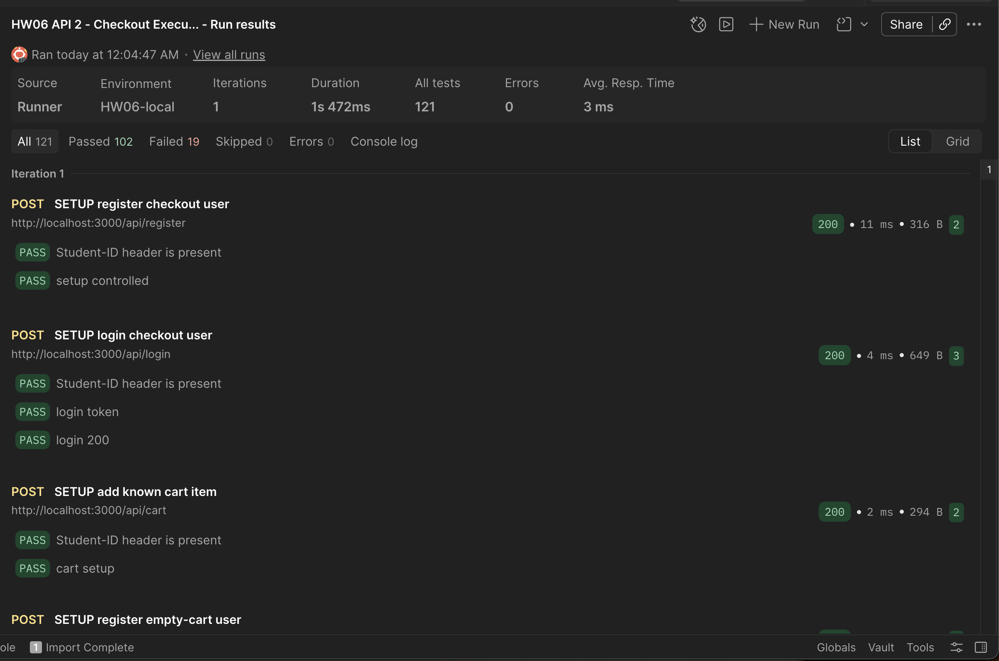
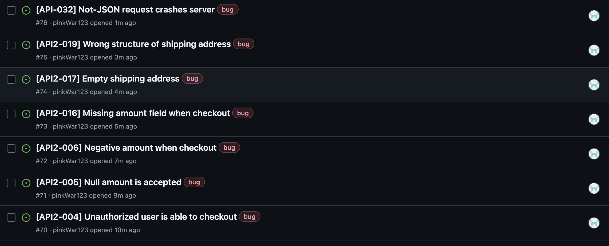
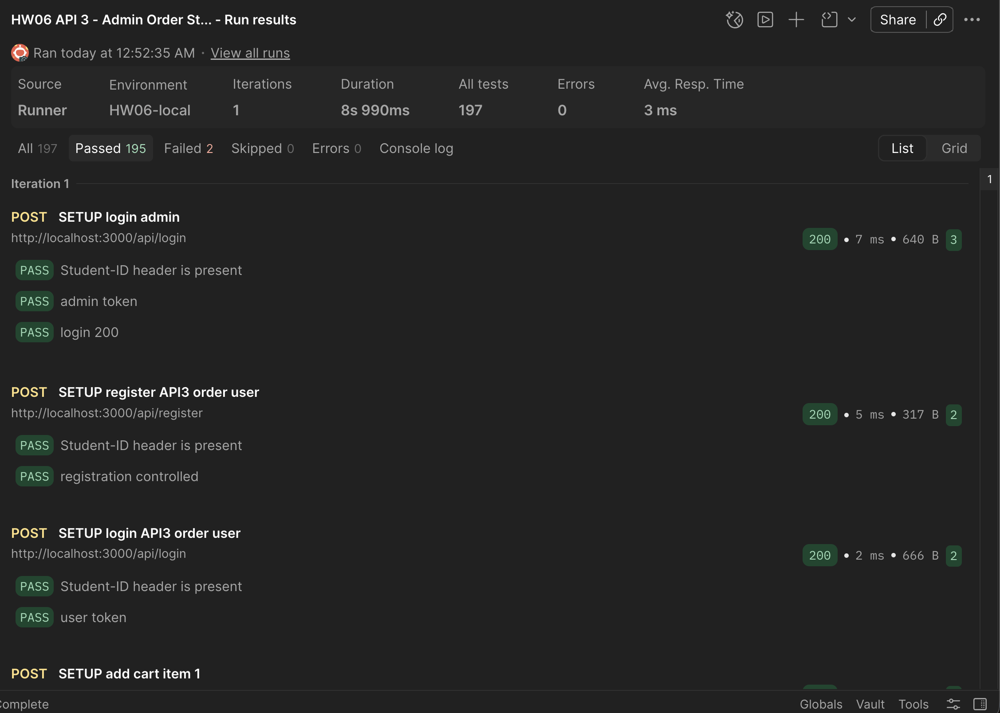

# HW06 – API Testing Report

## 1. Cover Page and Student Information

- **Student ID:** 22127345
- **Assignment:** HW06 – API Testing
- **SUT:** EShop
- **Selected test tool:** Postman + Newman (provisional; default assignment tool)
- **Backend base URL:** `http://localhost:3000`
- **Backend status:** Started from `../eshop-SUT/backend/server.js`; verified during Newman execution on 21/08/2026.

## 2. Executive Summary

API 1 (`POST /api/login`) was executed with the Postman Collection Runner and Newman. The Postman Runner evidence shows **48 requests**, **164 assertions**, **155 passed**, **9 failed**, and **0 errors** in one iteration. The failures confirm implementation defects in lockout behavior, sensitive-field disclosure, account enumeration, and unsafe content-type handling. The required Student-ID screenshots were captured; GitHub Issue evidence remains pending.

## 3. System Under Test and API Specification

The System Under Test is the EShop Vietnamese e-commerce demo application. The API specification is stored in `../eshop-SUT/api_specification.md`. The backend is implemented with Node.js, Express, and SQLite and listens at `http://localhost:3000`.

Initial connectivity evidence collected during setup:

- `GET /api/products` returned the seeded product list.
- `POST /api/login` with the seeded admin account returned a JWT and an admin user object.
- The `X-Student-Id: 22127345` header was included in the login verification request; the required pre-request-script console screenshot will be captured during the Postman execution phase.

## 4. Group API-Selection / Duplication Check

- **Student:** 22127345
- **Provisional three-API selection:** login, checkout, and admin order-status update.
- **Duplication check:** Pending confirmation from group members. This must be confirmed before test-case generation; no final claim of uniqueness is made yet.
- **Required evidence:** written confirmation or an equivalent group-selection record will be attached here.

## 5. Selected APIs

### 5.1 API 1 — Pool A

- **Feature:** FR-02 — Login and account lockout
- **Endpoint:** `POST /api/login`
- **Request body:** `{ "email": "...", "password": "..." }`
- **Expected success:** HTTP 200 with JWT token and user information.
- **Relevant negative/security scope:** invalid credentials, repeated failures and lockout, password handling, injection payloads, response disclosure, and token/schema validation.

### 5.2 API 2 — Pool B

- **Feature:** FR-08 — Checkout
- **Endpoint:** `POST /api/checkout`
- **Authentication:** JWT Bearer token required.
- **Request body in specification:** `{ "total_amount": 200000, "shipping_address": "..." }`
- **Expected behavior:** backend recalculates the order total from the cart, does not trust client-supplied `total_amount`, creates the order, and clears the cart after success.
- **Relevant negative/security scope:** unauthenticated access, tampered total, empty cart, invalid address, cart ownership/IDOR, and response-schema validation.

### 5.3 API 3 — Pool C

- **Feature:** FR-18 — Admin order management / order state transition
- **Endpoint:** `PUT /api/admin/orders/:id/status`
- **Authentication:** JWT Bearer token for an admin account.
- **Request body:** `{ "status": "confirmed" }`; allowed states are `pending`, `confirmed`, `shipping`, `delivered`, and `canceled`.
- **Expected behavior:** only valid transitions are accepted; terminal states cannot transition; users cannot perform admin operations; valid updates return the documented success response.
- **Relevant negative/security scope:** missing/invalid token, user-to-admin escalation, IDOR, invalid transitions, terminal-state transitions, malformed IDs/statuses, and response-schema validation.

## 6. Test Design and Coverage Strategy

The API 1 design applies equivalence partitioning, boundary value analysis, decision tables, state-transition testing, security/error guessing, and response-schema validation. The detailed strategy, conditions, and traceability artifacts are stored in [`artifacts/api1_login_test_strategy.md`](../artifacts/api1_login_test_strategy.md), [`artifacts/api1_login_test_conditions.md`](../artifacts/api1_login_test_conditions.md), and [`artifacts/api1_login_traceability.csv`](../artifacts/api1_login_traceability.csv).

### 6.1 Domain Partitions

The test design partitions known versus unknown emails, correct versus incorrect passwords, missing/null/empty/whitespace values, malformed and overlong emails, hostile payloads, and malformed protocol bodies. Boundary cases include the first, second, and third failed-login attempts and the lockout period.

### 6.2 State Transitions

The planned state model is `UNLOCKED → FAILED(1) → FAILED(2) → LOCKED → UNLOCKED after expiry`, with a successful login resetting the failure state. Stateful cases use an isolated account or a database reseed.

### 6.3 Security Requirements SEC-01–SEC-07

API 1 covers injection and hostile input resistance, account-enumeration resistance, brute-force lockout, JWT integrity, unexpected-field role escalation, sensitive response disclosure, and mandatory Student-ID header evidence. Exact SEC-01–SEC-07 wording will be reconciled against the course specification during human audit.

### 6.4 Response Schema Validation

The planned assertions verify HTTP status, required JSON keys and types, JWT syntax and identity claims, absence of a token on failure, and absence of plaintext passwords, reset tokens, lock metadata, or other unnecessary secrets.

## 7. API 1 Full Pipeline

### 7.1 Specification and Scope

API 1 is `POST /api/login` for FR-02. It accepts `email` and `password`, returns a JWT on success, rejects invalid credentials, and applies an account lockout after at least three consecutive failures. The request must include `X-Student-Id: 22127345`.

See [`artifacts/api1_login_test_strategy.md`](../artifacts/api1_login_test_strategy.md) and [`artifacts/api1_login_test_conditions.md`](../artifacts/api1_login_test_conditions.md).

### 7.2 AI Generation Process

The AI was instructed to derive test conditions before cases and to use the API specification plus the local implementation as test basis. It was instructed to cover every request parameter, FR-02 lockout transitions, security examples, schema validation, robustness, and the HW06 Student-ID requirement. The generated output is recorded in [`artifacts/api1_login_test_cases.csv`](../artifacts/api1_login_test_cases.csv).

### 7.3 AI-Generated Test Cases (Target: at least 35)

**Generated count: 40.** Cases span functional, negative, security, robustness, state-transition, schema, and traceability checks. After the human audit below, every row has been labeled `VALID` / `INVALID` / `INCOMPLETE` with reasoning recorded in the `HumanReview` column of [`artifacts/api1_login_test_cases.csv`](../artifacts/api1_login_test_cases.csv).

### 7.4 Human Audit: VALID / INVALID / INCOMPLETE

Every AI-generated case was reviewed against the SUT spec (`eshop-sut/api_specification.md` and `eshop-sut/README.md`, which defines the exact lockout rule and SEC-01–SEC-07) and the local implementation. The backend was started and key behaviors were verified directly (curl) to ground the audit. **Result: 37 VALID / 0 INVALID / 3 INCOMPLETE.**

- **VALID (37).** Cases whose expected results correctly match the specification. This includes the lockout cases: per the README the counter must increment by exactly **1** and lock after **3** consecutive failures for **30 s**, so LOGIN-025/026/027 encode the correct spec oracle even though the implementation deviates (see bugs below).
- **INVALID (0).** No AI case contradicted the specification outright; the AI's core oracles were sound.
- **INCOMPLETE (3) — corrected:**
  - **LOGIN-015** — `TestData` (“email longer than normal email limit”) and oracle were undefined (the spec sets no email length limit). Corrected to a concrete 300-character email with an explicit `no 500 / no stack trace / no token` oracle.
  - **LOGIN-029** — the “does not reveal unnecessary details” oracle was too vague and did not assert enumeration resistance. Corrected to require the locked-account response to be indistinguishable from an unknown-account response (generic 401), with no attempt/lock metadata or existence hint.
  - **LOGIN-034** — the oracle did not assert “no 500 / no stack trace”. Corrected to require a controlled 4xx. The verified behavior is a **500 TypeError with a full stack trace** for a `text/plain` body (genuine bug).

The audit also confirmed several genuine implementation bugs that the (correct) spec-based cases will detect at execution:

| # | Bug (verified) | Detected by |
|---|---|---|
| B1 | Failed-attempt counter increments by **2** instead of 1 (0 → 2 → 4) | LOGIN-025/026 |
| B2 | Account locks after **2** failures instead of 3 | LOGIN-026/027 |
| B3 | Lock duration is **180 s** instead of the required **30 s** | LOGIN-027 |
| B4 | Login response returns the **plaintext password** and lock metadata (`reset_token`, `login_attempts`, `locked_until`) — violates SEC-01/SEC-07 | LOGIN-039, SLOGIN-003 |
| B5 | Locked-account response (403 + “Tài khoản đã bị khóa”) is distinguishable from an unknown-account response (401) — **account-enumeration** weakness | SLOGIN-004, LOGIN-029 |
| B6 | `text/plain` content-type body causes a **500 crash** with a stack trace | LOGIN-034 |
| B7 | Malformed / wrong-shape JSON returns an **HTML error page leaking absolute file paths** | LOGIN-035, SLOGIN-006 |

These will be confirmed and filed as GitHub Issues during the execution phase.

### 7.5 Student-Added Test Cases (At least 5)

6 original student-authored cases (SLOGIN-001–006) were added — see [`artifacts/api1_login_test_cases.csv`](../artifacts/api1_login_test_cases.csv). Each targets a gap the AI missed, with the reason it was missed:

| ID | Focus | Why the AI missed it |
|---|---|---|
| SLOGIN-001 | Successful login **after lock expiry** (LOCKED → UNLOCKED by time) | The AI's state-transition graph stopped at “locked”; it never modelled the time-based expiry → UNLOCKED edge. |
| SLOGIN-002 | **Register → login** integration (FR-01 → FR-02) with a freshly created account | The AI generated cases per endpoint in isolation and assumed a pre-seeded “known user”; it never chained the primary registration→login happy path. |
| SLOGIN-003 | Hard schema assertion that `password` / `reset_token` / `login_attempts` / `locked_until` are **absent** from the response | AI's LOGIN-039 phrased disclosure generically and never pinned exact forbidden field names, so the plaintext password leak slipped through. |
| SLOGIN-004 | **Differential** check: locked-account vs unknown-account responses must be indistinguishable (enumeration resistance) | The AI tested “no enumeration” one path at a time (unknown email only) and never compared locked vs unknown responses. |
| SLOGIN-005 | Full unsupported-method set (GET/PUT/PATCH/DELETE) on a POST-only route | The AI only enumerated a single method (GET, LOGIN-037). |
| SLOGIN-006 | Non-object JSON bodies (array / number / string) handled safely | The AI tested malformed JSON and empty object but not well-formed JSON of the wrong shape. |

**Why each was missed (categories):** SLOGIN-001 and SLOGIN-002 are **API/model limitations** (state-graph and cross-endpoint reasoning the AI did not perform); SLOGIN-004, SLOGIN-005 and SLOGIN-006 are **prompt quality** issues (the AI covered only the obvious single-path variants); SLOGIN-003 is a **model limitation** (the AI trusted the documented `{token, user}` shape without auditing the real row payload).

### 7.6 Execution Results

The Postman collection [`artifacts/api1_login.postman_collection.json`](../artifacts/api1_login.postman_collection.json) was executed in Postman Collection Runner and with Newman against `http://localhost:3000` on 21/08/2026. The Postman run used the `HW06-local` environment. The collection used environment variables for the base URL, Student ID, credentials, and disposable accounts; credentials were passed at runtime and are not stored in the collection.

| Tool/run | Requests | Assertions | Passed | Failed | Errors |
|---|---:|---:|---:|---:|---:|
| Postman Collection Runner | 48 | 164 | 155 | 9 | 0 |
| Newman CLI artifact | 48 | 162 | 153 | 9 | 0 |

Every request included the `X-Student-Id: 22127345` header through the collection pre-request script, and the automated header assertion passed for all requests. The supplied evidence consists of: (A) the pre-request script that injects and logs the header, (B) the post-response assertions, (C) the Collection Runner summary showing 155 passed and 9 failed, and (D) the failed-case view showing `X-Student-Id: 22127345` in the request headers.

#### API 1 Postman Evidence

The following screenshots are included in [`artifacts/evidence/api1/`](../artifacts/evidence/api1/):

1. **Pre-request script and Student-ID injection**

   

2. **Post-response assertions**

   

3. **Collection Runner execution summary**

   

4. **Failed cases and injected Student-ID header**

   

Execution failures were:

- `LOGIN-027`: the third failed login returned 403 because the implementation locked the account early; the specification requires the third triggering attempt to return 401 and lock for 30 seconds.
- `LOGIN-034`: `text/plain` input caused HTTP 500 instead of a controlled 4xx response.
- `LOGIN-039` and `SLOGIN-003`: the login response exposed plaintext `password` and other sensitive account fields.
- `SLOGIN-001`: the case requires waiting until lock expiry; the immediate execution correctly observed that the account was still locked. This needs a timed/manual or dedicated reset fixture before treating it as a standalone defect.
- `SLOGIN-004`: the locked account returned 403 rather than the same generic 401 response as an unknown account, confirming account enumeration through lockout.

The complete HTML and JUnit outputs are [`artifacts/api1_newman_report.html`](../artifacts/api1_newman_report.html) and [`artifacts/api1_newman_report.xml`](../artifacts/api1_newman_report.xml).

### 7.7 Bugs Found and Links

The Newman/Postman execution confirmed the following defects. All four confirmed API 1 defects listed below have been filed on the group's GitHub Issues page.

| Bug | Evidence | Status |
|---|---|---|
| Lockout triggers before the required third failure / wrong lockout behavior | `LOGIN-027` in Newman HTML report | [GitHub Issue #66](https://github.com/pinkWar123/software-testing-group-06/issues/66) |
| `text/plain` / malformed input produces HTTP 500 | `LOGIN-034` in Newman HTML report | [GitHub Issue #67](https://github.com/pinkWar123/software-testing-group-06/issues/67) |
| Login response discloses plaintext password and account metadata | `LOGIN-039`, `SLOGIN-003` | [GitHub Issue #68](https://github.com/pinkWar123/software-testing-group-06/issues/68) |
| Locked and unknown accounts are distinguishable | `SLOGIN-004` | [GitHub Issue #69](https://github.com/pinkWar123/software-testing-group-06/issues/69) |

## 8. API 2 Full Pipeline

### 8.1 Specification and Scope

API 2 is `POST /api/checkout` for FR-08 Checkout. It requires a JWT Bearer token and the assignment Student-ID header `X-Student-Id: 22127345`. The documented request is `{ "total_amount": 200000, "shipping_address": "123 Le Loi, TP.HCM" }`; the expected implementation must recalculate the amount from the authenticated user's cart, create a `pending` order, and clear that user's cart. The success schema is `{ "message": "Checkout successful", "orderId": <positive integer> }`. Negative cases cover authentication, validation, empty/malformed carts, ownership, injection, role escalation, side effects, and exact error handling.

The design artifacts are [`api2_checkout_test_strategy.md`](../artifacts/api2_checkout_test_strategy.md), [`api2_checkout_test_conditions.md`](../artifacts/api2_checkout_test_conditions.md), [`api2_checkout_test_cases.csv`](../artifacts/api2_checkout_test_cases.csv), and [`api2_checkout_traceability.csv`](../artifacts/api2_checkout_traceability.csv).

### 8.2 AI Generation Process

The AI was given the local API specification and the FR-07/FR-08/FR-10 and SEC-01–SEC-07 test basis, then instructed to derive conditions before generating atomic cases. The output was constrained to cover every request parameter, authentication, cart/order state transitions, client-total tampering, injection, IDOR, role escalation, malformed protocol input, Student-ID evidence, and exact success/error schemas. **37 AI-generated cases** were produced in `artifacts/api2_checkout_test_cases.csv`; they were subsequently audited and four incomplete oracles were corrected.

### 8.3 AI-Generated Test Cases (Target: at least 35)

The initial generation target is met: **37 cases** (`API2-001`–`API2-037`), extended with six student-authored cases (`SAPI2-001`–`SAPI2-006`). Coverage is partitioned across P0/P1/P2 functional, security, state, robustness, protocol, and schema cases. The traceability matrix maps the cases to FR-08, FR-07, and SEC-01–SEC-07.

### 8.4 Human Audit: VALID / INVALID / INCOMPLETE

Every AI-generated API 2 case was reviewed against the spec (`api_specification.md` + `README.md`, which defines FR-08 checkout and SEC-01–SEC-07) and verified with live requests against the running backend. **Result: 33 VALID / 0 INVALID / 4 INCOMPLETE.**

- **VALID (33).** Oracles correctly encode the FR-08 contract (server-calculated total, cart cleared, order owned by the JWT user) and the SEC requirements. This includes the total-integrity and cart-dependency cases, which the implementation does not satisfy (see bugs).
- **INVALID (0).** No AI case contradicted the specification outright.
- **INCOMPLETE (4) — corrected:**
  - **API2-005** — null `total_amount`: vague “4xx or ignore” → corrected to forbid persisting a null total.
  - **API2-006** — string `total_amount`: vague → corrected to forbid persisting a non-numeric total.
  - **API2-008** — zero `total_amount`: vague → corrected to forbid a zero-priced persisted order.
  - **API2-012** — wrong auth scheme: oracle didn't pin scheme enforcement → corrected to require that only `Bearer` is accepted.

The audit confirmed genuine implementation defects (verified via live requests) that the correct spec-based cases will catch at execution:

| # | Bug (verified) | Detected by |
|---|---|---|
| C1 | Client-supplied `total_amount` is **trusted** and persisted instead of the server-calculated cart total (order created with 999999 / −100 / 0 / string) | API2-002/003/007/008/006, SAPI2-001 |
| C2 | **No validation**: missing/null/empty/whitespace/non-string/overlong `shipping_address` and missing/null/negative `total_amount` all still create an order | API2-004/005/016/017/018/019, SAPI2-006 |
| C3 | **Cart is not read and not cleared** on checkout: empty-cart checkout creates an order; duplicate requests create duplicate orders | API2-020/021/022, SAPI2-002 |
| C4 | **Bearer scheme not enforced**: a valid JWT sent as `Basic <jwt>` is accepted (200) | API2-012 |
| C5 | `text/plain` body causes a **500 crash** with a full stack trace | API2-032 |
| C6 | Malformed JSON returns an **HTML error page leaking absolute file paths** / error paths leak stack+paths | API2-031/037 |

The Newman execution below reproduced the predicted failures. GitHub issue filing remains pending for API 2.

### 8.5 Student-Added Test Cases (At least 5)

6 original student-authored cases (SAPI2-001–006) were added — see [`artifacts/api2_checkout_test_cases.csv`](../artifacts/api2_checkout_test_cases.csv). Each targets a gap the AI missed, with the reason it was missed:

| ID | Focus | Why the AI missed it |
|---|---|---|
| SAPI2-001 | Persisted order total equals the **sum of the user's cart line items** (server recompute) | AI stated “server cart total” abstractly but never pinned the computation or a read-back assertion. |
| SAPI2-002 | **Double-submit idempotency** — two identical requests create exactly one order | AI modelled “repeat after cleared cart” (API2-021) but not true duplicate-submission idempotency. |
| SAPI2-003 | **Read-back via GET /api/orders/my-orders** to verify `status=pending` and ownership | AI asserted `pending` only in text; it never added the verification action to confirm the created state. |
| SAPI2-004 | **SQL/string injection in the numeric `total_amount` field** | AI tested injection only on the address field, overlooking the numeric field as a surface. |
| SAPI2-005 | **Cross-user cart isolation** (A's checkout must not read/consume B's cart) | AI tested ownership via body fields but not actual cart-content isolation between real users. |
| SAPI2-006 | **Overlong `shipping_address`** length boundary (BVA upper bound) | AI covered empty/whitespace/non-string addresses but no maximum-length case. |

**Why each was missed (categories):** SAPI2-001, SAPI2-003, SAPI2-005 are **model limitations** (abstract oracles, incomplete state/ownership modelling); SAPI2-002 is a **model limitation** (no duplicate-submission reasoning); SAPI2-004 is an **API characteristic** (numeric field overlooked as an injection surface); SAPI2-006 is a **prompt quality** issue (incomplete boundary-value set).

### 8.6 Execution Results

The audited API 2 suite was executed with Newman against `http://localhost:3000` on 21/08/2026 and rerun in the Postman Collection Runner on 22/08/2026. The collection contains 43 API cases plus five stateful setup requests, for **48 requests** total. Runtime variables supplied disposable credentials; no password was stored in the collection. The pre-request script injected and logged `X-Student-Id: 22127345` for all 48 requests.

| Run | Requests | Assertions | Passed | Failed | Script errors | Avg. response |
|---|---:|---:|---:|---:|---:|---:|
| Newman CLI | 48 | 121 | 102 | 19 | 0 | 2 ms |
| Postman Collection Runner (GUI) | 48 | 121 | 102 | 19 | 0 | 3 ms |

The 19 failed assertions are expected defect observations, not tool failures: API2-004–008, API2-012, API2-016–022, API2-032, API2-037, and SAPI2-002/004/006. They reproduce client-total trust and missing validation, acceptance of `Basic <JWT>`, checkout from an empty cart and duplicate checkout, a `text/plain` 500 with stack disclosure, unsafe error handling, numeric-field injection acceptance, and overlong-address acceptance. Authentication cases API2-009–011 and unsupported-method case API2-033 passed. The generated artifacts are [`api2_checkout.postman_collection.json`](../artifacts/api2_checkout.postman_collection.json), [`api2_newman_report.html`](../artifacts/api2_newman_report.html), and [`api2_newman_report.xml`](../artifacts/api2_newman_report.xml).

The execution evidence is included below. The Postman Runner screenshot shows **121 tests, 102 passed, 19 failed, 0 errors**, and the GitHub Issues screenshot shows the filed API 2 defects.

### 8.7 Bugs Found and Links

The run confirms the candidate defects C1–C6 listed in §8.4. The following seven API 2 defects were filed as GitHub Issues and are linked by the issue number shown in the evidence screenshot:

| Test case | Defect | GitHub issue |
|---|---|---|
| API2-004 | Unauthorized user is able to checkout | [Issue #70 — API2-004](https://github.com/pinkWar123/software-testing-group-06/issues/70) |
| API2-005 | Null `total_amount` is accepted | [Issue #71 — API2-005](https://github.com/pinkWar123/software-testing-group-06/issues/71) |
| API2-006 | Negative `total_amount` is accepted | [Issue #72 — API2-006](https://github.com/pinkWar123/software-testing-group-06/issues/72) |
| API2-016 | Missing `total_amount` is accepted | [Issue #73 — API2-016](https://github.com/pinkWar123/software-testing-group-06/issues/73) |
| API2-017 | Empty `shipping_address` is accepted | [Issue #74 — API2-017](https://github.com/pinkWar123/software-testing-group-06/issues/74) |
| API2-019 | Incorrect `shipping_address` structure is accepted | [Issue #75 — API2-019](https://github.com/pinkWar123/software-testing-group-06/issues/75) |
| API2-032 | Non-JSON request crashes the server | [Issue #76 — API2-032](https://github.com/pinkWar123/software-testing-group-06/issues/76) |

The remaining failed assertions are retained as execution evidence and are grouped under C1–C6; they were not duplicated into separate issues in this submission.

## 9. API 3 Full Pipeline

### 9.1 Specification and Scope

API 3 is `PUT /api/admin/orders/:id/status` for FR-18 Admin order management, constrained by the FR-10 state machine. It requires an admin Bearer JWT and accepts `{ "status": "confirmed" }`, with allowed states `pending`, `confirmed`, `shipping`, `delivered`, and `canceled`. Valid transitions return HTTP 200 with `{ "message": "Order status updated" }`; invalid transitions and unauthorized requests must return controlled 4xx JSON without changing the order.

The design basis and risk assessment are documented in [`artifacts/api3_admin_order_status_test_strategy.md`](../artifacts/api3_admin_order_status_test_strategy.md). The scope includes authentication/authorization, ID and status validation, valid and terminal-state transitions, IDOR, injection, malformed protocol inputs, exact response schema, persistence, and the required Student-ID header. Human audit and execution are not claimed complete at this stage.

### 9.2 AI Generation Process

The AI generation step used the API specification, FR-10/FR-18 requirements, SEC-01–SEC-07, and the local endpoint implementation as the test basis. The prompt required test conditions before cases and explicit coverage of input partitions, order-state transitions, admin authorization, IDOR/injection, robustness, schema, and the HW06 header requirement.

### 9.3 AI-Generated Test Cases (Target: at least 35)

**Generated count: 40.** Cases cover positive transitions, invalid and terminal transitions, authentication and role boundaries, path/status partitions, injection, malformed protocol inputs, response schema, side-effect isolation, and Student-ID evidence. All rows have now been human-labeled `VALID` / `INVALID` / `INCOMPLETE` in the audit below (§9.4).

See [`artifacts/api3_admin_order_status_test_cases.csv`](../artifacts/api3_admin_order_status_test_cases.csv), [`artifacts/api3_admin_order_status_test_conditions.md`](../artifacts/api3_admin_order_status_test_conditions.md), and [`artifacts/api3_admin_order_status_traceability.csv`](../artifacts/api3_admin_order_status_traceability.csv).

### 9.4 Human Audit: VALID / INVALID / INCOMPLETE

Every AI-generated API 3 case was reviewed against the spec (`api_specification.md` + `README.md`, which defines FR-18, the FR-10 state machine and SEC-01–SEC-07) and verified with live requests against the running backend. **Result: 34 VALID / 0 INVALID / 6 INCOMPLETE.**

- **VALID (34).** Oracles correctly encode the FR-10 transition rules, the SEC requirements, and the response schema. This includes the terminal-state and authorization cases whose oracles are correct even though the implementation violates them (see bugs).
- **INVALID (0).** No AI case contradicted the specification outright.
- **INCOMPLETE (6) — all corrected for structure.** API3-008 through API3-013 were malformed records: the AI merged the expected-result text into the `TestData` field, leaving `ExpectedResult` empty. I split each into proper `TestData` / `ExpectedResult` columns. The underlying security oracles were correct, so the verdict after the structural fix is VALID for each; the six rows are labelled `INCOMPLETE (corrected)` to record the fix.

The audit confirmed genuine implementation defects (verified via live requests) that the correct spec-based cases will catch at execution:

| # | Bug (verified) | Detected by |
|---|---|---|
| D1 | **No `role=admin` check** — a regular `role=user` JWT successfully updates any order (SEC-03 violation) | API3-011/013, SAPI3-002 |
| D2 | **`canceled → delivered` wrongly allowed** — a canceled (terminal) order can be revived to delivered | SAPI3-001 |
| D3 | **Bearer scheme not enforced** — a valid JWT sent as `Basic <jwt>` is accepted | API3-012 |
| D4 | `text/plain` body causes a **500 crash** with a full stack trace | API3-035 |
| D5 | Malformed JSON returns an **HTML error page leaking absolute file paths** (and error paths leak stack/paths) | API3-034/038 |
| D6 | Invalid-transition error message discloses the current order status (`Invalid state transition from X to Y`) — minor enumeration | API3-023-028 |

These will be confirmed and filed as GitHub Issues during the execution phase.

### 9.5 Student-Added Test Cases (At least 5)

6 original student-authored cases (SAPI3-001–006) were added — see [`artifacts/api3_admin_order_status_test_cases.csv`](../artifacts/api3_admin_order_status_test_cases.csv). Each targets a gap the AI missed, with the reason it was missed:

| ID | Focus | Why the AI missed it |
|---|---|---|
| SAPI3-001 | `canceled → delivered` must be rejected (terminal-state edge) | AI tested only canceled→confirmed; it asserted "canceled is terminal" generally without enumerating every out-edge, so the unusual `canceled→delivered` bug was missed. |
| SAPI3-002 | Non-admin token cannot update another user's order (SEC-03, explicit role check) | AI assumed role enforcement existed instead of verifying that the middleware only checks token validity. |
| SAPI3-003 | **Read-back** via GET confirms the persisted status and that only the target order changed | AI asserted success/persistence only in oracle text, without a GET verification step. |
| SAPI3-004 | Repeated transition (confirmed→confirmed) is rejected — documented non-idempotent behavior | AI modeled forward transitions but never re-transition/idempotency of an already-reached state. |
| SAPI3-005 | Huge order ID (BVA upper bound, 2^31+) is rejected | AI's boundary set covered 0/−1/decimal but omitted the large/overflow side. |
| SAPI3-006 | Status carrying embedded/trailing characters (e.g. `confirmed\n`) is rejected (exact match) | AI tested empty/whitespace/case/numeric statuses but not a valid token wrapped in extra characters. |

**Why each was missed (categories):** SAPI3-001, SAPI3-002, SAPI3-003 are **model limitations** (incomplete state-graph/authorization/verification modelling); SAPI3-004, SAPI3-005, SAPI3-006 are **prompt quality** (missing idempotency, large-boundary, and hostile-status variants).

### 9.6 Execution Results

The API 3 collection [`artifacts/api3_admin_order_status.postman_collection.json`](../artifacts/api3_admin_order_status.postman_collection.json) was executed with Newman against `http://localhost:3000` on 22/08/2026. The run used the generated local environment [`artifacts/api3_local.postman_environment.json`](../artifacts/api3_local.postman_environment.json), an admin login setup, a disposable API 3 order user, and ten order fixtures prepared across the relevant lifecycle states.

| Tool/run | Requests | Assertions | Passed | Failed | Request/script errors | Avg. response |
|---|---:|---:|---:|---:|---:|---:|
| Newman CLI | 74 | 197 | 195 | 2 | 0 | 1 ms |

All 74 requests executed the pre-request script and the automated Student-ID assertion passed for every request with `X-Student-Id: 22127345`. The Postman Runner result supplied as human evidence is shown below; it records 197 tests, 195 passed, 2 failed, 0 skipped, and 0 errors. The separate manual console screenshot required by the assignment is still pending and is not claimed complete here.

*Figure 9.1 — Postman Runner execution result for API 3.*

The only failed test case was `API3-035` and it produced two failed assertions: the `text/plain` request returned HTTP 500 instead of a controlled 4xx response, and the response contained stack-trace disclosure. This is execution evidence of an API robustness/security defect. The defect is tracked as [GitHub Issue #77 — API3-035: Not-JSON payload crashes server when admin checks order status](https://github.com/pinkWar123/software-testing-group-06/issues/77). The generated HTML and JUnit reports are [`artifacts/api3_newman_report.html`](../artifacts/api3_newman_report.html) and [`artifacts/api3_newman_report.xml`](../artifacts/api3_newman_report.xml).

### 9.7 Bugs Found and Links

| Test case | Defect | Evidence / tracking |
|---|---|---|
| API3-035 | A `text/plain` request causes HTTP 500 and stack-trace disclosure instead of a controlled client error. | [GitHub Issue #77](https://github.com/pinkWar123/software-testing-group-06/issues/77); [Postman Runner screenshot](../artifacts/evidence/api3/01_postman_runner_api3.png); [Newman HTML report](../artifacts/api3_newman_report.html) |

## 10. Postman / Karate / RestAssured Features Used

- Postman collection with one traceable request per test case.
- Collection pre-request script for automatic `X-Student-Id` injection and console logging.
- Environment variables for base URL, Student ID, credentials, and disposable test accounts.
- Newman CLI execution with CLI, HTML, and JUnit reporters.
- Assertions for status, crash resistance, JWT presence, response shape, and forbidden sensitive fields.
- Two setup requests for isolated disposable accounts.

The submitted Postman evidence includes the pre-request script, post-response assertions, Collection Runner summary, console logs, and request-header inspection. Additional workspace/monitor/mock-server features were not used because they were not required for this local API execution.

## 11. Bug Summary

## 12. CI/CD Integration

### 12.1 Pipeline Configuration

### 12.2 All-Passing Sample Run

### 12.3 Intentionally Failing Sample Run

### 12.4 Screenshots and Links

## 13. AI-Driven API Test Generator

### 13.1 Design Overview

### 13.2 Self-Drawn Architecture Diagram

### 13.3 Pseudocode

### 13.4 Demonstration Video (Optional)

## 14. Test Summary

## 15. Limitations and Lessons Learned

## 16. References

## Appendix A — AI Prompt Log

## Appendix B — AI Audit Report

## Appendix C — AI Critique
